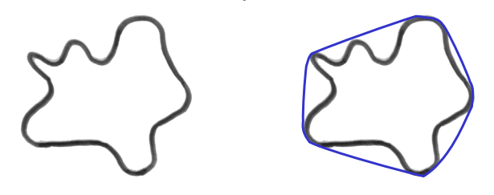

# Instance Segmenter

## Introduction

Quantitative analysis of image log data is of great importance in the oil and gas industry. This analysis stands out in the characterization of reservoirs that exhibit great variability in pore scales, such as pre-salt carbonates. Frequently, only the matrix porosity of rocks is not enough to characterize the fluid flow properties in these reservoirs. In fact, the presence of regions subject to intense karstification and rocks with significant vugular porosity governs the behavior of fluids in these reservoirs. Due to their nature and scale, image logs stand out as an important tool for a better understanding and more accurate characterization of these rocks.

However, the quantitative use of these images is a challenge due to the large number of artifacts such as spiraling, breakouts, eccentricity, ledges, drill marks or sampling marks, among others. Therefore, the correct interpretation, identification, and correction of these artifacts is of crucial importance.

In this context, machine learning and computer vision techniques are used for automation and assistance in the analysis processes of well log images.

Image Log Instance Segmenter is a module of GeoSlicer that performs instance segmentation of artifacts of interest in log images. Instance segmentation means that objects are separated individually from each other, and not only by classes. In GeoSlicer, the detection of two types of artifacts is currently available:

- Sampling marks
- Ledges

After execution, a model generates a segmentation node (labelmap) and a table with properties for each detected instance, which can be analyzed using the Instance Editor module, present in the Image Log environment.

## Sampling marks

For sampling marks, [Mask-RCNN](https://github.com/matterport/Mask_RCNN) is used, a high-performance convolutional network designed for instance detection in traditional RGB images. Although profile images do not have the three RGB channels, the network input was adapted to analyze Transit Time and Amplitude logs as two color channels for network training.

Two trained models are available for sampling mark detection: a primary model and a secondary, test model. The purpose of having a secondary model is to allow users to compare the two models to determine which is better, enabling the discarding of the weaker model and the inclusion of future competing models in new versions of GeoSlicer.

This model generates a table with the following properties for each detected sampling mark:

- Depth (m): real depth in meters.

- N depth (m): nominal depth in meters.

- Desc: descent number.

- Cond: mark condition.

- Diam (cm): equivalent diameter, the diameter of a circle with the same mark area.
$$D = 2 \sqrt{\frac{area}{\pi}}$$

- Circularity: circularity, a measure of how close to a circle the mark is, the closer to 1, given by the equation:
$$C=\frac{4 \pi \times area}{perimetro^2}$$

- Solidity: solidity, a measure of the mark's convexity, the closer to 1, given by the equation:
$$S=\frac{area}{area\text{_}convexa}$$

|  |
|:--------------------------------------------------------------:|
|         Figure 1: Area versus convex area (in blue).           |

- Azimuth: horizontal position in degrees along the image, 0 to 360 degrees.

- Label: instance identifier in the resulting segmentation.

## Ledges

For ledges, traditional computer vision techniques are used, which identify diagonal marks characteristic of ledges in transit time images.

- Depth (m): real depth in meters.
- Steepness: measured in degrees, the inclination of the ledge relative to the horizontal axis.
- Area (cm²): area in square centimeters.
- Linearity: how much the ledge resembles a straight line.
- Label: the instance identifier in the resulting segmentation.