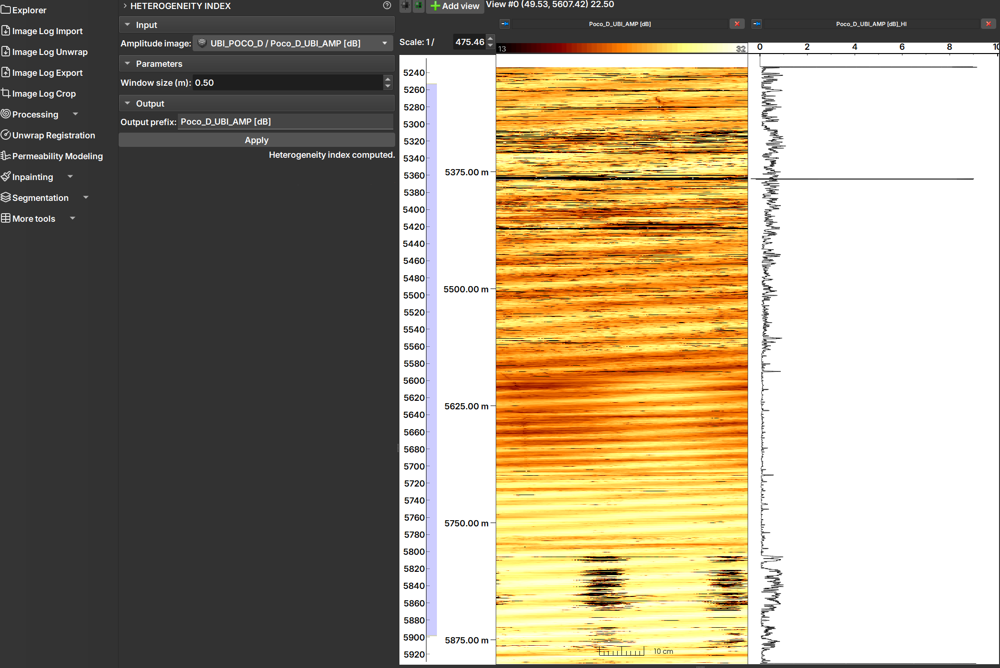

# Well Logs Environment

The Well Logs environment is designed for the visualization and analysis of well log data, such as image logs and curves.

## Data Visualization

The main feature of this environment is the ability to display multiple logs side by side, all synchronized by depth.

*Well Log environment, showing an image (left) and a curve (right) aligned by depth.*

### Visualization Types

- **Images:** 2D logs, such as well images, are displayed as images in a vertical track.
- **Tables:** Tables of values by depth are displayed as a curve.
- **Histograms:** It is possible to visualize multiple histograms at different depths in a single track, for example, results from the [Charts](/ImageLog/MoreTools/MoreTools.md#charts) module.

### Navigation and Interaction

- **Depth Axis:** A vertical depth axis is displayed on the left, serving as a reference for all logs.
- **Synchronization:** Scrolling and zooming are synchronized across all tracks, allowing for comparative analysis at different depths.
- **Add/Remove Tracks:** To add a new visualization track, select the desired data in the "Explorer" panel and click the "Add view" button in the toolbar. To remove, use the close button in the track header.

## Sections

The GeoSlicer Well Logs environment is organized into several modules, each dedicated to a specific set of tasks. Click on a module to learn more about its functionalities:

*   **[Import](/ImageLog/Import/Import.md):** To load well log data in DLIS, LAS, and CSV formats.
*   **[Unwrap](/ImageLog/Unwrap/Unwrap.md):** To rectify well images.
*   **[Export](/ImageLog/Export/Export.md):** To export processed data.
*   **[Crop](/ImageLog/Crop.md):** To crop image data.
*   **[Processing](/ImageLog/Processing/Processing.md):** Tools to apply filters and corrections, such as:
    *   [Eccentricity](/ImageLog/Processing/Processing.md#eccentricity): For eccentricity correction.
    *   [Spiral Filter](/ImageLog/Processing/Processing.md#spiral-filter)
    *   [Quality Indicator](/ImageLog/Processing/Processing.md#quality-indicator)
    *   [Heterogeneity Index](/ImageLog/Processing/Processing.md#heterogeneity-index)
    *   [Azimuth Correction](/ImageLog/Processing/Processing.md#azimuth-shift)
    *   [CLAHE (Contrast Limit Adaptive Histogram Equalization)](/ImageLog/Processing/Processing.md#clahe-tool): For contrast enhancement.
*   **[Unwrap Registration](/ImageLog/UnwrapRegistration/UnwrapRegistration.md):** To register rectified images.
*   **[Permeability Modeling](/ImageLog/PermeabilityModeling/PermeabilityModeling.md):** To calculate permeability from image attributes.
*   **[Inpainting](/ImageLog/Inpainting/Inpainting.md):** To fill gaps in the image.
    *   [ImageLog Inpaint](/ImageLog/Inpainting/Inpainting.md#image-log-inpaint)
    *   [Core Inpaint](/ImageLog/Inpainting/Inpainting.md#core-inpaint)
*   **[Segmentation](/ImageLog/Segmentation/Segmentation.md):** Modules for segmenting well images:
    *   **[Segment Editor](/ImageLog/Segmentation/Segmentation.md#manual-segmentation):** Manual and semi-automatic tools for segment editing.
    *   **[Instance Segmenter](/ImageLog/Segmentation/Segmentation.md#instance-segmenter):** Automatic segmentation based on machine learning.
    *   **[Instance Editor](/ImageLog/Segmentation/Segmentation.md#instance-segmenter-editor):** Tools to refine instance segmentation results.
*   **[Additional Tools](/ImageLog/MoreTools/MoreTools.md):**
    *   [Volume Calculator](/ImageLog/MoreTools/MoreTools.md#volume-calculator)
    *   [Table Filter](/ImageLog/MoreTools/MoreTools.md#table-filter)
    *   [Tables Editor](/ImageLog/MoreTools/MoreTools.md#tables)
    *   [Charts](/ImageLog/MoreTools/MoreTools.md#charts)

## What you can do?

With the GeoSlicer Well Logs environment, you can:

*   **Visualize and analyze well log data, such as image logs and curves.**
*   **Apply filters and corrections to the data.**
*   **Segment well images to identify different features.**
*   **Calculate permeability from image attributes.**
*   **Export processed data.**