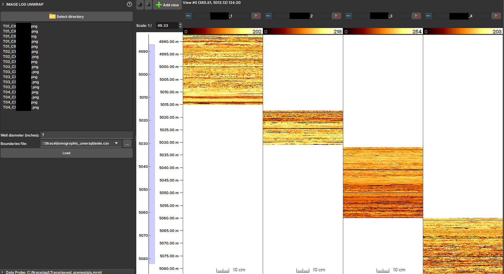

# <a id="image-log-unwrap-import">Unwrapped Tomographic Image Importer (Unwrap)</a>

The **Unwrapped Tomographic Image Importer** module is a specialized tool for loading and reconstructing image profiles from 2D drill core images that have been scanned and "unwrapped".

In some workflows, the borehole wall image is obtained by scanning drill cores and then unwrapping this cylindrical image into a 2D representation. This module serves to import these 2D images (in formats such as JPG, PNG, or TIF) and reconstruct them into a profile image with the correct depth in GeoSlicer. It uses a CSV file to obtain depth information and a well diameter to correctly scale the image's circumference.

## Input Requirements

To use this importer, your files must follow strict naming and structural conventions.

### Image File Naming Convention

Image files must be named following the pattern:
`T<ID_testemunho>_CX<primeira_caixa>CX<ultima_caixa>.<extensao>`

-   `T<ID_testemunho>`: The numeric identifier of the core.
-   `_CX<primeira_caixa>CX<ultima_caixa>`: The range of core boxes contained in the image file.
-   `<extensao>`: The file extension (e.g., `jpg`, `png`, `tif`).

**Example:** `T42_CX1CX5.jpg` refers to core 42 and contains images from boxes 1 to 5.

### Boundaries File (CSV)

A CSV file is required that maps each core box to its top and base depths. The file must contain the following columns:

-   `poco`: The well name.
-   `testemunho`: The core ID (must match the one used in the file name).
-   `caixa`: The box number.
-   `topo_caixa_m`: The top depth of the box in meters.
-   `base_caixa_m`: The base depth of the box in meters.

## How to Use

1.  **Select directory:** Click the button to choose the folder containing the unwrapped image files and the boundaries CSV file.
2.  **Check Files:** The list of detected image files will be displayed. The module will attempt to automatically find and select a `.csv` file in the same directory.
3.  **Well diameter (inches):** Enter the well diameter in inches. This value is crucial for correctly scaling the image width to the well's circumference.
4.  **Boundaries file:** If the CSV file is not automatically selected, point to the correct location in this field.
5.  **Load:** Click the button to start the import.

## Output

The module will process the images and create one or more profile images in the scene. Each image represents a complete core, assembled from its respective image files and positioned at the correct depths. The generated images will be organized in a folder with the same name as the input directory within the project hierarchy.