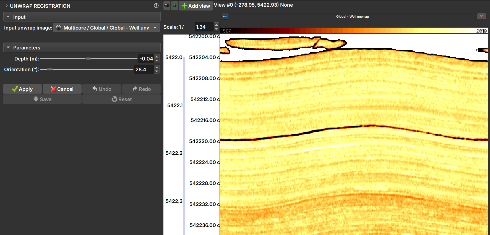

# Unwrap Registration

After creating an unwrapped core image in the Core environment, it may be necessary to adjust its vertical position (depth) or its rotation (orientation) to align it correctly with other well profiles, such as acoustic image logs (Well Logs environment). The Unwrap Registration module offers an interactive interface to perform these adjustments manually.

## How to Use

The registration process involves selecting the unwrapped image, adjusting it using the sliders, and then saving the changes.

### 1. Select the Input Image

-   **Input unwrap image:** Select the unwrapped core image you want to register from the project hierarchy. The list will only show images that have been properly marked as "Well unwrap".

### 2. Adjust the Parameters

Once an image is selected, the parameter sliders are activated. Changes made with the controls are displayed in real-time in the 2D and 3D views.

-   **Depth (m):** Move the slider to adjust the image's depth. Positive values move the image up, and negative values move it down.
-   **Orientation (°):** Move the slider to rotate the image horizontally.

### 3. Workflow and Actions

The module uses an "apply" and "save" system to manage changes. This allows experimenting with various adjustments before making them permanent.

-   **Apply:** Confirms the current depth and orientation adjustments. Once a change is "applied", it can be undone using the `Undo` button. You can apply multiple changes in sequence.
-   **Cancel:** Discards the adjustments made with the sliders since `Apply` was last pressed.
-   **Undo / Redo:** Navigates through the history of changes that were confirmed with `Apply`.
-   **Reset:** Reverts **all** applied changes, returning the image to its last saved state. Use this option to discard all work done since the last `Save`.
-   **Save:** Permanently applies all changes to the project. This action:
    -   Modifies the current unwrapped image.
    -   Applies the same depth and orientation transformations to all associated core volumes (both the 3D image and unwraps), ensuring consistency across the entire *Multicore* dataset.
    -   Clears the `Undo`/`Redo` history.

    !!! warning "Warning"
        The **Save** action cannot be undone.

### Summary of Recommended Workflow

1.  In the Core environment, import and unwrap a core.
1.  In the Well Logs environment, import other images of interest.
1.  Visualize the images, both unwrapped and other image logs. [How to visualize images in the Well Logs environment](/ImageLog/Introduction.md)
1.  Enter the module via Processing > **Unwrap Registration**.
1.  Select the image loaded in the Core environment under **Input unwrap image**.
1.  Use the **Depth** and **Orientation** controls to visually align the image.
1.  When satisfied with an adjustment, click **Apply**.
1.  Repeat steps 2 and 3 as needed, applying multiple adjustments.
1.  If you make a mistake, use **Undo** to revert the last applied change or **Reset** to start over from the last saved point.
1.  When the final alignment is correct, click **Save** to make the changes permanent and update all related core data.