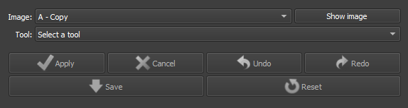
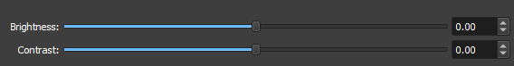
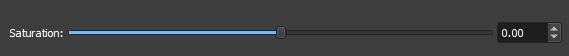

# Image Tools

The Thin Section Image Tools module in GeoSlicer offers a set of functionalities aimed at manipulating and analyzing digital rock images. This module serves as a versatile toolbox for users who need to perform operations such as cropping, resizing, color adjustments, and image filtering, all within the GeoSlicer environment.

## Panels and their Usage

|  |
|:-----------------------------------------------:|
| Figure 1: Presentation of the Thin Section Image Tools module. |

### Main Options

 - _Image_: Choose the Image to be modified. 

 - _Tool_: Choose the Tool to be used. 

 - _Apply/Cancel_: Apply the current tool to the image. Cancels the Started Process.

 - _Undo/Redo_: Undoes or redoes the applied effects
 
 - _Save/Reset_: Finalizes the process preventing Undo/Redo or undoes all applied processes.

### Brightness/Contrast:
|  |
|:-----------------------------------------------:|
| Figure 2: Presentation of the interface for the Brightness/Contrast option. |

 - _Brightness_: Choose the new brightness level of the image. 

 - _Contrast_: Choose the new contrast level of the image.

### Saturation:
|  |
|:-----------------------------------------------:|
| Figure 3: Presentation of the interface for the Saturation option. |

 - _Saturation_: Choose the new color saturation level of the image. 

### Histogram Equalization:

Histogram Equalization is an image processing technique that adjusts contrast by redistributing intensity levels more uniformly. This improves the visibility of details in low-contrast areas, making the image clearer and more informative. 

### Shading Correction:

Shading Correction is an image processing technique that removes unwanted lighting variations and shadows caused by uneven lighting conditions during image capture. This process normalizes image intensity, improving data uniformity and accuracy.