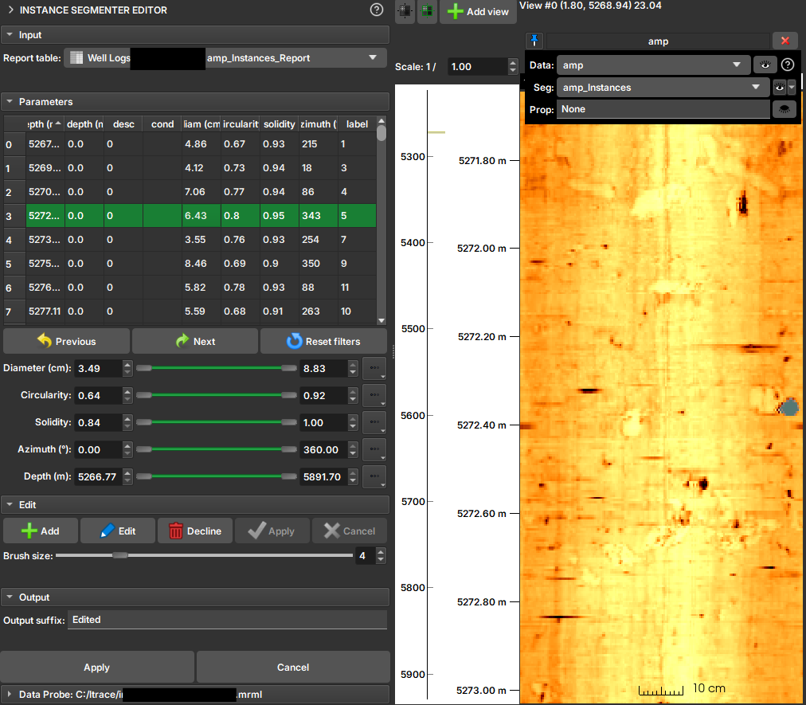

# Instance Segmenter Editor

## Overview

The **Instance Segment Editor** module is an interactive tool for visualizing, filtering, and editing the results of an instance segmentation. It is designed to work in conjunction with the results of modules like the [Instance Segmenter for Well Log Profiling](/ImageLog/Segmentation/Segmentation.md#instance-segmenter), which identifies individual objects in an image and extracts their properties.

With this editor, you can:

*   Visually inspect each segmented instance.
*   Filter instances based on their properties (e.g., size, shape, orientation).
*   Create, edit, and remove instances interactively, by painting directly on the image.

This tool is essential for quality control and refining the results of automatic segmentations, allowing for efficient manual corrections.

## How to Use

### Data Selection

1.  **Report table:** Select the properties table generated by the instance segmentation module. This table contains the data for each identified object. The editor relies on a specific attribute (`InstanceSegmenter`) in the table to identify the associated label image and instance type.
2.  It is recommended to visualize the image (AMP, TT, or both) and the instances in the [visualization tracks](/ImageLog/Introduction.md).

### Filtering Instances

The main functionality of the editor is the ability to filter instances based on their properties. For each numerical property in the table (such as area, circularity, etc.), a `range slider` is displayed in the **Parameters** section.

To filter:

1.  Locate the slider corresponding to the property you want to filter (e.g., `Area`).
2.  Use the slider's handles to define the desired value range (minimum and maximum).
3.  Markers that fall outside the filter range appear highlighted in red.

You can adjust the ranges for multiple properties simultaneously to create complex filters. To reset all filters to their original values, click the **Reset filters** button.

### Editing Instances and Segments

Editing operations allow you to refine the segmentation, whether by creating new segments, editing existing ones, or removing them.

*   **Visualization:** Click on a row in the table to select the corresponding instance. The visualization tracks will automatically shift to the instance's depth, highlighting it.

*   **Add:** Initiates the mode for creating a new segment. The mouse cursor transforms into a brush in the visualizations. You can "paint" the new instance directly onto the image. After painting, click **Apply** to calculate the properties of the new segment and add it to the table, or **Cancel** to discard.

*   **Edit:** Similar to "Add" mode, but for an existing segment. Select an item in the table and click **Edit** to modify its shape in the image using the brush. Click **Apply** to save the changes or **Cancel** to revert.

*   **Decline:** To delete an instance, select it in the table and click **Decline**. The selected instance will be removed from the table and the image.

*   **Brush size:** A slider allows you to adjust the brush size for add and edit operations.

## Module Interface

The interface is divided into four main sections:

1.  **Input:** Menu for selecting the `Report table`.
2.  **Parameters:** Contains the sliders for filtering instances and the table displaying the results.
3.  **Edit:** Contains the buttons for editing operations (`Add`, `Edit`, `Decline`, `Apply`, `Cancel`) and the brush size control.
4.  **Output:** Allows you to define a suffix for the output files and definitively apply the changes, generating a new set of table and label image.