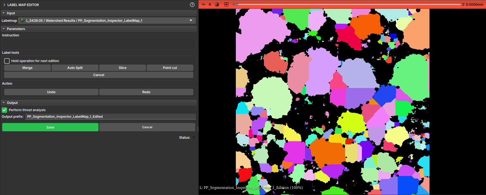

## LabelMap Editor

This module allows the editing of labelmaps, typically generated by the Watershed algorithm in the Segment Inspector module.

The results generated by the watershed are not always as expected; this module allows the user to edit these results label-by-label, merging or splitting the divisions made by the algorithm.

The module features an interface with the following operations:

- *Merge*: Merges two labels;
- *Auto Split*: Attempts to split a label into more than one part;
- *Slice*: Cuts the label along a user-defined line;
- *Point cut*: Cuts the label along a line passing through a user-defined point;

The interface also features Undo and Redo buttons to revert or advance changes.