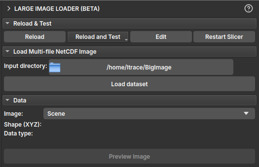
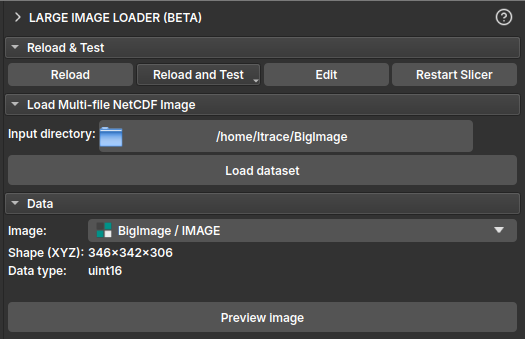
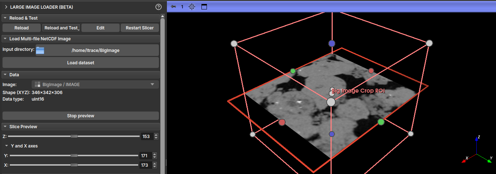
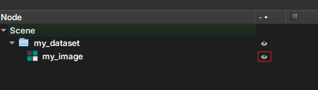
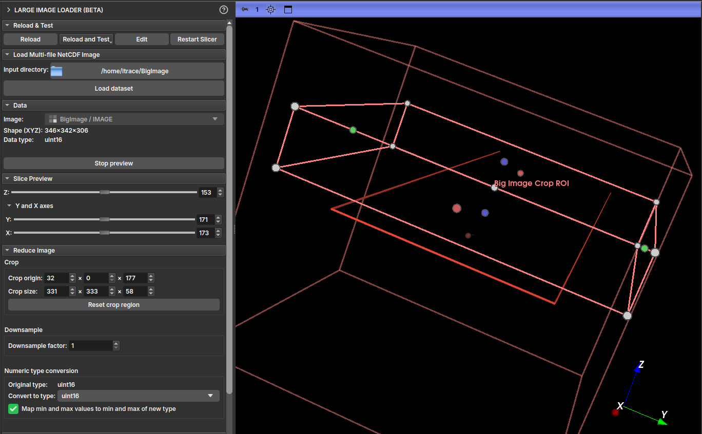
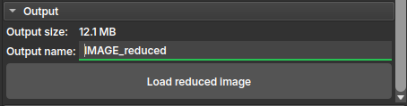
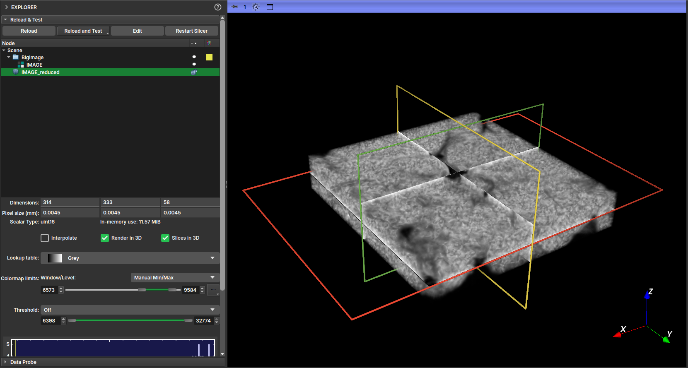

The **_Big Image_** module is a toolkit for working with large images using limited memory. Visualize slices, crop, downsample resolution, and convert type without loading the entire image into RAM. Currently, it supports loading NetCDF images from multiple local filesystem files or MicroCT NetCDF images from the BIAEP Browser module.

## Loading

Follow the steps below to load, preview, and reduce a large image.

#### Step 1: Load the NetCDF Dataset

1.  In the **Load Multi-file NetCDF Image** section, click the button next to **Input directory** to select the folder containing the NetCDF file(s) (`.nc`).
2.  Once a valid directory is selected, the **Load dataset** button will be enabled.
3.  Click **Load dataset**. This will parse the files' metadata and create virtual images in the _GeoSlicer_ data hierarchy. This operation is fast and does not consume much memory, as the image data is not yet loaded.

!!! note "Note"
    A **virtual image** is an image in the _GeoSlicer_ project that points to the location where a large image is stored. When saving the project, only the image's address is stored in the project folder.

 

|  |
|:-----------------------------------------------:|
| Figure 1: "Load Multi-file NetCDF Image" section with the directory selected and the "Load dataset" button enabled. |

#### Step 2: Select and Inspect the Image

1.  In the **Data** section, click the **Image** selector to view the list of available images in the loaded dataset. Select the image you want to inspect.
2.  After selection, the **Shape (XYZ)** and **Data type** fields will be populated with the information of the selected image.

 

|  |
|:-----------------------------------------------:|
| Figure 2: "Data" section showing image selection and populated information fields. |

#### Step 3: Preview Image Slices

1.  With an image selected, click the **Preview image** button to enter preview mode.
2.  The **Slice Preview** section will appear. Use the **Z**, **Y**, and **X** sliders to navigate through image slices in the 2D viewers. Only the selected slice is loaded from disk, allowing exploration of very large images.
3.  To exit preview mode, click **Stop preview**.

 

|  |
|:-----------------------------------------------:|
| Figure 3: "Slice Preview" section and 2D viewers showing a slice of the large image. |

!!! note "Note"
    For NetCDF images saved without *chunking*, viewing with the **Z** slider (YX plane) is usually the fastest, while other axes take longer. For images saved with *chunking*, it is possible to view quickly along any axis.

!!! tip "Tip"
    In the **Explorer** module, you can start previewing an already loaded virtual image by activating its eye icon.
    

#### Step 4: Configure Image Reduction

To load a smaller version of the image into memory, configure the options in the **Reduce Image** section.

*   **Crop**: Define a region of interest (ROI) to crop the image. Specify the starting coordinate in **Crop origin** and the crop size in **Crop size** for each axis (X, Y, Z). You can define the crop by interacting with the ROI in the 3D viewer, or by defining the values directly. Use the **Reset crop region** button to reset the area to the entire image.
*   **Downsample**: Reduce the image resolution by defining a **Downsample factor**. A factor of 2, for example, will reduce the image size by 8 times (2³).
*   **Numeric type conversion**: Convert the image's numeric type to one that consumes less memory (for example, `uint8`).
    *   If the **Map min and max values...** checkbox is marked, the image values will be remapped to the new type range, preserving the dynamic range.
    *   If unchecked, values outside the new range will be clamped.

 

|  |
|:-----------------------------------------------:|
| Figure 4: "Reduce Image" section with Crop, Downsample, and Type Conversion options highlighted. |

#### Step 5: Load the Reduced Image

1.  In the **Output** section, check the estimated final image size in **Output size**.
2.  Define a name for the new volume in **Output name**.
3.  Click **Load reduced image**. The reduction operations (cropping, resampling, and type conversion) will be executed, and the resulting volume will be loaded into _GeoSlicer_.

 

|  |
|:-----------------------------------------------:|
| Figure 5: "Output" section with the output name and "Load reduced image" button highlighted. |

With the reduced image generated, you can visualize it by enabling its display in the **Explorer** tab.

|  |
|:-----------------------------------------------:|
| Figure 6: 3D visualization of the reduced version of the image. |