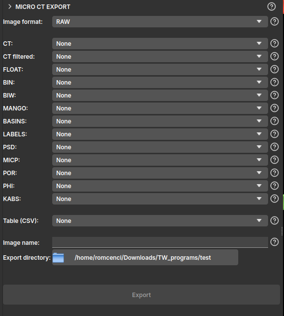

## MicroCT Export

This module provides a series of export formats for volumes loaded or generated by GeoSlicer, facilitating integration with other software or saving the results.

The module's interface is presented simply, where the user can select one of the export formats:

- *RAW*: Raw binary files. Supports /scalar/ volume, /labelmap/, and segmentations. Exports a separate file for each volume with the standard nomenclature;
- *TIF*: TIFF files. Supports only /scalar/ volume. Exports a separate file for each volume with the standard nomenclature;
- *NetCDF*: NetCDF files. Supports /scalar/ volume, /labelmap/, and segmentation. Exports a single `.nc` file containing all volumes;

The interface is also designed to operate following a standard nomenclature, defined by Petrobras, which follows the logic below:

- *CT*: image with 16-bit unsigned integer values, typically the sample's own CT;
- *CT filtered*: cropped or filtered image based on the original, also with 16-bit unsigned integer values;
- *FLOAT*: image with 32-bit real values, usually representing a component of the velocity field or pressure;
- *BIN*: 8-bit binary image, typically 1 representing pore and 0 the solid;
- *BIW*: 8-bit binary image, inverting the BIN classification, 1 represents the solid and 0 the pore;
- *MANGO*: 8-bit binary image, 0 and 1 represent the pore, while 102 and 103 are solid, intermediate values between 1 and 102 are linearly distributed in the image and inversely proportional to the sample's porosity;
- *BASINS*: segmented image, typically with integer values, where segments are defined as: 1 = Pore, 2 = Quartz, 3 = Microporosity, 4 = Calcite, 5 = High attenuation coefficient;
- *LABELS*: 8-bit image representing a label map or segmentation, assigning a unique identifier for each connected component or segmented region;
- *PSD*: 16-bit image with integer values representing the maximum sphere diameter that contains the point and remains completely within the segmented porous medium;
- *MICP*: 16-bit image with integer values representing the maximum sphere diameter that reached the point from one of the edges of the segmented porous medium;
- *POR*: 32-bit image with real values representing the local porosity of the sample, point by point, varying between 0 and 1;
- *PHI*: 32-bit image with real values that can represent the sample's porosity;
- *KABS*: 64-bit image with real values representing the absolute permeability field of the sample;
- *Table (CSV)*: Exports a table from GeoSlicer to a `.csv` file with the same name as the node;

After selecting the folder where you want to create the files, click `Export`.