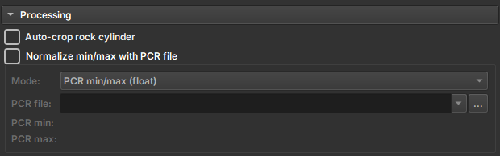
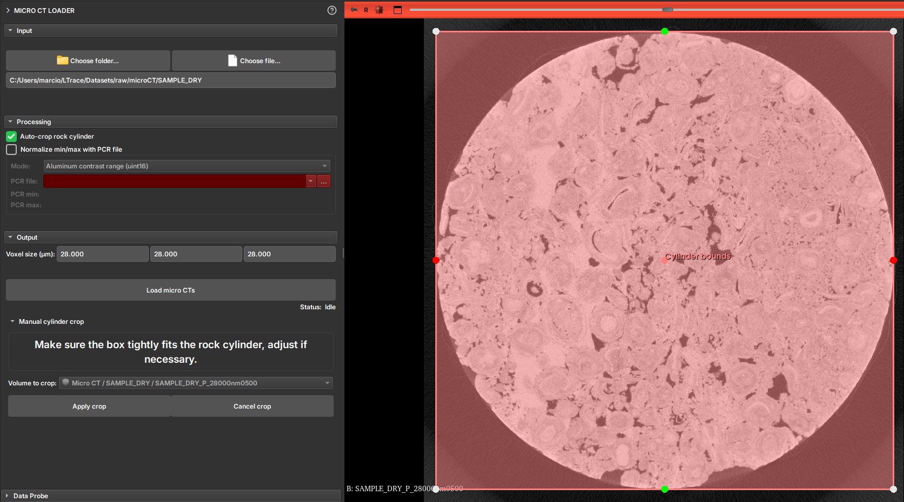

## MicroCT Import

The micro CT environment has only one **_Loader_** to load 3D volumes. It is capable of recognizing various types of data, such as:

- **_RAW_**: Image files in RAW format.
- **_TIFF_**: Image files in TIFF format.
- **_PNG_**: Image files in PNG format.
- **_JPG_**: Image files in JPG format.

With the exception of the RAW format, the **_Loader_** requires a directory containing the 2D images that make up the volume. The **_Loader_** will recognize the images and assemble the volume automatically. Below we will detail these two modes of operation.

### Viewing TIFF, PNG, and JPG formats

1. Click the **_Choose folder_** button to select the directory containing micro CT images. In this option, the directory needs to contain 2D images to compose the 3D volume.
2. Upon selecting the directory, the module reports how many images it found, so that the user can confirm that all images were detected correctly. If images are missing, the user can check if the name of any of them is not outside the standard, causing the detection failure.
3. Automatically, the module attempts to detect the pixel size of the images through the file name (e.g., prefix "_ 28000nm). If the detected value is not correct, the user can change the value manually.
4. Click the **_Load micro CTs_** button to load the images. The 3D volume will be assembled and made available in the main **_View_** and accessible via **_Explorer_**.

### Viewing RAW format

1. Click the **_Choose file_** button to select the RAW file.
2. As the .RAW file does not contain image information directly in the format, the module attempts to infer the data settings from the file name. For example, **AFLORAMENTO_III_LIMPA_B1_BIN_1000_1000_1000_02214nm.raw**
    - Pixel size: 2214nm
    - Volume size: 1000x1000x1000
    - Pixel type: BIN (8 bit unsigned)
3. The user can manually change the volume settings, such as pixel size, volume size, and data type, if any information was not detected correctly or simply does not exist.
4. Click the **_Load_** button to load the volume. The 3D volume will be assembled and made available in the main **_View_** and accessible via **_Explorer_**.

#### Exploring Import Parameters

There is a **Real-time update** option that allows the volume to be updated automatically as settings are changed. However, we recommend that the user does not use this option for very large volumes.

1. Change the _X dimension_ field until straight columns appear in the image (if the columns are slightly inclined then the value is close to being correct). Try with different endianness and pixel type values if no value in _X dimension_ seems to make sense.
2. Move _Header size_ until the first row of the image appears at the top.
3. Change the value of the _Z dimension_ field to a few tens of slices to make it easier to see when the _Y dimension_ value is correct.
4. Change the value of _Y dimension_ until the last row of the image appears at the bottom.
5. Change the _Z dimension_ slider until all image slices are included.

### Advanced Import Features

#### Auto-crop

The user can enable the **_Auto-crop Rock Cylinder_** option to automatically crop the image. This solution is applied to cases where the study volume is a cylinder, typically surrounded by other layers of different materials. This option attempts to detect the relevant cylinder and generate a region to crop. Before applying the crop, the module presents the detected region so that the user can confirm if the region is correct or make adjustments to frame the region of interest.

#### Image Normalization

Some images can be imported using a value normalization file, the PCR. To do this, the user must select the **_Normalize min/max with PCR file_** option and select the corresponding PCR file. The file usage options are:

- **_Normalize min/max (float)_**: Normalizes the image values based on the PCR file.
- **_Divide by alumminum median (float)_**: Divides the image values by the aluminum median.
- **_Alumminum contrast range (uint8)_**: Defines the aluminum contrast range.