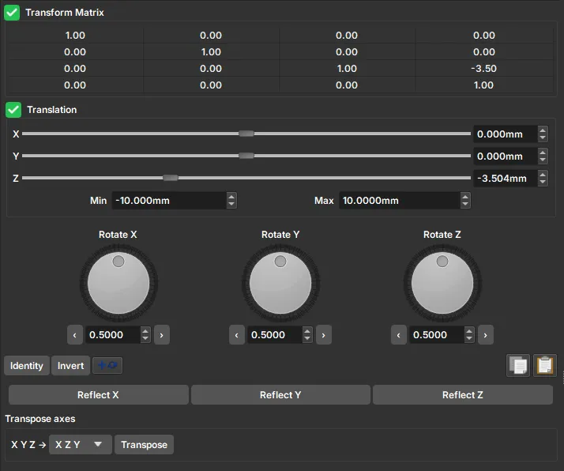
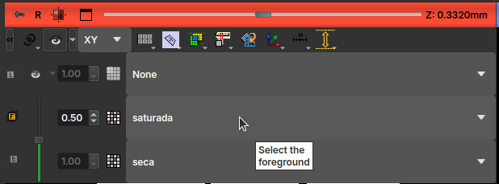
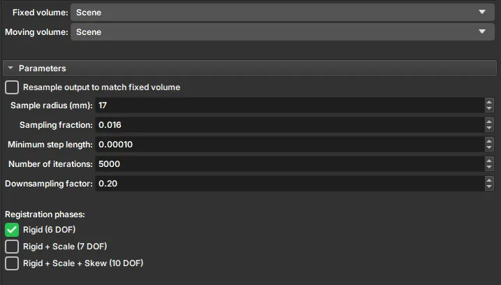

# Registration

Registration is used to align two images of the same sample, commonly utilized for slides (but with a different interface) when PP/PX exists. In Micro CT, we generally use it when we have images of the same sample, dry and saturated, or when the sample undergoes cleaning processes.

Alignment can be done manually or using an automatic algorithm. In simple cases, the automatic method should be able to solve it, but in other cases, it's advisable to adjust manually first, bringing the samples at least close to the reference, and then run the automatic process for fine-tuning.

## Manual Registration

The manual registration interface features a transformation matrix that allows for a general affine transformation in the volume, given by the change of coordinates:

$$\mathbf{r'}=\mathbf{A}\cdot\mathbf{r}+\mathbf{B},$$

where $\mathbf{r}$ is a vector with the original image coordinates and $\mathbf{r'}$ are the transformed image coordinates. Thus, matrix $\mathbf{A}$ will be responsible for applying scale transformations (main diagonal elements), rotations, reflections, and shear, and vector $\mathbf{B}$ will be responsible for translations. The transformation matrix present in the manual registration interface is generally called an augmented matrix, allowing the transformation to be represented as a single matrix multiplication:

$$
\begin{pmatrix}
x'\\
y'\\
z'\\
1\\
\end{pmatrix}=
\begin{pmatrix}
A_{xx}     & A_{xy} & A_{xz}& B_x  \\
A_{yx}     & A_{yy} & A_{yz}& B_y  \\
A_{zx}     & A_{zy} & A_{zz}& B_z  \\
0          & 0      & 0     & 1  \\
\end{pmatrix}
\cdot
\begin{pmatrix}
x\\
y\\
z\\
1\\
\end{pmatrix}
$$

However, the most intuitive way to register the image is through the graphical elements present in the interface. Translations can be chosen either by sliders or by the selector on the right side; the Min and Max values represent the limits of these translations. Below the translation controls, the interface features rotating buttons associated with rotations around each axis; it is important to evaluate the axis pointing towards the computer screen when choosing the desired rotation. Furthermore, the interface also provides buttons to reflect the image along one of the axes and options to transpose the axes (swapping x for y, and so on).

!!! tip
	It is common to find a pore or element with a very characteristic shape in one of the slices (green, red, or yellow windows) in the reference image (sometimes it may also be necessary to adjust the color scale, for example, by filtering high-attenuation elements). After finding such a characteristic shape, translations are performed along that direction until the same shape is recognized in the moving image (depending on the case, the element might be quite deformed or appear far from the original coordinate). After that, transverse translation transformations relative to the screen axis, rotations, and reflections can be performed so that the moving volume aligns with the reference one. After matching the images within the slice, one must still check how the other slices look, as other rotations around other axes can affect them.

!!! tip
	To compare the volumes during registration, one can choose one volume as *foreground* and the other as *background*, using the selection box in the top-left corner of each view. When selecting these two volumes, the interface allows changing the opacity between the two using the slider on the left of the selection, or by holding the Ctrl button + clicking and dragging the mouse from bottom to top within the viewing window.
	

## Automatic Registration

In the Automatic Registration interface, you must select a reference volume and a moving volume that will automatically find the necessary transformation. Transformations will be applied to the "*Moving volume*" to match the "*Fixed volume*", and the result will be saved as a new transformed volume, preserving the original and reference volumes.

The parameters used in automatic registration are:

- *Sample Radius*: radius of the sample in millimeters. This radius will be used to create a mask that identifies relevant data for registration.
- *Sampling Fraction*: the fraction of voxels from the Fixed volume that will be used for registration. The value must be greater than zero and less than or equal to one. Higher values increase computation time but can result in greater precision.
- *Minimum step length*: a value greater than or equal to 10-8. Each optimization step will be at least this size. When no more steps can be taken, registration is considered complete. Smaller values allow the optimizer to make more subtle adjustments but can increase registration time.
- *Number of iterations*: This parameter determines the maximum number of iterations before stopping optimization. Lower values (500–1000) force early termination but increase the risk of stopping before reaching an optimal solution.
- *Downsampling factor*: This parameter directly affects algorithm efficiency. High values (~1) can require a lot of execution time. Intermediate values, such as 0.3, have proven ideal for obtaining good results with reasonable computational cost.
- *Registration phases*: Choose the types of transformations the algorithm can apply to the original image.
  - *Rigid (6 DOF)*: is a transformation that only performs translations and rotations of the image, with 6 degrees of freedom: 3 translations (xyz) + 3 rotations.
  - *Rigid + Scale (7 DOF)*: can perform another type of transformation besides rigid ones; it can increase or decrease the image scale.
  - *Rigid + Scale + Skew (10 DOF)*: in addition to the previous transformations, it can perform shearing in different directions.
  These phases are on a scale where the first type of transformations, with fewer degrees of freedom, will deform the original image less, and the last can deform with more freedom.