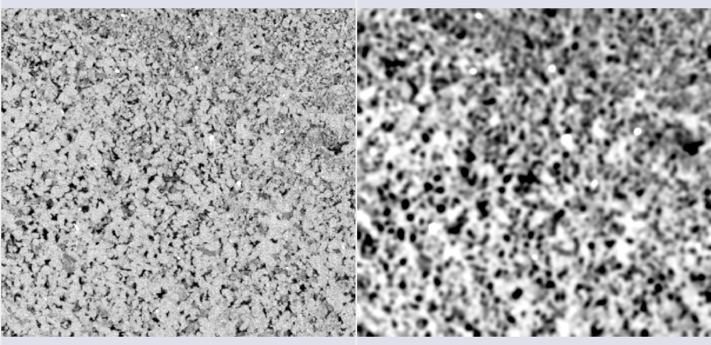
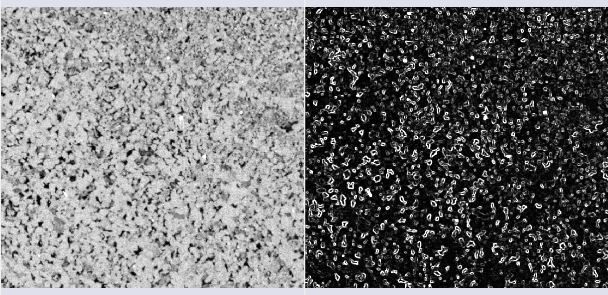
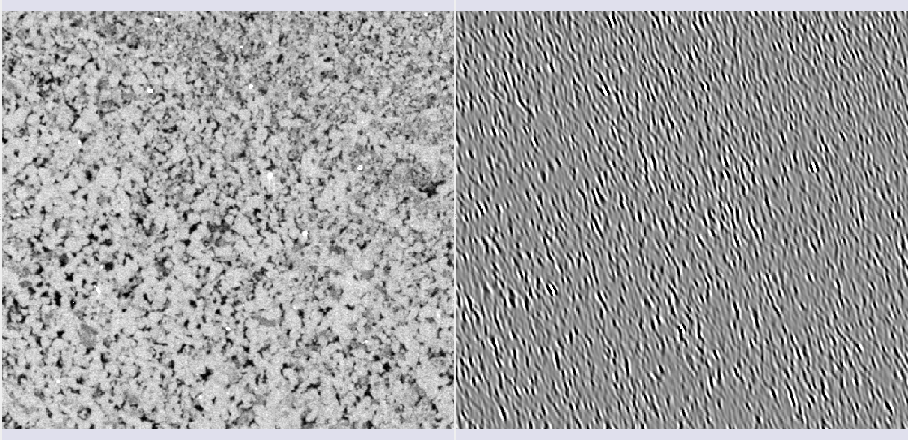
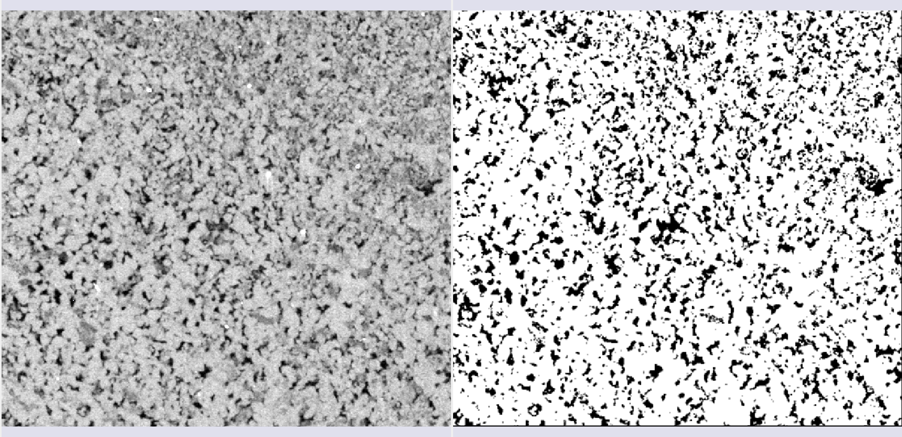
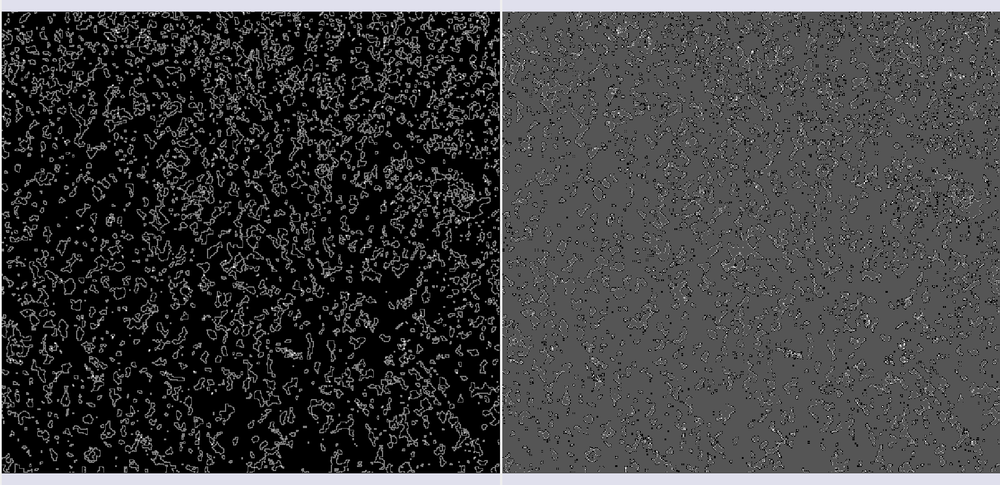
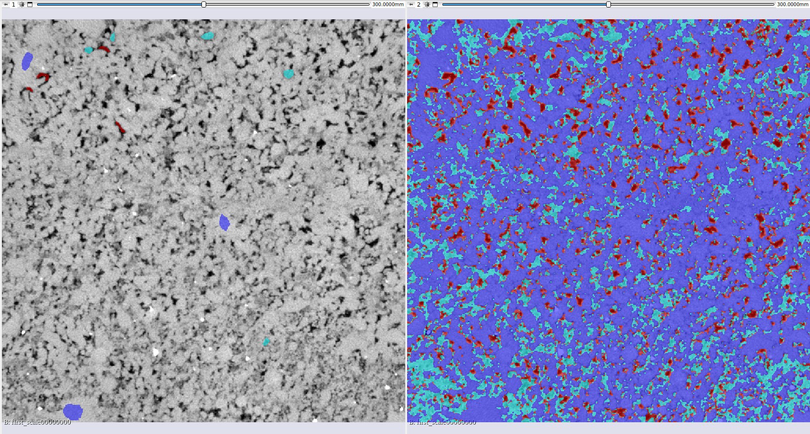
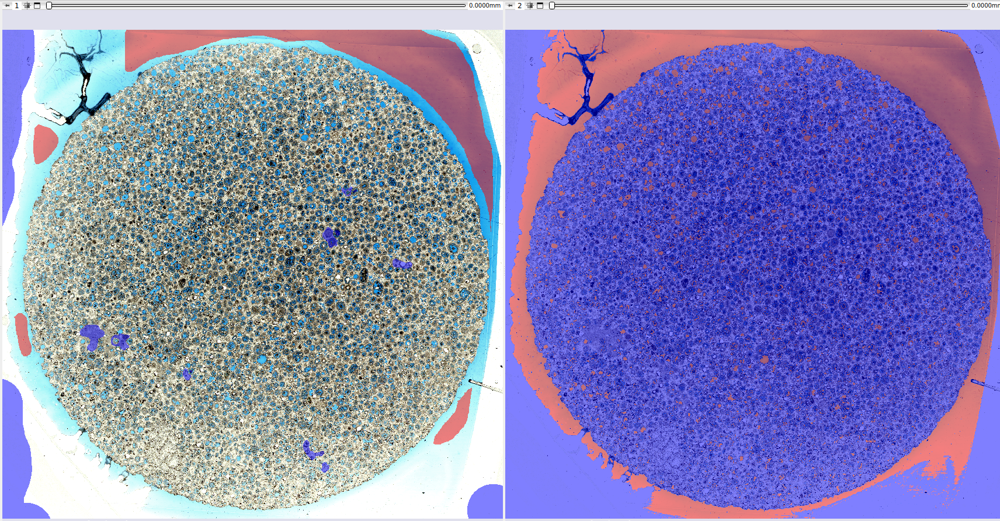
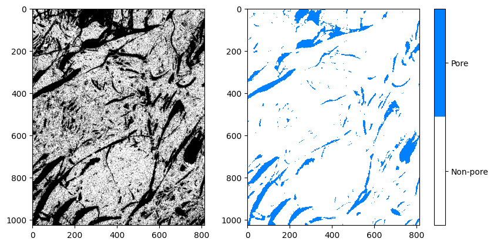
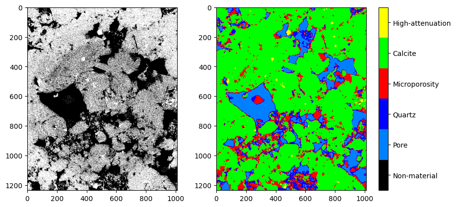

## AI Segmenter

The **MicroCT Segmenter** module offers the *Model Training* option, which performs the segmentation of an entire sample based on a simple initial annotation. Based on this annotation, different methods train a model and infer the result across the entire image or within a region of interest (SOI). The trained model can be saved and reused on other images.

### Random-Forest Method

Random-Forest is a method that constructs multiple decision trees during training to create a robust model. The final classification is determined by the majority vote of the trees. For this method, it is possible to select different *features* (characteristics) extracted from the image for training.

#### Feature selection (*features*)

*   **Raw input image**: Adds the image itself as one of the inputs.
*   **Gaussian filter**: Applies a Gaussian kernel of a chosen radius as a filter to the image.

|  |
|:-----------------------------------------------:|
| Figure 1: Gaussian filter. |

*   **Winvar filter**: Variance-based filter, calculates $\left\lt x^2\right\gt-\left\lt x\right\gt^2$ within a kernel of a chosen radius.

|  |
|:-----------------------------------------------:|
| Figure 2: Winvar filter. |

*   **Gabor filters**: Calculated in equally spaced $\theta$ directions, these filters are composed of a Gaussian part and a sinusoidal part. In 2D, the formula is:

$$ f(x,y,\omega,\theta,\sigma)=\frac{1}{2\pi\sigma^2}\exp\left[-\frac{1}{2}\frac{x^2+y^2}{\sigma^2}+I\omega(x\cos\theta+y\sin\theta)\right] $$

|  |
|:-----------------------------------------------:|
| Figure 3: Gabor filter in one of the $\theta$ directions. |

*   **Minkowsky functionals**: Morphological parameters that describe the data geometry, associated with volume, surface, mean curvature, and Euler characteristic.

|   |
|:-----------------------------------------------:|
| Figure 4: Minkowsky filters. |

*   **Variogram range**: Measures the average variation of values as a function of distance. The *range* is the distance where the variation is maximal. It is useful for differentiating textures and grain sizes.

|  |
|:-----------------------------------------------:|
| Figure 5: Variogram range. |

### Bayesian Inference Method

This method uses **Bayes' rule** to classify image pixels, updating the probabilities of a pixel belonging to a class based on annotations.

The approach in GeoSlicer assumes a **Multivariate Normal Distribution** for the likelihood function, where the mean $\mu_s$ and covariance matrix $\Sigma_s$ of each segment are calculated from the annotations:

$$ f(x_p|s)=\frac{1}{\sqrt{(2\pi)^k \det \Sigma_s}}\exp\left(-\frac{1}{2}(x_p-\mu_s)^T \Sigma_s^{-1} (x_p-\mu_s)\right) $$ 

Where $x_p$ is the pixel vector in a window, and $\mu_s$ and $\Sigma_s$ are the mean and covariance of segment $s$.

The inference of the probability of each segment for a pixel is obtained by Bayes' rule, and the segment that maximizes this probability is chosen.

To optimize performance, some treatments are applied, such as percentile transformation in MicroCT images and conversion to HSV format in thin section images. Additionally, to speed up the process, it is possible to calculate covariance sparsely, using only the principal axes or planes, which is especially useful in 3D.

Below are some results of the method's application to tomography and thin section images:

|  |
|:-----------------------------------------------:|
| Figure 6: Semi-automatic segmentation using Bayesian inference on MicroCT data. |

|  |
|:-----------------------------------------------:|
| Figure 7: Semi-automatic segmentation using Bayesian inference on thin section data. |

### Pre-trained Models

GeoSlicer offers pre-trained models based on the **U-Net** architecture to solve two common problems in rock microtomography: binary segmentation (pore/non-pore) and *basins* segmentation (multiple minerals).

#### Training

Model training was performed with a vast dataset (68 volumes for the binary model and 106 for the *basins* model), applying a linear histogram transformation to facilitate generalization. Volumes were cropped into 128³ voxel subvolumes, and 75% of them underwent random transformations (data augmentation) to improve model robustness. To handle class imbalance (pores are less common), the **Tversky loss function** was used, which adjusts the model's sensitivity to minority classes, improving accuracy in pore detection.

#### Results

The pre-trained models show high-quality results. The binary segmentation model is particularly accurate in identifying pores, while the *basins* model offers complete segmentation of different minerals.

##### Binary Segmentation

|  |
|:---------------------------------------------------------------:|
| Figure 8: Comparison between the original image, the annotation, and the binary segmentation result. |

##### *Basins* Segmentation

|  |
|:---------------------------------------------------------------:|
| Figure 9: Comparison between the original image, the annotation, and the basins segmentation result. |

#### References

*   SCHMIDT, U. et al. (2018). *Cell detection with star-convex polygons*. In: Medical Image Computing and Computer Assisted Intervention–MICCAI 2018. Springer.
*   SALEHI, S. S. M. et al. (2017). *Tversky loss function for image segmentation using 3D fully convolutional deep networks*. In: Machine Learning in Medical Imaging. Springer.
*   WEIGERT, M. et al. (2020). *Star-convex polyhedra for 3D object detection and segmentation in microscopy*. In: Proceedings of the IEEE/CVF winter conference on applications of computer vision.
*   BAI, M. & URTASUN, R. (2017). *Deep watershed transform for instance segmentation*. In: Proceedings of the IEEE conference on computer vision and pattern recognition.
*   HE, K. et al. (2017). *Mask r-cnn*. In: Proceedings of the IEEE international conference on computer vision.
*   RONNEBERGER, O. et al. (2015). *U-net: Convolutional networks for biomedical image segmentation*. In: Medical Image Computing and Computer-Assisted Intervention–MICCAI 2015. Springer.