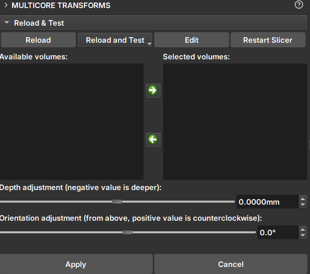

# Multicore Transform

_GeoSlicer_ module to manually modify the orientation and depth of _cores_.

## Panels and their usage

|  |
|:-----------------------------------------------:|
| Figure 1: Multicore Transform Module. |

### Transform

- _Available volumes/Selected Volumes_: The _Available volumes_ area displays the volumes that can be modified by the module. Clicking the green arrow pointing to the right moves the selected volumes to the _Selected Volumes_ area. To remove them from this area, use the green arrow pointing to the left.

- _Depth adjustment_: Applies translation to the volume's depth. Negative values are deeper.

- _Orientation adjustment_: Applies a counter-clockwise rotation to the volume.

- _Apply_: Applies the depth and orientation changes.

- _Cancel_: Cancels the changes and clears the previous fields.