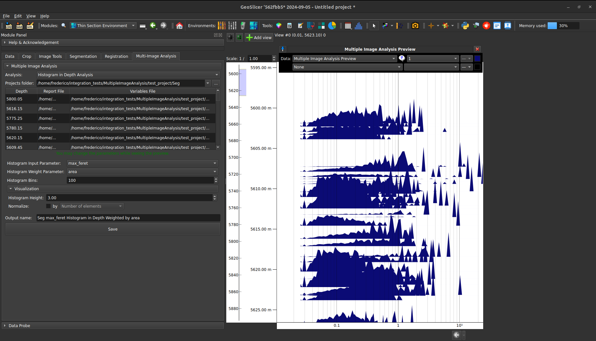
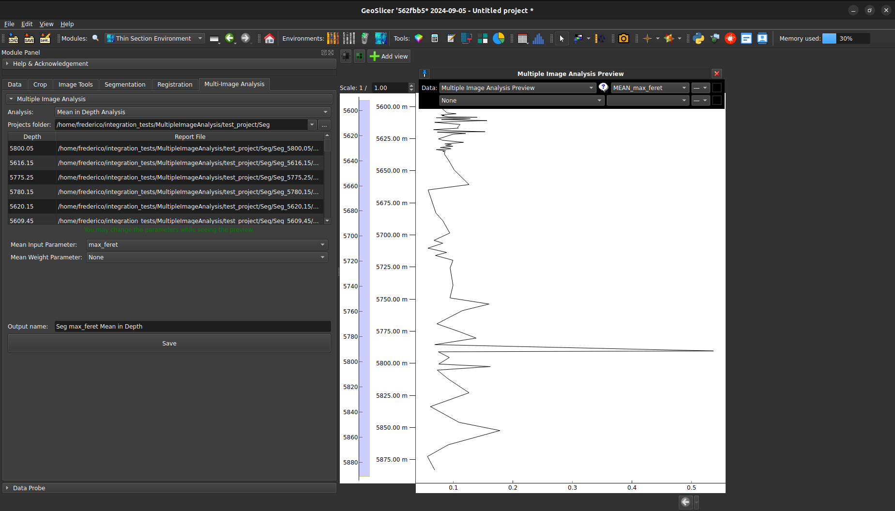
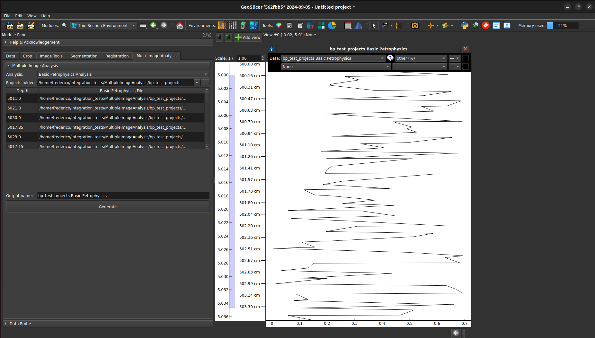

# Multiple Image Analysis

Create various types of analysis from datasets included in multiple GeoSlicer projects. To use it, provide a directory path containing multiple GeoSlicer project folders. The included project folders must conform to the following pattern:

`<TAG>_<DEPTH_VALUE>`

### Example Directory Structure

- **Project Folder**
    - `TAG_3000,00m`
        - `TAG_3000,00m.mrml`
        - **Data**
    - `TAG_3010,00m`
        - `TAG_3010,00m.mrml`
        - **Data**

## Analyses

### 1. Histogram by Depth

Generates a histogram curve for each depth value, based on a specific parameter from the 'Segment Inspector' plugin report.

|  |
|:-----------------------------------------------:|
| Figure 1: Histogram by Depth analysis interface. |

#### Configuration Options

- **Histogram Input Parameter**: Defines the parameter used to create the histogram.
- **Histogram Weight Parameters**: Defines the parameter used as weight in the histogram.
- **Histogram Bins**: Specifies the number of bins in the histogram.
- **Histogram Height**: Adjusts the visual height of the histogram curve.
- **Normalize**: Applies normalization to the histogram values. Normalization can be based on the number of elements or on one of the parameters available in the Segment Inspector report (e.g., Voxel Area, ROI Area).

### 2. Mean by Depth

Calculates the mean value for each depth based on a specific parameter from the 'Segment Inspector' plugin report.

#### Configuration Options

- **Mean Input Parameter**: Defines the parameter to be analyzed.
- **Mean Weight Parameters**: Defines the parameter used as weight during the analysis.

|  |
|:-----------------------------------------------:|
| Figure 2: Mean by Depth analysis interface. |

### 3. Basic Petrophysics

Generates a table that includes parameters related to the Basic Petrophysics method of the 'Segment Inspector' plugin, organized by depth value.

|  |
|:-----------------------------------------------:|
| Figure 3: Basic Petrophysics analysis interface. |