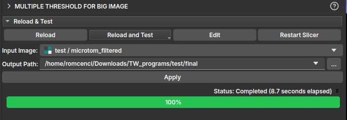

## Multiple Threshold

This module is used to segment a sample loaded via Big Image mode from a manual segmentation by [Multiple Threshold](/Volumes/Segmentation/Segmentation.md#multiple-thresholds).

To use this feature, first load the reduced image from the **[Large Image Loader](/Volumes/BigImage/BigImage.md)** module. Once loaded, navigate to the module in **[Manual Segmentation](/Volumes/Segmentation/Segmentation.md#manual-segmentation)** and click the *Multiple threshold* icon. After selecting the *thresholds* and performing the segmentation on the reduced image, click *Apply to full volume*. This should redirect to the current module's page, where the output path to save the result will be chosen.

