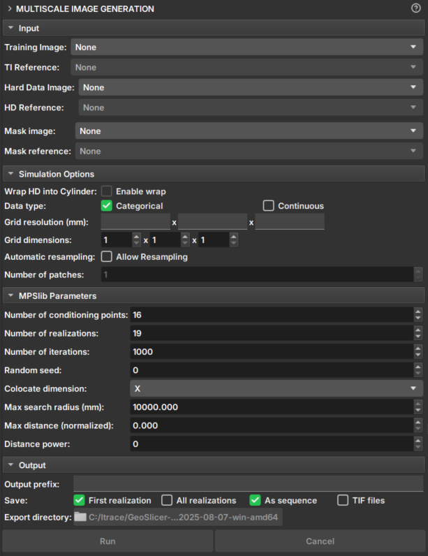

## Image Generation

The Multiscale Image Generation module offers an interface with various parameters for manipulating and configuring the MPSlib library. MPSlib features a set of algorithms based on multiple point statistical (MPS) models inferred from a training image.
Currently, only the Generalized ENESIM algorithm with direct sampling (DS) mode is available.

### Panels and their use

|  |
|:-----------------------------------------------:|
| Figure 1: Multiscale Image Generation Module. |

#### Input Data

 - _Training Image_: Volume that acts as a training image.

 - _Hard Data Image_: Volume that acts as "Hard Data", where values and points are fixed during the simulation.

 - _Mask Image_: Volume that acts as a mask for selecting the simulation area. Unselected segments will not be included in the simulation.

#### Simulation Options

 - _Wrap HD into cylinder_: If the "Hard Data" is a well image (2D), this option causes the image to be considered a cylinder and performs simulations as 3D.

 - _Data type_: Determines whether the data type is continuous or categorical. Segmentations and Labelmaps can be used for discrete and continuous simulations, but scalar volumes can only be used for continuous.
   - Categorical: Segmentations control regions and determine the class value of the Hard Data and Training Image volume. Unselected segments will be disregarded.
   - Continuous: Segmentations control which regions and volume values will be used as Hard Data or training data. Unselected segments will be disregarded.

 - _Grid Resolution_: Voxel resolution of the resulting image (mm).

 - _Grid Dimensions_: Dimensions of the resulting image.

 - _Automatic resampling_: Activates the automatic resizing functionality of the input data to the simulation grid's dimension and resolution. If the image is an imagelog, Y-axis resizing is disabled.
    - _Spacing_: New axis resolution after resizing.
    - _Size_: New axis dimension after resizing.
    - _Ratio_: Ratio of the new voxel resolution to the initial resolution.

#### Parameters

 - _Number of Conditioning points_: Number of conditioning points to be used in each iteration.
 
 - _Number of realizations_: Number of simulations and images to be generated.

 - _Number of iterations_: Maximum number of iterations when searching the training image.

 - _Random seed_: Initial value used to start the simulation. The same seed with the same parameters always generates the same result.

 - _Colocate dimensions_: For a 3D simulation, ensure that the order in the last dimensions is important, allowing a 2D co-simulation with conditional data in the third dimension.

 - _Max search radius_: Only conditional data within a defined radius is used as conditioning data.

 - _Max distance (normalized)_: The maximum distance that will lead to the acceptance of a conditional model match. If the value is 0, a perfect match will be sought.

 - _Distance power_: Weights the conditioning data based on the distance from the central values. A value of 0 configures no weighting. 

#### Output Options

 - _Output prefix_: Name of the generated volume or file. In case of multiple realizations, a number is added to indicate the realization.

 - _Save_: Options for saving the results.
   - _First realization_: Saves only the first realization as an individual volume.
   - _All realizations_: Saves all realizations as individual volumes.
   - _As sequence_: Saves the realizations in a sequence set. The "_proxy" output volume indicates it is a sequence and has the controllers for visualizing the realizations.
   - _TIF files_: Saves all realizations as tiff files.

 - _Export directory_: Directory where the tiff files will be saved. It is only enabled if the "TIF files" option is selected.

#### Buttons

- _Run_: Executes the mps sequentially. The _Geoslicer_ interface is locked during the execution of this option.
- _Run Parallel_: Executes the mps in parallel. In this option, the execution runs in another thread, and the interface can be used during execution.
- _Cancel_: Interrupts the simulation execution. Only when executed in parallel.