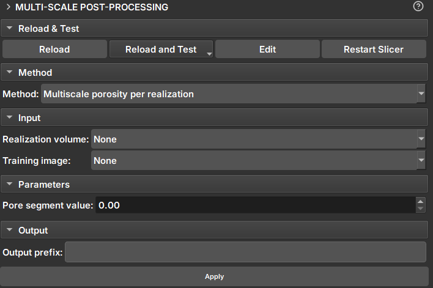

## Post Processing

Module for data extraction after Multiscale simulation.

|  |
|:-----------------------------------------------:|
| Figure 1: Multiscale Post Processing Module. |

### Methods

#### Porosity per Realization
Produces a table with the porosity percentage of each slice of a volume, across all volumes in a sequence.
##### Input Data and Parameters
1. _Result Volume_: Volume for porosity calculation. If the volume is a proxy for a sequence of volumes, porosity will be calculated for all realizations.
2. _Training Image_: Extra volume included in the calculations and added to the table as a reference.
3. _Pore segment Value_: Value to be considered as a pore in scalar volumes (continuous data)
4. _Pore segment_: Segment to be considered as a pore in Labelmaps (discrete data).

 

#### Pore Size distribution
Recalculates the distribution of pore size for frequency.
##### Input Data and Parameters
1. _PSD Sequence Table_: Table or proxy of sequence of tables resulting from the Microtom module.
2. _PSD TI Table_: Table result from microtom for the training image.