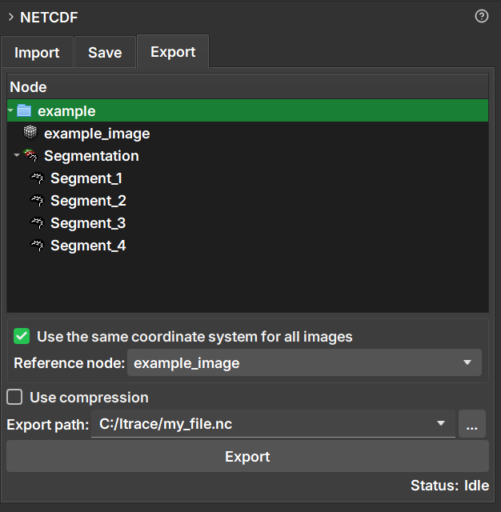

### NetCDF Export

The **Export** tab allows you to save one or more scene items (volumes, segmentations, tables) into a **new** NetCDF (`.nc`) file. It is the ideal tool to create a new dataset from results generated or modified in GeoSlicer.

#### How to Use

1.  Navigate to the **NetCDF** module and select the **Export** tab.
2.  In the data hierarchy tree displayed in the module, select the items you wish to export. You can select individual items (such as volumes or tables) or entire folders to export all their content.
3.  Choose the destination path and the name of the new file in the **Export path** field.
4.  Configure the export options as needed (detailed below).
5.  Click the **Export** button.

#### Export Options

-   **Use the same coordinate system for all images:**
    -   When checked, this option ensures that all exported images are spatially aligned. Images are resampled to fit a common coordinate system, defined by the **Reference node**.
    -   This is useful for ensuring alignment, but it can increase the file size if images have very different orientations or spacings, due to the need for _padding_.
    -   If unchecked, each image is saved with its own coordinate system, which can result in a smaller file.

-   **Reference node:**
    -   Enabled only when the option above is checked.
    -   Select an image (volume) that will serve as a reference for the coordinate system. All other images will be aligned to this one.

-   **Use compression:**
    -   When checked, applies compression to the data, which reduces the final file size.
    -   Compression can make the process of saving and loading the file slightly slower.

#### Difference between Export and Save

-   **Export** always creates a **new** `.nc` file.
-   **Save** modifies an **existing** `.nc` file that was previously imported.