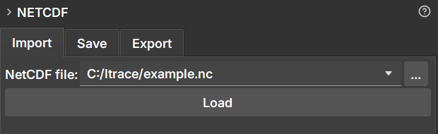

### NetCDF Import

The **Import** tab is used to load data from NetCDF (`.nc`) or HDF5 (`.h5`, `.hdf5`) files into GeoSlicer.

#### How to Use

1.  Navigate to the **NetCDF** module and select the **Import** tab.
2.  Click the file selection button next to "NetCDF file:" to open the file explorer.
3.  Select the `.nc`, `.h5`, or `.hdf5` file you want to load.
4.  Click the **Load** button.

#### Behavior

When loading a file, GeoSlicer creates a new folder in the data hierarchy with the same name as the file. All volumes, segmentations, and tables contained within the NetCDF file are loaded into this folder.

This project folder is linked to the original file. This linking is essential for the **Save** functionality, which allows updating the original file with new data generated in GeoSlicer.