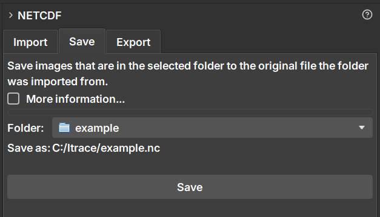

### Save Data to an Existing NetCDF File

The **Save** tab offers a way to update a NetCDF file (`.nc`) that was previously imported into GeoSlicer. It allows you to add new items (such as volumes, segmentations, or tables) from a project folder back to the original file, modifying it directly.

The main motivation for using the **Save** functionality is to be able to save changes or new data (such as a newly created segmentation) back to the original NetCDF file, **preserving all existing attributes, metadata, and coordinate structure**. Unlike the "Export" option, which creates an entirely new file, "Save" only appends the new data, ensuring that consistency with the original file is maintained. This is ideal for iterative workflows where you enrich an existing dataset without losing the original context.

#### How to Use

The **Save** functionality is designed for a specific workflow:

1.  First, **import** a NetCDF file using the **Import** tab. This will create a project folder in the data hierarchy.
2.  Work on your project. You can, for example, create a new segmentation for a volume that was in the file or drag a new volume into the project folder.
3.  Navigate to the **NetCDF** module and select the **Save** tab.
4.  In the **Folder** field, select the project folder that corresponds to the file you want to update.
5.  The **Save as:** field will be automatically populated with the original file path, confirming where the changes will be saved.
6.  Click the **Save** button.

#### Behavior

-   The operation **modifies the original file**. It is recommended to create a backup if you need to preserve the file's previous state.
-   Only **new** items within the project folder that do not yet exist in the `.nc` file will be added.
-   Items that were already in the file **are not overwritten or deleted**.
-   Newly added images are automatically resampled to align with the coordinate system of the data already existing in the file.

#### Difference between Save and Export

-   **Save** modifies an **existing** `.nc` file, preserving its structure and metadata.
-   **Export** always creates a **new** `.nc` file.