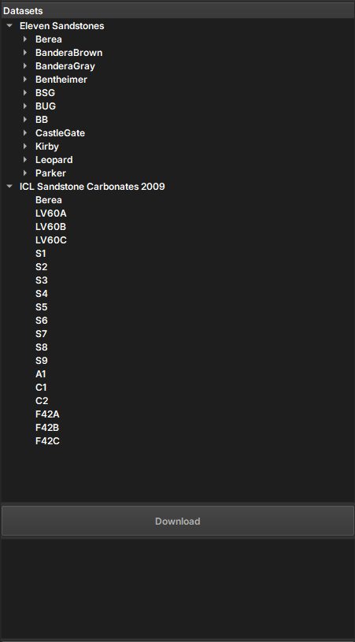

## Open Data Rocks

The Open Data Rocks module allows access to digital rock images typically acquired using three-dimensional imaging techniques. The module uses the **[drd](https://github.com/LukasMosser/digital_rocks_data)** library by Lukas-Mosser to access microtomography data from various geological sources, including the **[Digital Rocks Portal](https://www.digitalrocksportal.org/)** and **[Imperial College London](https://www.imperial.ac.uk/earth-science/research/research-groups/pore-scale-modelling/micro-ct-images-and-networks/)**. It allows the download and extraction of important datasets, such as Eleven Sandstones and ICL Sandstone Carbonates, facilitating processing and saving in NetCDF format for later analysis.

### Panels and their Use

|  |
|:-----------------------------------------------:|
| Figure 1: Presentation of the Auto Registration module. |

#### Main Options
 
 - _Datasets_: Choose from the images available for download

 - _Download_: start the download of the selected sample

 - _Feedback Panel_: Information about the download process is returned through this panel