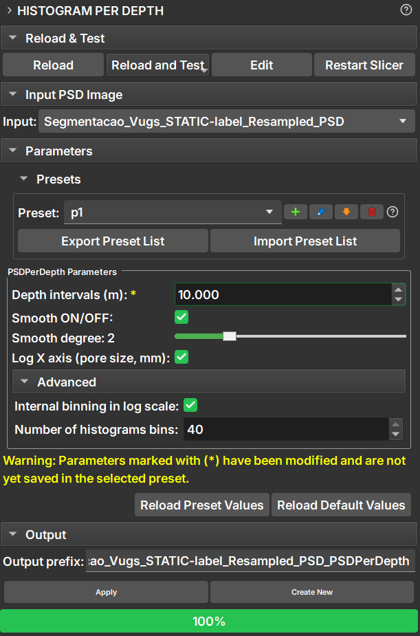
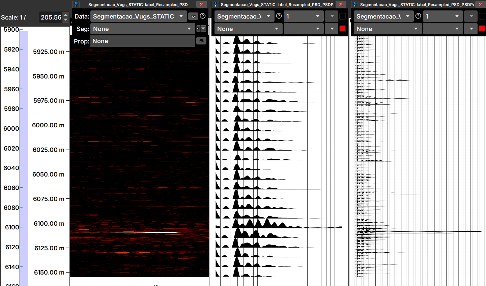

## Histograms Per Depth

The *Histograms Per Depth* allows, starting from the output image of the Histograms Per Depth – where the value of each pixel represents the pore size at that position – to visualize the pore size distribution in the form of a series of histograms arranged along the depths.

### Panels and their use

|  |
| :-----------------------------------------------: |
|  Figure 1: Presentation of the Histograms Per Depth module.  |

#### The interface of the Histograms Per Depth module is orgabized as follows:

1. **Input:**
    
    - **Input PSD Image:** - Output image from the Image Log PSD module – where the value of each pixel represents the pore size at that position. When selecting an image, it is automatically opened in a new view if it is not already being displayed (left image in _Figure 2_).
.

2. **Parameters:**
    
    - __Presets__: Different combination of parameters (depth intervals, number of bins, horizontal scale) can be saved and loaded as presets
    - __Depth intervals (m)__: The depth thickness over which each histogram will be computed. For example, If an input image has 10m and Depth Intervals was set to 2m, the calculation will result in 5 histograms - the first covering 0-1m, the second 2-3m, ..., till 8-9m.
    - __Smooth ON/OFF__: Optional application of a Savitzky-Golay filter to smooth the histograms
    - __Smooth degree__: How much the histograms will be smoothed
    - __Log X axis (pore size, mm)__: Toggles the histograms visualization between linear and logarithmic horizontal scale

    Advanced (change these with caution):

    - __Internal binning in log scale__: For a geometric reason, the distribution of pore sizes is more diverse for smaller values (lots of small circles occupy the same area of a big circle...).  This is why the pore sizes are, by default, distributed logarithmically, leading to better resolution at small pore sizes.
    - __Number of histogram bins__: This controls the horizontal resolution of the histograms - the more bins, the higher the resolution. The horizontal axis represents the pore sizes in mm. Increasing this number beyond the default makes the calculation slower.
    
    - __Reload Preset Values__: Restore the values of the Parameters to those of the current selected Preset
    - __Reload Default Values__: Restore the values of the Parameters the moddule's default ones

3. **Output:**

    Defines the prefix for the output node. By default, the prefix receives the same name as the input segmentation node with the suffix `_PSDPerDepth`.

### Output

|  |
| :-----------------------------------------------: |
|  Figura 2: In the center view, the Result of a Histogram Per Depth calculation, displayed as histograms. At right, another view, generated via Create New button (from this point on, this view will be updated at every parameter change, while the center view will remain as is). On the left view we see the input PSD image.  |

After successful execution, the module will generate and display in a new view an image consisting of a series of histograms (_Figure 2_, at center), according to the parameters defined in the module. Every change on a parameter automatically triggers the recalculation of the histograms.

Clicking _Create New_ generates a new view of histograms. From this point on, changes in parameters will be applied only to this new view - allowing the user to make comparisons.