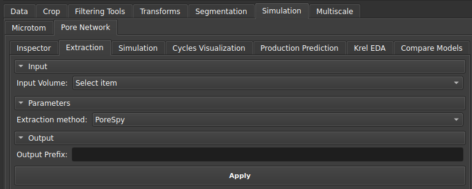
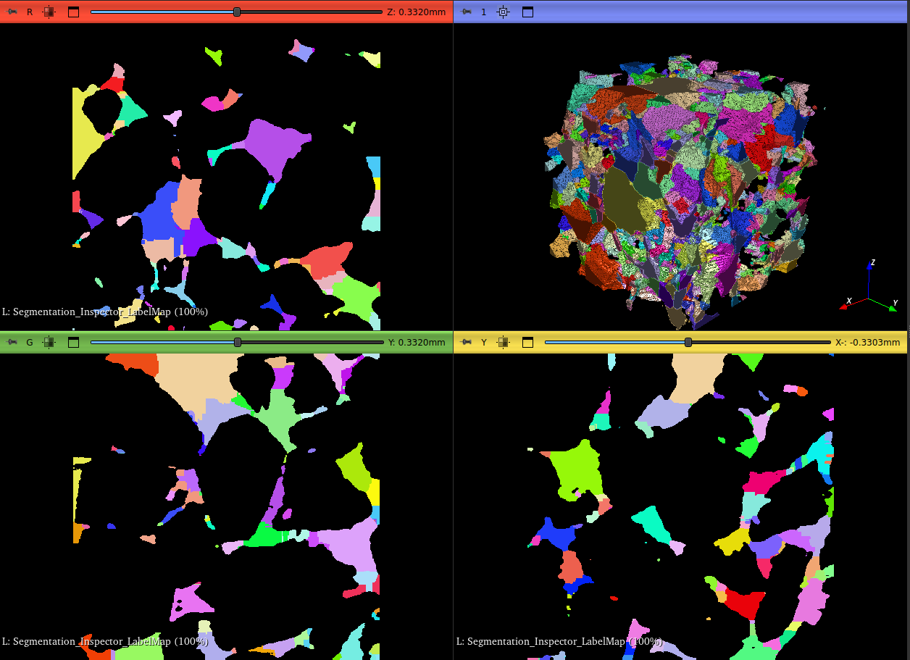
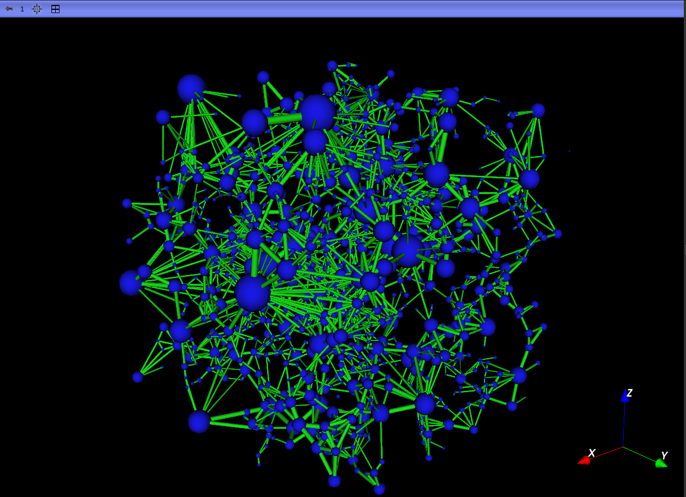
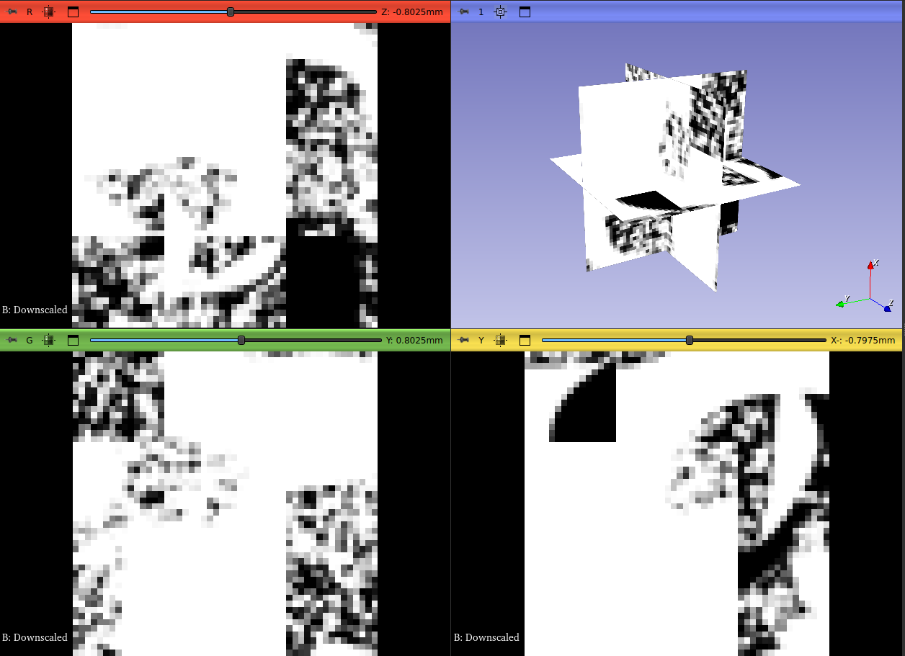
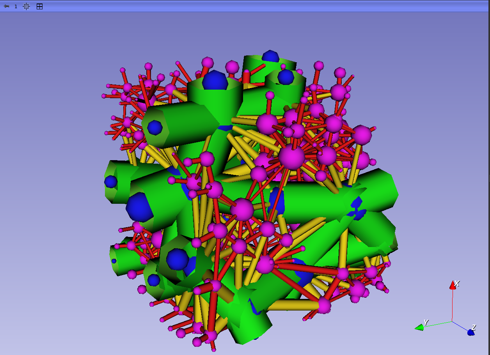

## Extractor

This module is used to extract the pore and bond network from: an individualized segmentation of pores (_Label Map Volume_) performed by a _watershed_ algorithm, generating a uniscalar network; or from a porosity map (_Scalar Volume_), which will generate a multiscalar model with resolved and unresolved pores.

|  |
|:-----------------------------------------------------------------------:|
| Figure 1: Extraction Module Interface. |

After extraction, the following will be available in the GeoSlicer interface: the pore and throat tables, as well as the network visualization models. The generated tables will be the data used in the subsequent simulation step.

| { width=50% }{ width=50% } |
|:-----------------------------------------------------------------------:|
| Figure 1: On the left, the Label Map used as input for extraction, and on the right, the extracted uniscalar network. |

| { width=50% }{ width=50% } |
|:-----------------------------------------------------------------------:|
| Figure 2: On the left, the Scalar Volume used as input for extraction, and on the right, the extracted multiscalar network, where blue represents resolved pores, and pink represents unresolved pores. |

**Color Scale:**

**Spheres (Pores):**

*    **Blue** - Resolved pore
*    **Magenta** - Unresolved pore

**Cylinders (Throats):**

*    **Green** - Throat between resolved pores
*    **Yellow** - Throat between a resolved and an unresolved pore
*    **Red** - Throat between unresolved pores