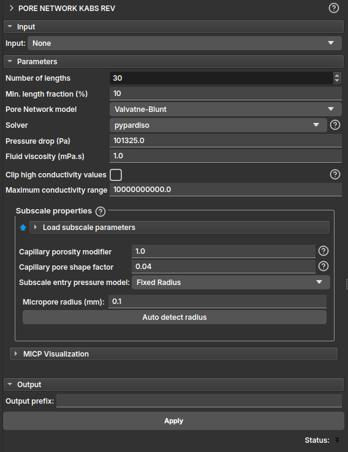

## Kabs REV

The **Pore Network Kabs REV** module allows to perform single-phase (absolute permeability) simulations in multiple volume slices using the pore network.

It can be used to evaluate the quality in predicting the absolute permeability measurement, in order to discover what minimum volume size is needed to suppress the error due to finite size.

- **Input**: Expects as input a porosity map generated from the Microporosity module by [segmentation](/Volumes/Microporosity/Microporosity.md#porosity-map-via-segmentation). If the input is a porosity map, it will consider the multi-scale model. It is also allowed for the input to be a LabelMap generated through the [Segment Inspector](/Volumes/Segmentation/Segmentation.md#segment-inspector) module, in which case a single-scale model will be considered, and the Subscale properties field can be ignored.

### Parameters (Parameters)

- **Number of lengths**: number of length samples (or slices) to be considered in the simulation;
- **Min. length fraction (%)**: minimum length fraction, in percentage, for defining the slices;

The other parameters are equivalent to those of the module that performs absolute permeability simulation. Read more in the [PNM Simulation](/Volumes/PNM/PNM.md#one-phase) module.