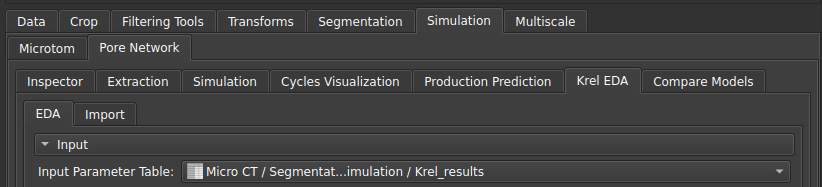
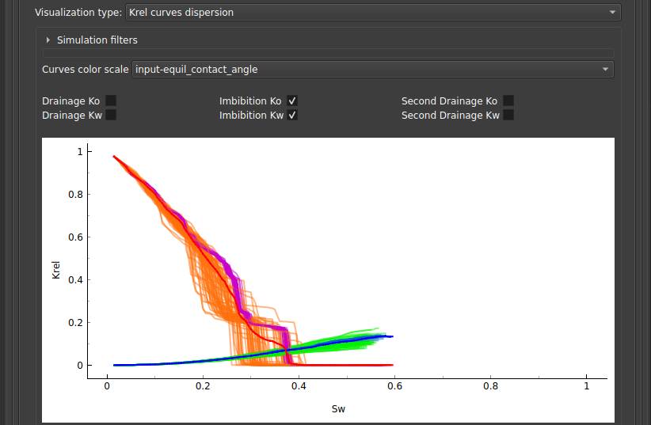
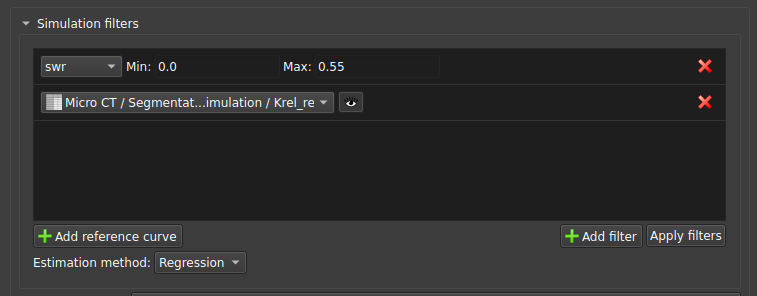
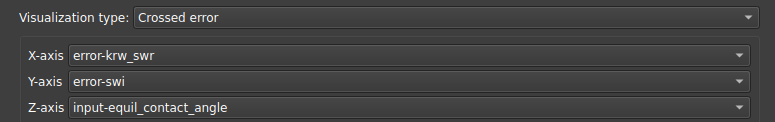
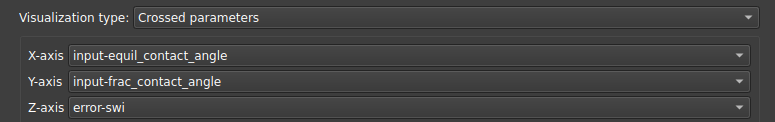
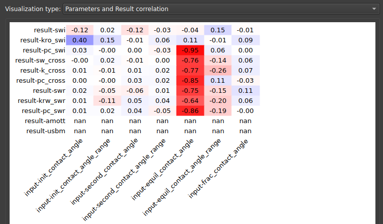
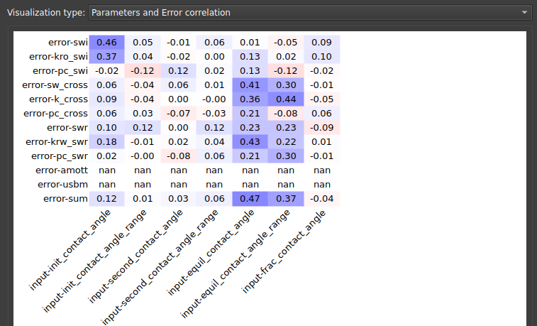
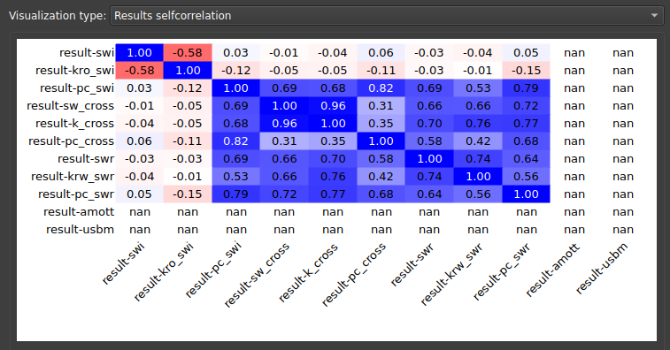
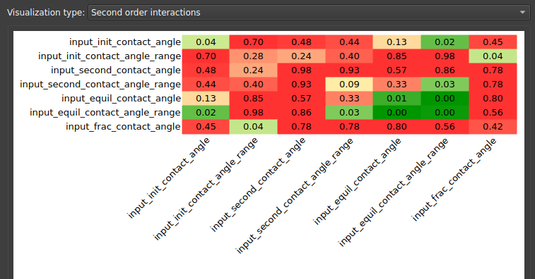
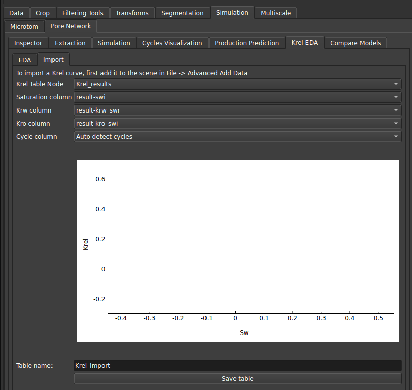

## Krel EDA

### EDA

To facilitate the analysis of the simulation set and understand how the different parameters affect the obtained results, the Krel EDA module was created.

After running several simulations using the [Pore Network Simulation](/Volumes/PNM/PNM.md#two-phase) module, the user can input the table with the results obtained from that module, in order to visualize the curve cloud graphs, and also perform post-processing of their results.

|  |
|:-----------------------------------------------------------------------:|
| Figure 1: Krel EDA module input. |

Various tools have been created to facilitate these analyses using interactive graphs.

#### Krel curves dispersion

By selecting "Krel curves dispersion" as the visualization type, the dispersion graph of the krel curves from various simulations will be shown, along with their respective average.

It is possible to choose, using the selector boxes located just above the graph, which types of curves will be shown: drainage or imbibition curves and water and oil curves separately.

|  |
|:-----------------------------------------------------------------------:|
| Figure 2: Krel curve cloud. |

To understand how these curves are distributed according to certain parameters, a color scale for the curves can be selected under "Curves color scale".

##### Filtering and adding reference curves

It is also possible to filter the curve cloud to show only a subset of the data using the collapsible section named "Simulation filters":

|  |
|:-----------------------------------------------------------------------:|
| Figure 3: Filtered Krel curve cloud with a reference curve. |

There, it is possible to add a filter based on a parameter, and also add a reference curve, which could be experimental data, for example, for comparison.

#### Crossed error

This visualization type is suitable for comparing the correlation between measurement errors and a parameter indicated by the color scale. The interface allows selecting which measurement error will be on the x and y axes, and also which parameter will be indicated on the color scale.

|  |
|:-----------------------------------------------------------------------:|
| Figure 4: Crossed error visualization parameters. |

#### Crossed parameters

This visualization type serves to compare the correlation between parameters and the error indicated by the color scale. The interface allows selecting which parameter will be placed on the x and y axes, and also which error will be indicated on the color scale.

|  |
|:-----------------------------------------------------------------------:|
| Figure 5: Crossed parameters visualization parameters. |

#### Parameters and Result correlation

In this visualization, the user can check the correlations between the simulation results and the parameters entered into the algorithm, thus identifying which parameters most affect the results.

|  |
|:-----------------------------------------------------------------------:|
| Figure 6: Correlation between parameters and results. |

#### Parameters and Error correlation

Similarly, one might want to look at the correlations between simulation parameters and errors. This visualization type demonstrates this correlation matrix.

|  |
|:-----------------------------------------------------------------------:|
| Figure 7: Correlation between parameters and errors. |

#### Results self-correlation

To understand how the results correlate with each other, i.e., how permeability is affected by saturation or pressure obtained in the simulation, one can look at the results' self-correlation matrix, presented in this visualization.

|  |
|:-----------------------------------------------------------------------:|
| Figure 8: Results self-correlation matrix. |

#### Higher order interactions

In statistical analysis, we might also want to understand the correlation reliability coefficients, which represent higher-order interactions than correlation. Three types of visualizations are available to interpret these higher-order dependencies: "Second order interactions", "Second order interactions list", "Third order interactions list".

|  |
|:-----------------------------------------------------------------------:|
| Figure 9: Second-order interactions. |

### Import

The Import tab can be used to bring in results from an experimental table (for example) with krel curves. By selecting the columns corresponding to saturation, water permeability, oil permeability, and the cycle, the user can save a table to be used in the EDA module.

|  |
|:-----------------------------------------------------------------------:|
| Figure 10: Import Tab. |
