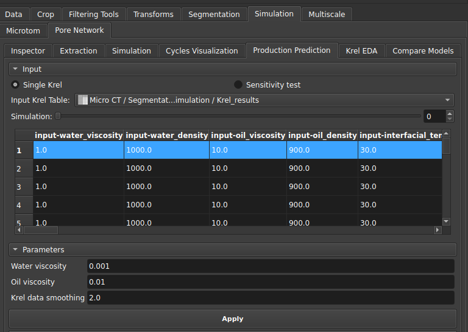
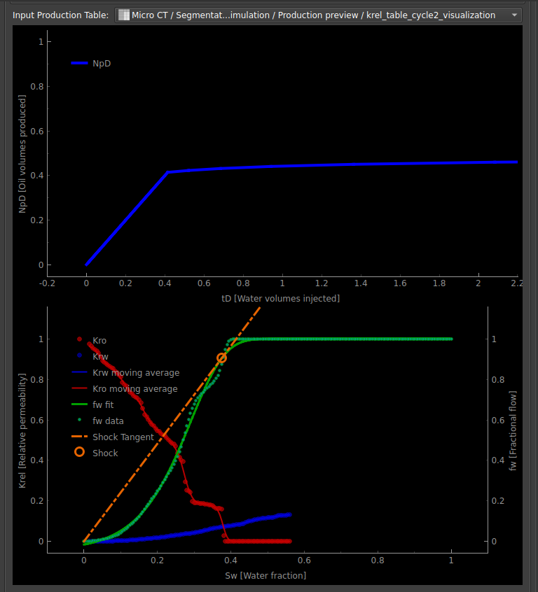
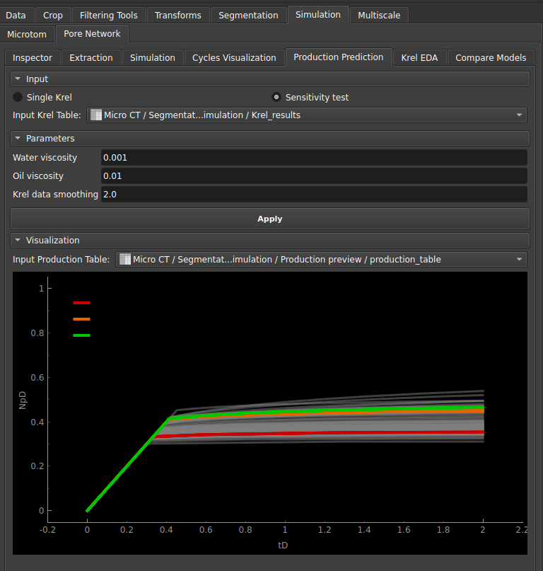

## Production Prediction

This module can be used to estimate the amount of oil that can effectively be extracted for a given sample from the relative permeability curve, using the Buckley-Leverett equation.

### Single Krel

The first available option uses the relative permeability curve constructed for a single two-phase simulation.

|  |
|:-----------------------------------------------------------------------:|
| Figure 1: Production module parameters. |

In the interface, in addition to the table with the simulation results, the user can choose the water and oil viscosity values that will be used in the estimation, as well as a smoothing factor for the krel curve.

|  |
|:-----------------------------------------------------------------------:|
| Figure 2: Production estimation curve for single simulation. |

The generated graphs then correspond to the oil production estimation curve (in produced volume) based on the amount of water injected. And below, the relative permeability curve with an indication of the estimated shock wave.

### Sensitivity test

The other option can be used when multiple relative permeability curves are generated.

In this case, a cloud of curves will be generated and the algorithm also calculates the predictions: optimistic, pessimistic, and neutral.

|  |
|:-----------------------------------------------------------------------:|
| Figure 3: Production estimation curve for the sensitivity test. |