## Simulation

This module can perform different types of simulations based on the results of the pore and connection table (created in the [Extraction] module). The simulations include: [_One-phase_](/Volumes/PNM/PNM.md#one-phase), [_Two-phase_](/Volumes/PNM/PNM.md#two-phase), [_Mercury injection_](/Volumes/PNM/PNM.md#mercury-injection), explained in the following sections.

All simulations have the same input arguments: The pore table generated from the network extraction and, when the volume is multiscale, the [subscale model](/Volumes/PNM/PNM.md#subscale-model) used and its parameterization.

| 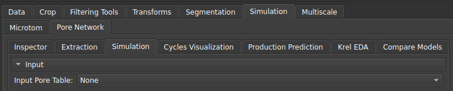                               |
|:----------------------------------------------------------------------------:|
| Figure 1: Input of the pore table generated with the [Extraction](/Volumes/PNM/PNM.md#extractor) module. |

### _One-phase_

The one-phase simulation is mainly used to determine the absolute permeability ($K_{abs}$) property of the sample. 

| 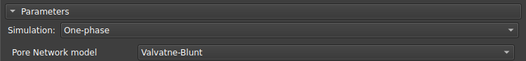                               |
|:----------------------------------------------------------------------------:|
| Figure 2: Single-phase simulation. |

Three different solvers can be used for this type of simulation:

- pypardiso (recommended): yields the best results, converging even in situations with very discrepant radii;
- pyflowsolver: includes an option to select the stopping criterion, but with lower performance than pypardiso;
- openpnm: the most traditionally used option;

| 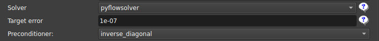                               |
|:----------------------------------------------------------------------------:|
| Figure 3: Pyflowsolver option and stopping criterion. The other options (pypardiso and openpnm) do not have this criterion. |

When the conductivity values are very different for the same sample, and this sample percolates more through the subscale, we may have problems converging to the solution. Because of this, we added an option to limit the values at high conductivities.

| 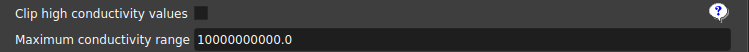                               |
|:----------------------------------------------------------------------------:|
| Figure 4: Options for limiting conductivity values. |

In addition, single-phase simulation can be performed in a single direction or in multiple directions using the Orientation scheme parameter.

| 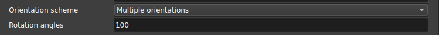                               |
|:----------------------------------------------------------------------------:|
| Figure 5: Orientation scheme used. |

### _Two-phase_

The two-phase simulation consists of initially injecting oil into the sample and increasing its pressure so that it invades virtually all pores, in a process known as drainage. After this first stage, the oil is replaced with water and the pressure is increased again to allow the water to invade some of the pores that were previously filled with oil, expelling the latter. This second process is known as imbibition. By measuring the permeability of the rock in relation to absolute permeability, as a function of water saturation during this process, we obtain the curve known as the relative permeability curve ($K_{rel}$).

Since each rock can interact physically or chemically with oil and water in different ways, we need a fairly large variety of parameters to calibrate the results in order to model and simplify this interaction, so that we can extract some physical meaning from the rock properties from the simulation. Below, we list some parameters that can be found in the two-phase simulation available in GeoSlicer. 

Currently, we have two algorithms available in GeoSlicer to perform two-phase simulation. The first is PNFlow, which is a standard algorithm implemented in C++, and the second is an algorithm developed by LTrace in Python.

#### Save/Load parameter selection table

To facilitate the reproduction of simulations that run on the same set of parameters, the interface has options to save/load parameters from tables that are saved with the project. Thus, when calibrating the set of parameters, the user can save this information for later analysis or use these same parameters in another sample.

| 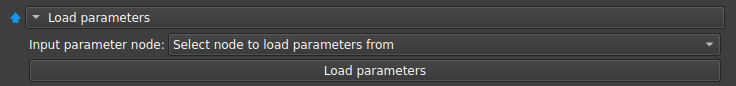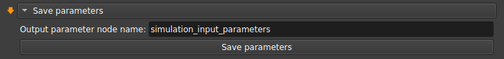                               |
|:----------------------------------------------------------------------------

#### Fluid properties

In this section, you can change the parameters of the fluids (water and oil) used in the simulation:

| 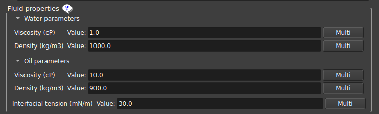                               |
|:----------------------------------------------------------------------------:|
| Figure 7: Input of fluid parameters (water and oil). |

#### _Contact angle options_

One of the main properties that affect the interaction of a liquid with a solid is wettability, which can be determined from the contact angle formed by the former when in contact with the latter. Thus, if the contact angle is close to zero, there is a strong interaction that “binds” the liquid to the solid, whereas when the contact angle is close to 180°, the interaction of the liquid with the surface is weak and it can flow more easily through it.

| 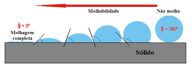                               |
|:----------------------------------------------------------------------------:|
| Figure 8: Visual representation of the concept of wettability and contact angle. |

We modeled the contact angles from two distributions used at different times: the Initial contact angle, which controls the contact angle of the pores before oil invasion; and the Equilibrium contact angle, which controls the contact angle after oil invasion. In addition to the base distributions used in each case, there is an option to add a second distribution for each of them, so that each pore is linked to one of the two distributions, with the “Fraction” parameter being used to determine what percentage of pores will follow the second distribution in relation to the first.

| 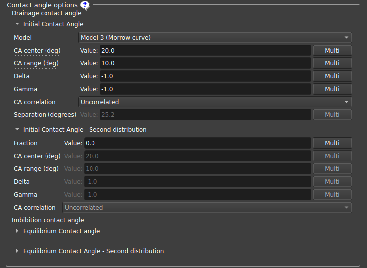                               |
|:----------------------------------------------------------------------------:|
| Figure 9: Contact angle distribution parameters. |

Each angle distribution, whether primary or secondary, initial or equilibrium, has a series of parameters that describe it:

- _Model_: allows modeling the hysteresis curves between advance/retreat angles from the intrinsic angles:

	- _Equal angles_: advance/retreat angles identical to the intrinsic angle;
- _Constant difference_: constant difference between the advance/retreat angles and the intrinsic angle;
- _Morrow curve_: advance/retreat curves determined by Morrow curves;

| 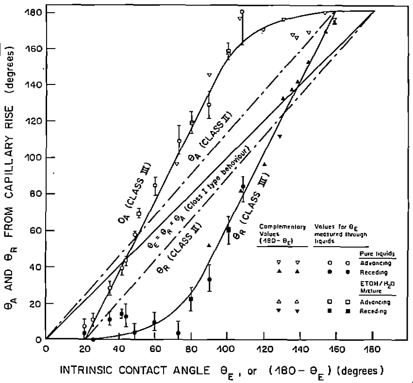{ width=50% } |
|:---------------------------------------------------------------------:|
| Figure 10: Curves for each of the contact angle models implemented in GeoSlicer. Image taken from N. R. Morrow, 1975 (https://doi.org/10.2118/75-04-04). |

- _Contact angle distribution center_: Defines the center of the contact angle distribution;
- _Contact angle distribution range_: Distribution range (center-range/2, center+range/2), with the minimum/maximum angle being 0º/180º, respectively;
- _Delta_, _Gamma_: Truncated Weibull distribution parameters; if a negative number is chosen, a uniform distribution is used; If positive numbers are chosen, it uses the following probability distribution: $p(\tilde\theta)=\frac{\gamma}{\delta}\frac{\tilde\theta^{\gamma-1}e^{-\tilde\theta^\gamma/\delta}}{1-e^{-1/\delta}}$ where $\tilde\theta\in[\theta_{min},\theta_{max}]$. Some ideas for parameters for this distribution are graphed below:

| 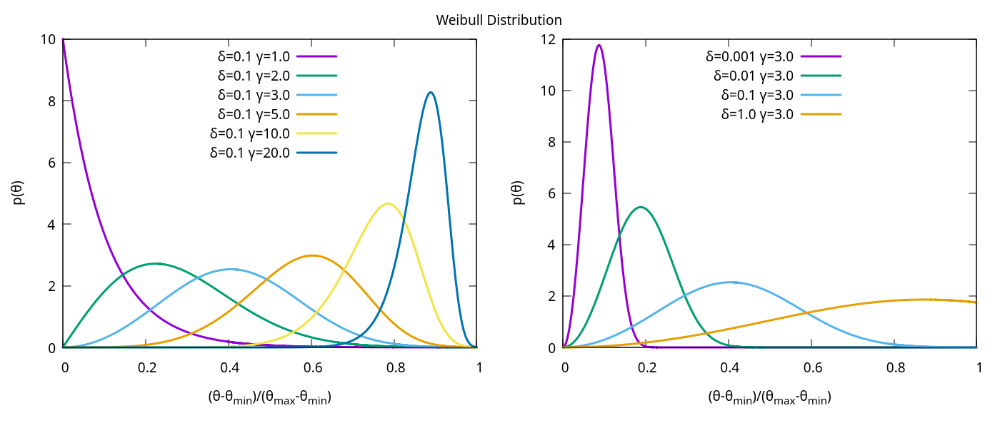{ width=50% } |
|:---------------------------------------------------------------------:|
| Figure 11: Weibull distribution. |

- Contact angle correlation: Chooses how the contact angle will be correlated to the pore radius: Positive radius defines larger contact angles for larger radii; Negative radius does the opposite, assigning larger angles to smaller radii; Uncorrelated means independence between contact angles and pore radius;
- _Separation_: If the chosen model is _constant difference_, defines the separation between advance and retreat angles;

Other parameters are defined only for the second distribution:

- _Fraction_: A value between 0 and 1 that controls which fraction of the pores will use the second distribution instead of the first; 
- _Fraction distribution_: Defines whether the fraction will be determined by the number of pores or total volume;
- _Correlation diameter_: If _Fraction correlation_ is chosen as _Spatially correlated_, defines the most likely distance to find pores with the same contact angle distribution;
- _Fraction correlation_: Defines how the fraction for the second distribution will be correlated, if spatially correlated, for larger pores, smaller pores, or random;

#### Execution Mode

The user can choose between two execution modes for running the **two-phase simulation**:

- **Local:** Runs the simulation directly on the user’s machine.  
  In this mode, the user can define the _Max subprocesses_ simulation option, which controls how many single-threaded subprocesses will run in parallel. The recommended value is about two-thirds of the total available CPU cores for optimal performance without overloading the system.

- **Remote:** Sends the simulation to be executed on a configured computing cluster.  
  In this mode, the user specifies the _Number of jobs_ into which the simulation will be divided. Ideal for very large sensitivity tests.
  The interface on the right will show the progress of the simulation, and the user can also _Open_ the partial results for inspection before completion.

| 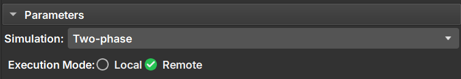 |
|:---------------------------------------------------------------------------------:|
|        Figure 12a: Execution mode selection for the two-phase simulation.         |

| 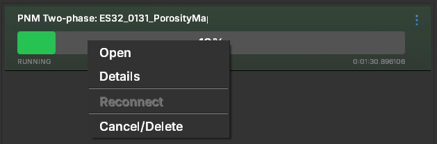 |
|:------------------------------------------------------------------------------------:|
|                               Figure 12b: Job options.                               |

This flexibility allows the user to take advantage of local processing for smaller test runs or to leverage cluster computing resources for more complex or large-scale simulations.

#### Simulation options

This section of parameters is dedicated to controlling the parameters related to the simulation itself.

| 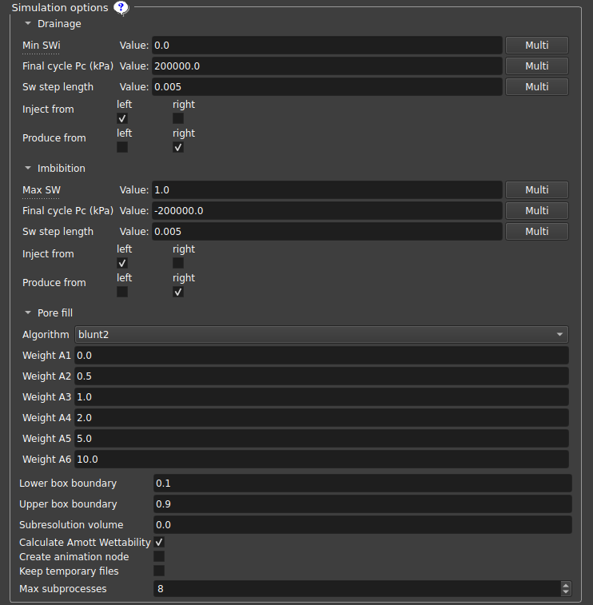 |
|:---------------------------------------------------------------------------------------:|
|                            Figure 13: Simulation parameters.                            |

- _Minimum SWi_: Sets the minimum SWi value, interrupting the drainage cycle when the Sw value is reached (SWi may be higher if water becomes trapped);
- _Final cycle Pc_: Interrupts the cycle when this capillary pressure is reached;
- _Sw step length_: Sw step used before checking the new permeability value;
- _Inject/Produce from_: Defines on which sides the fluid will be injected/produced along the z-axis; the same side can both inject and produce;
- _Pore fill_: Determines which mechanism dominates each individual pore filling event;
- _Lower/Upper box boundary_: Pores with a relative distance on the Z axis from the edge to this plane value are considered “left”/“right” pores, respectively;
- _Subresolution volume_: Considers that the volume contains this fraction of subresolution porous space that is always filled with water;
- _Plot first injection cycle_: If selected, the first cycle, oil injection into a fully water-saturated medium, will be included in the output graph. The simulation will run regardless of whether the option is selected or not;
- _Create animation node_: Creates an animation node that can be used in the “Cycles Visualization” tab;
- _Keep temporary files_: Keeps the .vtu files in the GeoSlicer temporary files folder, one file for each stage of the simulation;
- _Max subprocesses_: Maximum number of single-thread subprocesses to be executed; The recommended value for an idle machine is two-thirds of the total number of cores;
- _Number of jobs_: number jobs of into which the simulation will be divided on the cluster;

Since we have a vast number of parameters that can be modified to model the experiment from the simulation, it becomes useful to vary these parameters more systematically for an in-depth analysis of their influence on the results obtained. 

To do this, the user can select the “Multi” button available in most parameters. When clicking on Multi, three boxes appear with start, end, and step options, which can be used to run several simulations in a linearly distributed table of the values of these parameters. If more than one parameter is chosen with multiple values, simulations run with all possible parameter combinations, which can considerably increase the number of simulations and the time to execute them.

Upon completion of the simulation set, the user can perform analyses to understand the relationships between the simulation results and the parameters selected in the Krel EDA tab.

### _Mercury injection_

In addition to the one- and two-phase simulations, this module also offers a simulation of the Mercury intrusion experiment.

| 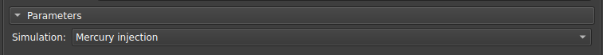                               |
|:----------------------------------------------------------------------------:|
| Figure 14: Mercury intrusion simulation. |

Mercury intrusion is an experiment in which liquid mercury is injected into a reservoir rock sample under vacuum, with increasing pressure. The volume of mercury invading the sample is measured as a function of mercury pressure. Since the contact angle of liquid mercury with mercury vapor is approximately independent of the substrate, analytical models, such as the tube bundle model, can be used to calculate the pore size distribution of the sample. 

The mercury intrusion test is relatively affordable, and its main relevance in the context of PNM lies in the ability to perform the simulation on a sample for which experimental results of Mercury Intrusion Capillary Pressure (MICP) curves are available. This allows the comparison of results to validate and calibrate the pore network extracted from the sample, which will be used in one- and two-phase simulations.

To facilitate the analysis of sub-resolution pore radius assignment, the code in GeoSlicer will produce, in addition to the graphs obtained by the simulation in OpenPNM, graphs of pore and throat radius distributions and also volume distributions, separating them into resolved pores (which are not altered by subscale assignment) and unresolved pores. This allows the user to check whether the subscale model has been applied correctly.

### <a id="subscale-model">Subscale Model</a>

In the case of a multiscale network, since the subscale radii cannot be determined from the image itself because they are outside the resolution, it is necessary to define a model for assigning these radii. Some options currently available are:

- Fixed radius: All subresolution radii are the same size as chosen in the interface.
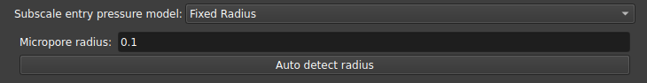

- _Leverett Function - Sample Permeability_: Assigns an inlet pressure based on the J Leverett curve based on the permeability of the sample;
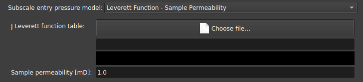

- _Leverett Function - Permeability curve_: Also uses the J Leverett curve but with a curve defined for permeability instead of a value;
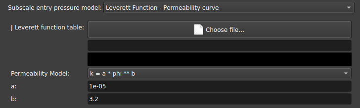

- _Pressure Curve_ and _Throat Radius Curve_: Assigns subresolution radii based on the curve obtained from a mercury injection experiment. The inlet pressure data can be used by volume fraction, or the equivalent radius can be used as a function of volume fraction;
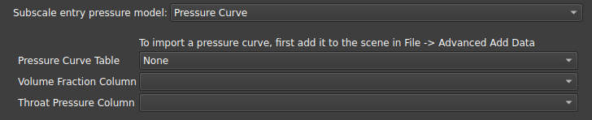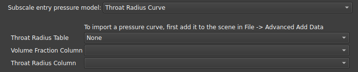

Both models require a table containing the **Incremental Pore Volume Fraction** ($\Delta S_i$). This parameter represents the portion of the total pore space that is filled with mercury during a specific pressure interval (or, equivalently, the volume associated with a specific range of throat sizes). It is obtained from the experimental Mercury Intrusion Capillary Pressure (MICP) cumulative saturation ($S_{Hg}$) by calculating the difference between consecutive points: $\Delta S_{i} = S_{Hg}(P_{i}) - S_{Hg}(P_{i-1})$. This fraction is used to weight the sub-resolution capillary functions, ensuring that the simulated mercury injection matches the experimental distribution of the sample.

The chosen subscale model has no impact on uniescalar network simulations, since all radii are already determined.  
