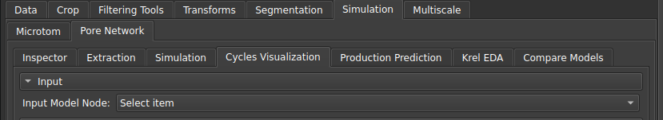
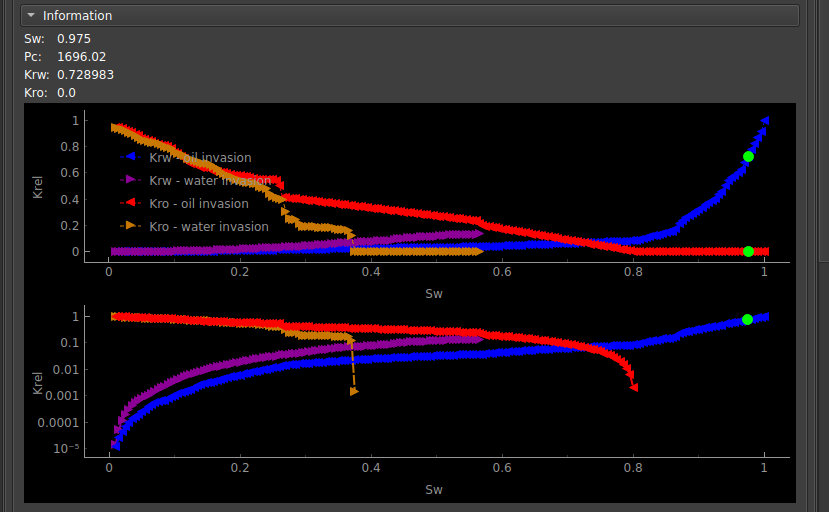
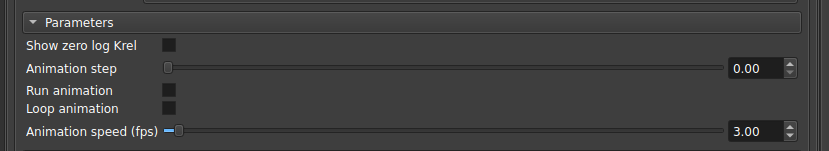

## Cycles Visualization

This module is used to control and visualize the relative permeability simulations created in the [Pore Network Simulation](/Volumes/PNM/PNM.md#two-phase) module with the "Create animation node" option activated.

|  |
|:-----------------------------------------------------------------------:|
| Figure 1: Animation node input for visualization. |

Upon selecting the animation node, a model of the pores and connections will appear in the 3D visualization with arrows in the inlet/outlet regions, indicating the direction of invasions. Additionally, the graphs in the "Information" section will show the Krel curves and some extra information.

|  |
|:-----------------------------------------------------------------------:|
| Figure 3: Relative permeability curves for the cycle. |

From the parameters section in the interface, the user can then control the animation.

|  |
|:-----------------------------------------------------------------------:|
| Figure 3: Parameter selection interface. |

- Show zero log Krel: Sets a non-zero value for points on the logarithmic scale;
- Animations step: Selects a specific time step in the animation;
- Run animation: Incrementally updates the simulation step automatically;
- Loop animation: Executes the update in a loop, returning to the beginning whenever it reaches the end;
- Animation speed: Chooses the speed of the automatic update;