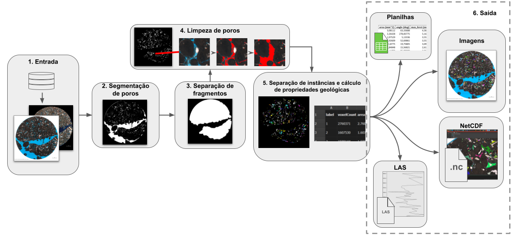
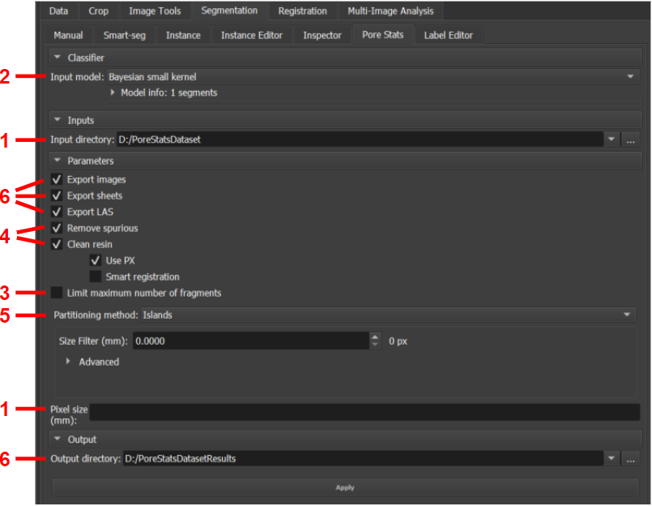
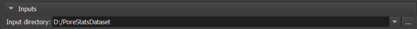
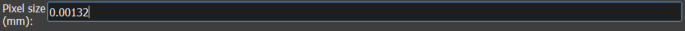
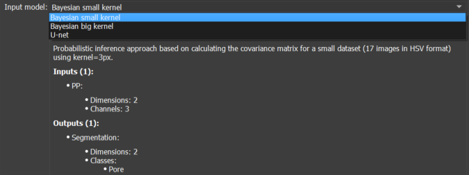
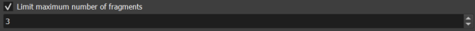
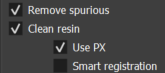
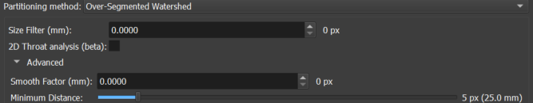
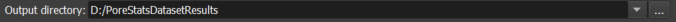
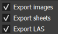

## <a id="pore-stats">Pore Stats: statistics and properties of pores and particles in thin section</a>

The _Pore Stats_ module offers features for calculating geological properties of pores in batches of rock thin section images, as well as related descriptive statistics. Given an input directory containing images related to the same well, the module is able to segment the porous region, separate the different pores, calculate different properties for each, and save reports and images summarizing the results.

### Interface and Functionality

The module is available in the _Thin Section_ environment, under the _Segmentation_ tab, _Pore Stats_ sub-tab. Figure 1 illustrates a general overview of the module's workflow, while Figure 2 shows the module's interface in GeoSlicer and, for each feature, points to the subsection of this section that describes it.

|  |
|:-----------------------------------------------:|
| Figure 1: General overview of the module's workflow. |

|  |
|:-----------------------------------------------:|
| Figure 2: *Pore Stats* module. |

#### 1. Input

The module is designed to iterate over all valid images it finds in a given input directory. An image is considered valid if the file format is PNG, JPEG, or TIFF and its name follows the pattern: `<well>_<depth-value>(-optional-index)<depth-unit>_<…>_c1.<extension>`. The `c1` suffix refers to plane-polarized (PP) images. Optionally, cross-polarized (PX) counterparts found in the same directory can also be used to assist in specific operations, and should have the `c2` suffix. An example of an input directory follows:

```
Diretório_entrada
    |__ ABC-123_3034.00m_2.5x_c1.jpg
    |__ ABC-123_3034.00m_2.5x_c2.jpg
    |__ ABC-123_3080.0-2m_c1.jpg
    |__ ABC-123_3080.0-2m_c2.jpg
    |__ ABC-123_3080.0m_c1.jpg
    |__ ABC-123_3080.0m_c2.jpg
    |__ ABC-123_3126.65m_2.5x_TG_c1.jpg
    |__ ABC-123_3126.65m_2.5x_TG_c2.jpg
```

The example describes an input directory with 4 JPEG images of well "ABC-123", corresponding to depths of 3034, 3080, and 3126.65 meters, in both PP/c1 and PX/c2 versions. Since there are two variations corresponding to the same depth (3080m), an optional index ("-2") is included in one of them. Between the depth and polarization information, some additional information may exist between *underlines* (such as "\_2.5x\_" and "\_TG\_").

In addition to the input directory, it is also necessary to specify the image scale in mm, that is, how many mm are represented by the distance between one pixel and the subsequent pixel.

The input directory can be defined using the _Input directory_ selector in the module's interface, within the _Inputs_ section of the interface. The image scale must be specified in the _Pixel size (mm)_ field, in the _Parameters_ section.

|  |
|:-----------------------------------------------:|
| Figure 3: Input directory selector. |

|  |
|:-----------------------------------------------:|
| Figure 4: mm/pixel scale field. |

#### 2. Pore Segmentation

Once an image is loaded, its porous region is segmented using the **[pre-trained models](/ThinSection/Segmentation/Segmentation.md#automatic-thin-section-segmentation)** available in GeoSlicer. In this module, 3 models are available:

* Small _kernel_ Bayesian model;
* Large _kernel_ Bayesian model;
* U-Net convolutional neural model.

Choose the model using the _Input model_ selector in the _Classifier_ section. The information box below the selector can be expanded for more details about each model.

|  |
|:-----------------------------------------------:|
| Figure 5: Pore segmentation model selector. |

#### 3. Fragment Separation

Many images have large "empty" regions, filled with pore resin, which are detected by the segmenter but do not actually correspond to the rock's porosity, but only to the region around its fragment(s) (see example in Figure 1). In some cases, not all but only the _N_ largest fragments of the rock section are of interest. To isolate the useful rock fragments, the following sequence of operations is applied:

* First, the largest fragment, corresponding to the entire area of the section, is isolated from the image edges;
* Then, all detected porosity that touches the image border is also discarded, as it is interpreted as visible pore resin around the useful rock area;
* Finally, if only the _N_ largest fragments are of interest, the size (in pixels) of each fragment of the remaining useful area is measured and only the _N_ largest are kept.

The module performs fragment separation automatically. However, it is possible to limit the analysis to the _N_ largest by checking the _Limit maximum number of fragments_ checkbox, in the _Parameters_ section, and defining the value of _N_ (between 1 and 20).

|  |
|:-----------------------------------------------:|
| Figure 6: Fragment limiter to be analyzed, from largest to smallest. |

#### 4. Pore Cleaning

This algorithm is responsible for applying two "cleaning" operations to conventional pore segmentation, which if not performed can negatively impact the final results.

**Removal of spurious pores**

Current GeoSlicer pore segmenters tend to generate spurious detections in small regions comprising rock but which, due to lighting/resolution/related effects, have a color similar to that of blue pore resin. The module executes a model capable of recognizing these detections and differentiating them from the correct ones, based on pixel values within an interval around the centroid of each segment. All detected spurious pores are discarded.

**Incorporation of bubbles and residues into the pore resin**

It is common for air bubbles and related residues to form in the pore resin. Segmenters do not detect these artifacts, not interpreting them as pore area, which influences the size and quantity of detected pores. This module aims to "clean" the resin, including these bubbles and residues into the corresponding pore body. Basically, some criteria must be met for an image region to be interpreted as a bubble/residue:

1.  <u>Having white color or blue color with low intensity and saturation</u>: generally, bubbles are white or, when covered with material, have an almost black shade of blue. Residues that eventually surround bubbles also have a low intensity blue level;
2.  <u>Touching the pore resin</u>: the transition between the resin and the artifacts is normally direct and smooth. Since the pore segmentation model accurately detects the resin region, the artifact needs to touch this region. Consequently, the current algorithm cannot detect less common cases where the artifact occupies 100% of the pore area;
3.  <u>Being barely visible in the PX/c2 image (if available)</u>: some rock elements may resemble artifacts and also be in contact with the resin. However, generally, artifacts are barely or not at all visible in PX/c2 images, while other elements are usually noticeable. This criterion is more effective the better the registration (spatial alignment) between the PP and PX images. The algorithm attempts to automatically correct image registration by aligning image centers. This step can be preceded by an operation to crop the useful rock area, discarding excess borders.

Cleaning operations are recommended, but they can take some time. Therefore, it is possible to disable them by unchecking the _Remove spurious_ checkbox for spurious pore removal and _Clean resin_ for resin cleaning, in the _Parameters_ section. If the latter is enabled, two other options are available:

*   _Use PX_ to use the PX image for criterion 3 analysis;
*   _Smart registration_ for automatic decision on whether to perform cropping before automatic registration. Not recommended if images are already naturally registered.

|  |
|:-----------------------------------------------:|
| Figure 7: Options for cleaning spurious pores and artifacts in pore resin |

#### 5. Instance Separation and Geological Property Calculation

Once the porous region is properly segmented and "cleaned", GeoSlicer's **[Partitioning](/ThinSection/Segmentation/Segmentation.md#segment-inspector)** feature is used to separate the segmentation into different pore instances and calculate the geological properties of each. The following properties are computed:

* Area (mm²);
* Angle (°);
* Maximum Feret's diameter (mm);
* Minimum Feret's diameter (mm);
* Aspect ratio;
* Elongation;
* Eccentricity;
* Ellipse perimeter (mm);
* Ellipse area (mm²);
* Ellipse: perimeter over area (1/mm);
* Perimeter (mm);
* Perimeter over area;
* _Gamma_.

Within the _Parameters_ section, choose the separation method using the _Partitioning method_ selector, between the _Islands_ option for separation by simple pixel connectivity and _Over-Segmented Watershed_ for applying the SNOW algorithm. Both options allow extra filtering of spurious detections by choosing an acceptable minimum value (_Size Filter (mm)_) for the size of the major axis (Feret's diameter) of the detection. The _watershed_ selection provides the following extra options:

*   _2D Throat analysis (beta)_: checkbox that allows including pore throat analysis in the inspection output reports;
*   _Smooth Factor (mm)_: factor that regulates the creation of more or fewer partitions. Small values are recommended;
*   _Minimum Distance_: standard minimum distance between segmentation peaks (points furthest from the edges) to be considered as belonging to different instances.

|  |
|:-----------------------------------------------:|
| Figure 8: Options for separating the porous region into different pore instances and calculating their geological properties. |

After all input parameters and options are defined, press the _Apply_ button to generate the results.

#### 6. Output

An output directory must also be specified. In it, a _pores_ sub-directory is created, within which a folder is created for each processed image, inheriting the image's name. Inside this folder, three files are created:

*   `AllStats_<image-name>_pores.xlsx`: spreadsheet containing the values of the geological properties of each detected instance;
*   `GroupsStats_<image-name>_pores.xlsx`: groups detected instances by area similarity and provides various descriptive statistics calculated on the properties of these groups;
*   `<image-name>.png`: image that highlights the detected instances in the original image by coloring them randomly.

In each sub-directory, a LAS folder is also created, containing .las files that summarize descriptive statistics of the instances for the entire well, separated by depth.

Finally, netCDF images of the results are also generated. They will be contained in the _netCDFs_ sub-directory.

Example:

```
Diretório_saída
    |__ pores
    |   |__ LAS
    |   |   |_ las_max.las
    |   |   |_ las_mean.las
    |   |   |_ las_median.las
    |   |   |_ las_min.las
    |   |   |_ las_std.las
    |   |__ ABC-123_3034.00m_2.5x_c1
    |   |   |__ AllStats_ABC-123_3034.00m_2.5x_c1_pores.xlsx
    |   |   |__ GroupsStats_ABC-123_3034.00m_2.5x_c1_pores.xlsx
    |   |   |__ ABC-123_3034.00m_2.5x_c1.png
    |   |__ ...
    |__ netCDFs
        |__ ABC-123_3034.00m_2.5x_c1.nc
        |__ ...
```

Define the output directory using the _Output directory_ selector in the _Output_ section. If it does not exist, the directory is automatically created.

|  |
|:-----------------------------------------------:|
| Figure 9: Output directory selector. |

Choose whether or not to generate the output reports using the _Export images_, _Export sheets_, and _Export LAS_ checkboxes in the _Parameters_ section. If checked, they respectively ensure the generation of the image illustrating the instances, the property and statistics spreadsheets, and the LAS files describing the well.

|  |
|:-----------------------------------------------:|
| Figure 10: Optional export of detected instance illustrations, property and statistics spreadsheets, and LAS files for statistics by depth. |