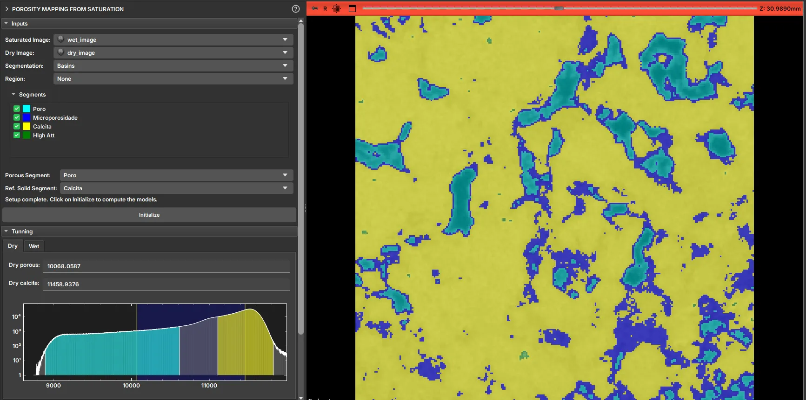

## Porosity map via saturation

This module is used to generate the porosity map for a specific sample based on the comparison between the dry and saturated sample.

The necessary inputs for using the module are:

- Dry and saturated image of the sample;

- Phase segmentation with at least two of the segments representing: the porous space and the solid;

> The dry and saturated images must be registered for this module to function properly.

Upon selecting the Segmentation, the module automatically recognizes the names "Poro" for the porous space and "Calcita" for the reference solid. However, the user can change which of the segments represents each of the phases that will be used to delimit the porosity map, with values 0 (solid) and 1 (pore). Any other unselected segments will be included in the intermediate porosity phase (grayscale).
After selecting the segments, you can click "Initialize", which will cause the module to appropriately calculate and color the histograms of the dry and saturated images. While the colors represent the segments (they will typically be delimited by straight lines if the segmentation was generated by threshold), the bars will indicate where the porosity map will be limited for values 0 and 1. Intermediate values will be scaled appropriately based on the range of the bars. Usually, the default values are already good.