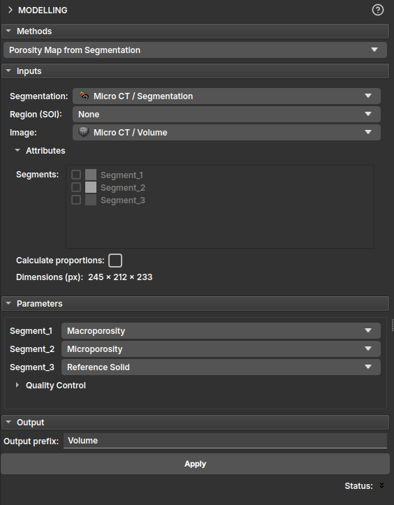

## <a id="porosity-map-via-segmentation">Porosity Map via Segmentation</a>

In this module, the porosity map can be generated from microtomography data and a segmentation performed on it. After selecting the segmentation, you can choose the classification for each segment as Macroporosity, Microporosity, Reference Solid, and High Attenuation. As a result, the algorithm will generate a porosity map where segments classified as Macroporosity will always be 1, Reference Solid and High Attenuation will be 0, and segments indicated by Microporosity will be on a grayscale between 0 and 1.

