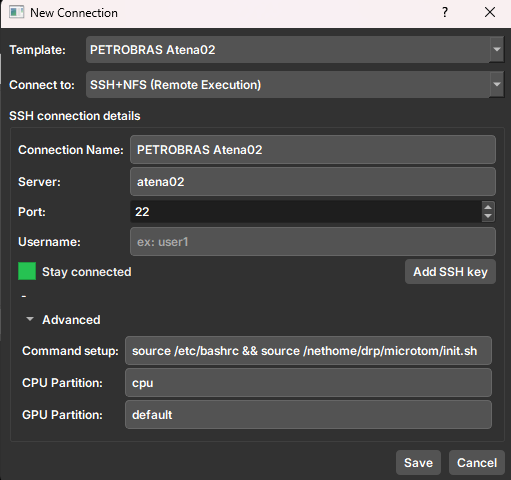
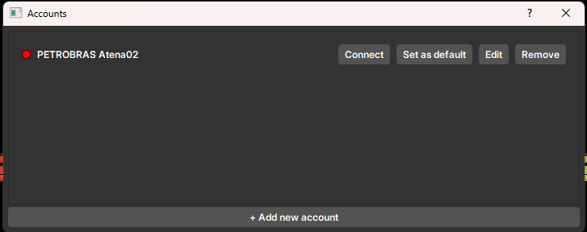
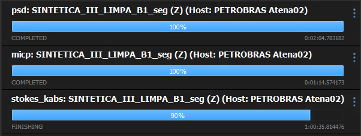

The GeoSlicer allows the user to connect to a remote account, via ssh, to access computational resources such as clusters. Currently, the implemented model is closely tied to Petrobras' execution requirements; however, any machine can be accessed by the **_Job Monitor_** module, as long as it has SSH access enabled and is accessible on the network.

## Connection

The account must be registered, as can be seen in Figure 1. The user must fill in the fields according to their access credentials. If the user has an SSH key, they can insert the path to the key by clicking on **Add Key**.

Note that the user can configure other parameters related to what will happen when the connection is established. For example, the _"Command Setup"_, which is the command executed immediately upon establishing the connection. The other parameters are specific to Petrobras' cluster.

## Accounts

Registered accounts are managed on the accounts screen, as can be seen in Figure 2. Here, the user can see which accounts are active, remove, and edit the registered accounts.

## Job Monitor

The **_Job Monitor_** module is responsible for monitoring the jobs that are being executed on the remote machine. Through it, the user can track the progress of running tasks. Currently, only tasks from the **_Microtom_** module are sent remotely. The **_Job Monitor_** is accessed through the dialogue bar, in the lower right corner.

