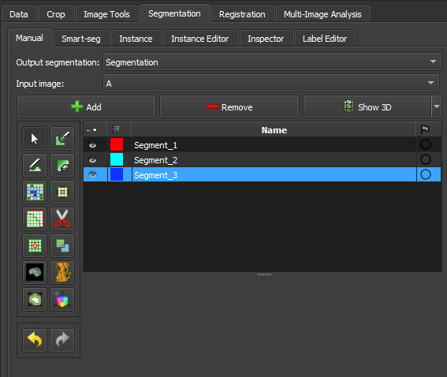
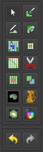
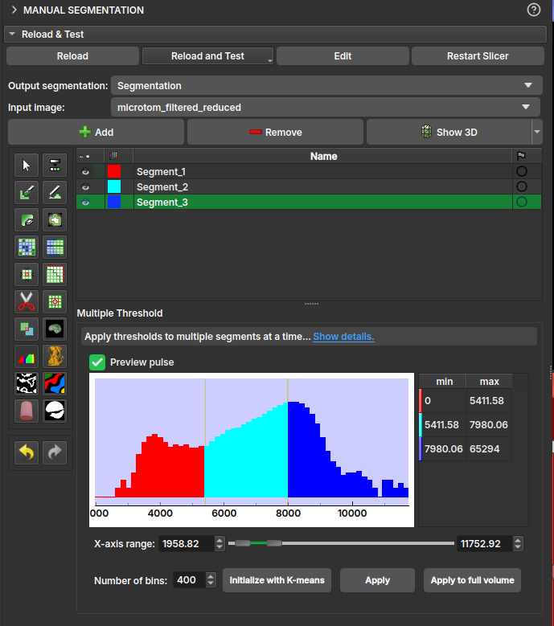

## Manual Segmentation

This module is used to specify segments (structures of interest) in 2D/3D/4D images. Some of the tools mimic a painting interface, such as Photoshop or GIMP, but operate on 3D arrays of voxels instead of 2D pixels. The module offers editing of overlapping segments, display in both 2D and 3D views, detailed visualization options, editing in 3D views, creation of segmentations by interpolation or extrapolation on some slices, and editing on slices in any orientation.

The Segment Editor does not edit labelmap volumes, but segmentations can be easily converted to/from labelmap volumes using the Explorer section and utilizing the secondary mouse button menu.

### Segmentation and Segment

The result of a segmentation is stored in the segmentation node in GeoSlicer. A segmentation node consists of several segments.

A segment specifies the region for a single structure. Each segment has a number of properties, such as name, preferred display color, content description (capable of storing standard DICOM encoded entries), and custom properties. Segments can overlap in space.

### Binary Labelmap Representation

The binary labelmap representation is probably the most commonly used representation because it is the easiest to edit. Most software using this representation stores all segments in a single 3D array, so each voxel can belong to a single segment: segments cannot overlap. In GeoSlicer, overlap between segments is allowed. To store overlapping segments in binary maps, segments are organized into layers. Each layer is internally stored as a separate 3D volume, and a volume can be shared among multiple non-overlapping segments to save memory.

In a segmentation with the source representation set to binary map, each layer can temporarily have different geometry (origin, spacing, axis directions, extents) - to allow moving segments between segmentations without unnecessary quality loss (each resampling of a binary map can lead to minor changes). All layers are forced to have the same geometry during certain editing operations and when the segmentation is saved to file.

### Panels and their usage

|  |
|:-----------------------------------------------:|
| Figure 1: Overview of the segment editor module. |

#### Main options

 - Segmentation: choose the segmentation to be edited.
 
 - Source volume: choose the volume to be segmented. The source volume selected the first time after the segmentation is created is used to determine the labelmap representation geometry of the segmentation (extent, resolution, axis directions, origin). The source volume is used by all editor effects that use the intensity of the segmented volume (e.g., threshold, level tracing). The source volume can be changed at any time during the segmentation process.

 - Add: Add a new segment to the segmentation and select it.

 - Remove: select the segment you want to delete and click Remove segment to delete it from the segmentation.

 - Show 3D: display your segmentation in the 3D viewer. This is a toggle button. When enabled, the surface is automatically created and updated as the user segments. When disabled, the conversion is not continuous, and the segmentation process is faster. To change the surface creation parameters: click the arrow next to the button, go to the "Smoothing factor" option, and use the value bar to edit a conversion parameter value. Setting the smoothing factor to 0 disables smoothing, making updates much faster. Set the smoothing factor to 0.1 for weak smoothing and 0.5 or higher for stronger smoothing.

### Segments Table

This table displays the list of all segments.

#### Table columns:

- Visibility (eye icon): Toggles segment visibility. To customize the display: open slice display controls (click the double-arrow button icons at the top of a slice viewer) or go to the Segmentations module.

- Color swatch: set the color and assign the segment to standardized terminology.

- Status (flag icon): This column can be used to set the editing status of each segment which can be used to filter the table or mark segments for further processing. 
Not started: default initial state, indicates that editing has not yet occurred.
In progress: when a “not started” segment is edited, its status is automatically changed to this.
Completed: the user can manually select this state to indicate that the segment is complete.
Flagged: the user can manually select this state for any custom purpose, e.g., to draw the attention of an expert reviewer to the segment.

### Effects section

|  |
|:-----------------------------------------------:|
| Figure 2: Effects section of the segment editor. |

- Effects toolbar: Select the desired effect here. See below for more information on each effect.

- Options: The options for the selected effect will be displayed here.

- Undo/Redo: The module saves the state of the segmentation before each effect is applied. This is useful for experimentation and error correction. By default, the last 10 states are remembered.
 
#### Effects
-------------------------------------------

Effects operate by clicking the Apply button in the effect's options section or by clicking and/or dragging in the slice or 3D views.

####  <a id="paint">Paint</a>

*   Choose the radius (in millimeters) of the brush to be applied.
    
*   Left-click to apply a single circle.
    
*   Left-click and drag to fill a region.
    
*   A trail of circles is left, which is applied when the mouse button is released.
    
*   Sphere mode applies the radius to slices above and below the current slice.
    

####  <a id="draw">Draw</a>

*   Left-click to create individual points of an outline.
    
*   Left-drag to create a continuous line of points.
    
*   Double left-click to add a point and fill the outline. Alternatively, right-click to fill the current outline without adding more points.

Note

The Scissors effect can also be used for drawing. The Scissors effect works in both slice and 3D views, can be configured to draw on more than one slice at a time, can also erase, can be restricted to drawing horizontal/vertical lines (using rectangle mode), etc.

####  Erase

Similar to the Paint effect, but the highlighted regions are removed from the selected segment instead of added.

If the Mask / Editable Area is set to a specific segment, the highlighted region is removed from the selected segment and added to the mask segment. This is useful when a part of a segment needs to be separated into another segment.

####  Level Tracing

*   Moving the mouse defines an outline where pixels have the same background value as the current background pixel.
    
*   Left-clicking applies this outline to the label map.
    

####  Grow from Seeds

Draw the segment within each anatomical structure. This method will start from these "seeds" and expand them to achieve the complete segmentation.

*   Initialize: Click this button after the initial segmentation is completed (using other editor effects). The initial calculation may take longer than subsequent updates. The source volume and automatic fill method will be locked after initialization, so if any of these need to be changed, click Cancel and initialize again.
    
*   Update: Update the completed segmentation based on altered inputs.
    
*   Auto-update: Enable this option to automatically refresh the result preview when the segmentation is changed.
    
*   Cancel: Remove result preview. Seeds are kept unchanged, so parameters can be changed, and segmentation can be restarted by clicking Initialize.
    
*   Apply: Replace seed segments with visualized results.
    

Notes:

*   Only visible segments are used by this effect.
    
*   At least two segments are required.
    
* If a part of a segment is erased or painting is removed using Undo (and not replaced by another segment), it is recommended to cancel and initialize again. The reason is that the effect of adding more information (painting more seeds) can propagate to the entire segmentation, but removing information (removing some seed regions) will not change the complete segmentation.

* The method uses an improved version of the grow-cut algorithm described in _Liangjia Zhu, Ivan Kolesov, Yi Gao, Ron Kikinis, Allen Tannenbaum. An Effective Interactive Medical Image Segmentation Method Using Fast GrowCut, International Conference on Medical Image Computing and Computer Assisted Intervention (MICCAI), Interactive Medical Image Computing Workshop, 2014_.

####  Margin

Increases or decreases the selected segment by the specified margin.

By enabling `Apply to visible segments`, all visible segments of the segmentation will be processed (in the order of the segments list).

####  Smoothing

Smooths segments by filling holes and/or removing extrusions.

By default, the current segment will be smoothed. By enabling `Apply to visible segments`, all visible segments of the segmentation will be smoothed (in the order of the segments list). This operation can be time-consuming for complex segmentations. The `Joint smoothing` method always smooths all visible segments.

Clicking the `Apply` button, the entire segmentation is smoothed. To smooth a specific region, left-click and drag in any slice or 3D view. The same smoothing method and strength are used in both whole-segmentation mode and region-based smoothing mode (brush size does not affect Smoothing strength, it only facilitates designating a larger region).

Available methods:

*   Median: removes small extrusions and fills small gaps while keeping smooth contours virtually unchanged. Applied only to the selected segment.
    

*   Opening: removes extrusions smaller than the specified kernel size. Adds nothing to the segment. Applied only to the selected segment.
    

*   Closing: fills sharp corners and holes smaller than the specified kernel size. Removes nothing from the segment. Applied only to the selected segment.
    

*   Gaussian: smooths all details. The strongest possible smoothing, but tends to shrink the segment. Applied only to the selected segment.
    

*   Joint smoothing: smooths multiple segments at once, preserving the watertight interface between them. If segments overlap, the segment higher in the segments table takes precedence. Applied to all visible segments.
    

####  <a id="scissors">Scissors</a>

Cuts segments to the specified region or fills regions of a segment (often used with masking). Regions can be drawn in both slice view and 3D views.

*   Left-click to start drawing (freeform or elastic circle/rectangle)
    
*   Release button to apply
    

By enabling `Apply to visible segments`, all visible segments of the segmentation will be processed (in the order of the segments list).

####  Islands

Use this tool to process "islands", i.e., connected regions that are defined as groups of non-empty voxels that touch each other but are surrounded by empty voxels.

*   `Keep largest island`: keeps the largest connected region.
    
*   `Remove small islands`: keeps all connected regions that are larger than the `minimum size`.
    
*   `Split islands into segments`: creates a single segment for each connected region of the selected segment.
    
*   `Keep selected island`: after selecting this mode, click on a non-empty area in the slice view to keep that region and remove all other regions.
    
*   `Remove selected island`: after selecting this mode, click on a non-empty area in the slice view to remove that region and preserve all other regions.
    
*   `Add selected island`: after selecting this mode, click on an empty area in the slice view to add that empty region to the segment (fill hole).

####  Logical Operators

Apply basic copy, clear, fill, and Boolean operations to the selected segment(s). See more details on the methods by clicking “Show details” in the effect description in the Segment Editor.

####  Mask Volume

Erase inside/outside a segment in a volume or create a binary mask. The result can be saved to a new volume or overwrite the input volume. This is useful for removing irrelevant details from an image or creating masks for image processing operations (such as registration or intensity correction).

*   `Operation`:
    
    *   `Fill inside`: sets all voxels of the selected volume to the specified `Fill value` inside the selected segment.
        
    *   `Fill outside`: sets all voxels of the selected volume to the specified `Fill value` outside the selected segment.
        
    *   `Fill inside and outside`: creates a binary labelmap volume as output, filled with the `Fill outside value` and `Fill inside value`. Most image processing operations require the background region (outside, ignored) to be filled with the value 0.
        
*   `Smooth border`: if set to >0, the transition between inside/outside the mask is gradual. The value specifies the standard deviation of the Gaussian blur function. Larger values result in a smoother transition.
    
*   `Input volume`: voxels from this volume will be used as input for the mask. The geometry and voxel type of the output volume will be the same as this volume.
    
*   `Output volume`: this volume will store the mask result. While it can be the same as the input volume, it is often better to use a different output volume, because then options can be adjusted, and the mask can be recalculated multiple times.

####  Color Threshold

This segmentation editing effect, called "Color threshold", allows the segmentation of images based on user-defined color ranges. The effect can operate in HSV or RGB color modes, allowing adjustments to hue, saturation, and value components. It also has adjustments for red, green, and blue levels. The effect offers a real-time visualization of the segmentation, using a preview pulse to help the user refine parameters before permanently applying changes. Additionally, the effect includes advanced functionalities, such as color space conversion and manipulation of circular ranges, enabling precise and customized segmentation.

####  Connectivity

This "Connectivity" effect allows segment selection in Geoslicer, enabling users to calculate connected regions within a segment in a specific direction. The effect includes configurable parameters such as connectivity jumps, direction, and output name, making it a versatile tool for detailed segmentation tasks. It efficiently handles connected component analysis and generates a new segment based on user-defined settings.

####  <a id="boundary-removal">Boundary Removal</a>

Removes the borders of visible segments using an edge detection filter. Only visible segments are modified in the process.

*   **Filter**: Only gradient magnitude so far.
*   **Threshold adjustment**: Adjusts the threshold to find a suitable border.
*   **Keep filter result**: Check this option to keep the filter result as a new volume, for inspection.

####  <a id="expand-segments">Expand Segments</a>

Applies the watershed process to expand visible segments, filling the empty spaces of the segmentation. The selected visible segments are used as seeds, or minima, from which they are expanded.

####  Smart Foreground

Automatically segments the useful area of an image or volume, i.e., the region that actually corresponds to the sample, rejecting border regions. By enabling the fragmentation feature (currently available only for thin sections), any fissures between rock fragments also cease to be considered useful area. This effect is convenient for workflows where areas adjacent to the rock might negatively influence results, such as determining the porosity rate of the sample.

#### <a id="multiple-thresholds">Multiple Thresholds</a>

The *multiple threshold* effect, available in the Volumes, Image Log, Core, and Multiscale environments, allows the user to segment a 3D volume based on multiple threshold values. Depending on the number of selected segments, a histogram with thresholds appears colored in the interface. Each segment will be separated by the threshold, with the next segment starting at a slightly higher threshold on the grayscale. This way, the image can be easily segmented based on its grayscale values.

* `Operation`:

    * `Fill internally`: segments the entire useful area of the image/volume;

    * `Erase externally`: given any already filled segment, it excludes all its region that resides outside the useful area.

* `Fragmentation`:

    * `Split`: enables/disables the fragmentation feature. Recommended only for polarized light thin section (PP) images. Once enabled, it allows choosing between:

        * `Keep all`: considers all fragments as useful area;
        * `Filter the N largest`: only the _N_ fragments with the largest area will be preserved, where _N_ is the value specified by the user.