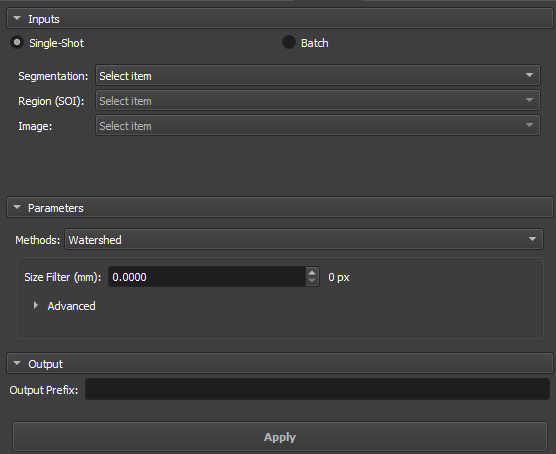
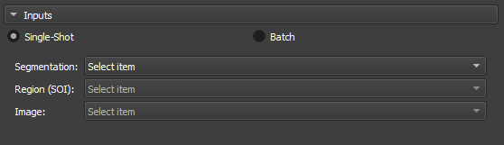
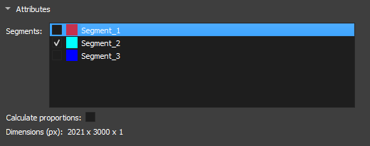
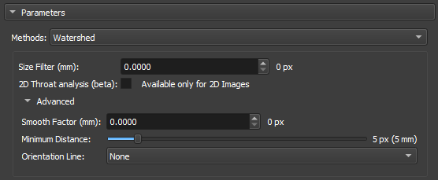
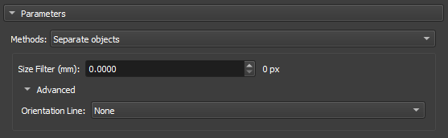
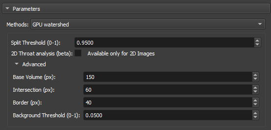
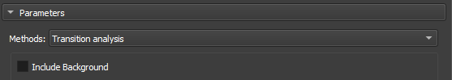

## Segment Inspector

This module provides several methods to analyze a segmented image. Particularly, the Watershed and Separate Objects algorithms allow a segmentation to be fragmented into multiple partitions, or multiple segments. It is generally applied to the segmentation of porous space to calculate the metrics of each porous element.
The input is a segmentation node or labelmap volume, a region of interest (defined by a segmentation node), and the master image/volume. The output is a labelmap where each partition (pore element) is in a different color, a table with global parameters, and a table with the different metrics for each partition.

### Panels and their use

|  |
|:-----------------------------------------------:|
| Figure 1: Overview of the Segment Inspector module. |

#### Main options
The Segment Inspector module interface is composed of Inputs, Parameters, and Output.

##### Single input

|  |
|:-----------------------------------------------:|
| Figure 2: Overview of the inputs in the Segment Inspector module. |

 - _Segmentation_: Input for the segmentation used in the partition.

 - _Region SOI_: Choose a segmentation of interest that contains at least part of the segmentation used in _Segmentation_.

 - _Image_: Field automatically filled with the reference node of the segmentation used in _Segmentation_.

##### Attributes

|  |
|:-----------------------------------------------:|
| Figure 3: Segment attributes in the Segment Inspector module. |

 - _Segments_: Segments contained in the segmentation selected in _Segmentation_. The list shows the visualization of the segment via the eye icon. For the fragmentation method to be initialized, a segment must be selected.

 - _Calculate proportions_: Checkbox to display the proportions of each segment in the image.

 - _Dimension(px)_: Displays the dimensions of the selected image.

#### Parameters and Methods

##### Watershed

The Watershed algorithm works by simulating the expansion of "watersheds" from points marked as local minima. As "water" fills the valleys, it defines the boundaries between different regions. This approach is widely used in applications where it is necessary to separate objects or pores in materials, taking advantage of contrasts between regions.

|  |
|:-----------------------------------------------:|
| Figure 4: Watershed in the Segment Inspector module. |

 - _Size Filter(mm)_: Controls the maximum segmentation range, directly influencing the size and connectivity of the segmented regions. Small values are used when you want to segment many fine details, whereas large values are used when the focus is on large areas or connected objects.

 - _2D throat analysis(beta)_: Adds 2D throat analysis metrics to the report.

 - _Calculate Coordination Number_: Calculates the number of neighboring regions (that share a border) with each of the watershed labels. We consider as a "neighbor" any label that shares a face, edge or vertex of another nearby.

 - _Smooth factor_: Parameter that adjusts the degree of smoothness on the edges of segmented regions, allowing control between preserving details and reducing noise or irregularities. With high factors, the segmentation will be smoother and simplified, but with loss of small details.

 - _Minimun Distance_: parameter that determines the smallest allowed distance between two local maxima or segmented objects. A larger value for this parameter will merge nearby objects, simplifying the segmentation, while a smaller value will allow the separation of closer objects, resulting in a more detailed segmentation.

 - _Orientation Line_: The orientation parameter allows the algorithm to align itself properly with the image features, improving segmentation accuracy.

##### Separate Objects

The "Separate Objects" segmentation method identifies connected regions in a binary matrix that represent information objects. This process is especially useful in porosity analysis, where it is important to distinguish different connected regions within a volume.

|  |
|:-----------------------------------------------:|
| Figure 5: Separate Objects in the Segment Inspector module. |

 - _Size Filter(mm)_: Controls the maximum segmentation range, directly influencing the size and connectivity of the segmented regions. Small values are used when you want to segment many fine details, whereas large values are used when the focus is on large areas or connected objects.

 - _Orientation Line_: The orientation parameter allows the algorithm to align itself properly with the image features, improving segmentation accuracy.

##### GPU Watershed

The Deep Watershed technique combines the traditional Watershed concept with deep neural networks to obtain more precise and robust segmentation. Using the power of deep learning, the method enhances the detection of boundaries and objects in complex scenarios, such as the analysis of porous materials with multiple levels of overlap. This approach is particularly effective for handling three-dimensional volumes and for performing precise segmentations in noisy images.

|  |
|:-----------------------------------------------:|
| Figure 6: GPU Watershed in the Segment Inspector module. |

 - _Split Threshold(0-1)_: Controls the maximum segmentation range, directly influencing the size and connectivity of the segmented regions. Small values are used when you want to segment many fine details, whereas large values are used when the focus is on large areas or connected objects.

 - _2D throat analysis(beta)_: Adds 2D throat analysis metrics to the report.

 - _Base volume (px)_: This parameter represents a base value that can be related to the size or scale of the volume being processed. It serves as a reference for calculating the depth or layers of the volume that will be analyzed.

 - _Intersection (px)_: This parameter is used to adjust how much regions within the volume can overlap during segmentation.

 - _Border (px)_: This parameter defines the size or thickness of the borders that will be considered when calculating the depth layers in the volume.

 - _Background Threshold(0-1)_: Acts as a cutoff point. All values below this threshold are considered to belong to the background, while values above the threshold are considered to be parts of objects or significant regions within the image or volume.

##### Transitions Analysis

Transitions Analysis focuses on examining the changes between regions or segments of an image. This method is mainly employed to study the mineralogy of samples.

|  |
|:-----------------------------------------------:|
| Figure 7: Transitions Analysis in the Segment Inspector module. |

 - _Include Background_: Uses the total dimensions of the input image for analysis.

##### Basic Petrophysics

|  |
|:-----------------------------------------------:|
| Figure 8: Transitions Analysis in the Segment Inspector module. |

 - _Include Background_: Uses the total dimensions of the input image for analysis.

#### Output

Enter a name to be used as a prefix for the results object (labelmap where each partition (pore element) is in a different color, a table with global parameters, and a table with the different metrics for each partition).

#### Properties / Metrics:

1. __Label__: partition label identification.
2. __mean__: mean value of the input image/volume within the partition region (pore/grain).
3. __median__: median value of the input image/volume within the partition region (pore/grain).
4. __stddev__: Standard deviation of the input image/volume value within the partition region (pore/grain).
5. __voxelCount__: Total number of pixels/voxels in the partition region (pore/grain).
6. __area__: Total area of the partition (pore/grain). Unit: mm².
7. __angle__: Angle in degrees (between 270 and 90) related to the orientation line (optional, if no line is selected, the reference orientation is the upper horizontal).
8. __max_feret__: Major Feret diameter. Unit: mm.
9. __min_feret__: Minor Feret diameter. Unit: mm.
10. __mean_feret__: Average of the minimum and maximum axes.
11. __aspect_ratio__: min_feret / max_feret.
12. __elongation__: max_feret / min_feret.
13. __eccentricity__: square(1 - min_feret / max_feret), related to the equivalent ellipse (0 ≤ e < 1), equal to 0 for circles.
14. __ellipse_perimeter__: Perimeter of the equivalent ellipse (equivalent ellipse with axes given by the minimum and maximum Feret diameters). Unit: mm.
15. __ellipse_area__: Area of the equivalent ellipse (equivalent ellipse with axes given by the minimum and maximum Feret diameters). Unit: mm².
16. __ellipse_perimeter_over_ellipse_area__: Perimeter of the equivalent ellipse divided by its area.
17. __perimeter__: Actual perimeter of the partition (pore/grain). Unit: mm.
18. __perimeter_over_area__: Actual perimeter divided by the area of the partition (pore/grain).
19. __gamma__: Circularity of an area calculated as 'gamma = perimeter / (2 * square(PI * area))'.
20. __pore_size_class__: Pore class symbol/code/id.
21. __pore_size_class_label__: Pore class label.

##### Definition of pore classes:

* __Microporo__: class = 0, max_feret less than 0.062 mm.
* __Mesoporo muito pequeno__: class = 1, max_feret between 0.062 and 0.125 mm.
* __Mesoporo pequeno__: class = 2, max_feret between 0.125 and 0.25 mm.
* __Mesoporo médio__: class = 3, max_feret between 0.25 and 0.5 mm.
* __Mesoporo grande__: class = 4, max_feret between 0.5 and 1 mm.
* __Mesoporo muito grande__: class = 5, max_feret between 1 and 4 mm.
* __Megaporo pequeno__: class = 6, max_feret between 4 and 32 mm.
* __Megaporo grande__: class = 7, max_feret greater than 32 mm.

##### Definition of grain classes:

* __Argila__: class = 0, max_feret less than 0.004 mm.
* __Silte muito fino__: class = 1, max_feret between 0.004 and 0.008 mm.
* __Silte fino__: class = 2, max_feret between 0.008 and 0.016 mm.
* __Silte médio__: class = 3, max_feret between 0.016 and 0.031 mm.
* __Silte grosso__: class = 4, max_feret between 0.031 and 0.062 mm.
* __Areia muito fina__: class = 5, max_feret between 0.062 and 0.125 mm.
* __Areia fina__: class = 6, max_feret between 0.125 and 0.25 mm.
* __Areia média__: class = 7, max_feret between 0.25 and 0.5 mm.
* __Areia grossa__: class = 8, max_feret between 0.5 and 1 mm.
* __Areia muito grossa__: class = 9, max_feret between 1 and 2 mm.
* __Grânulo__: class = 10, max_feret between 2 and 4 mm.
* __Seixo__: class = 11, max_feret between 4 and 64 mm.
* __Bloco ou Calhau__: class = 12, max_feret between 64 and 256 mm.
* __Matacão__: class = 13, max_feret greater than 256 mm.
