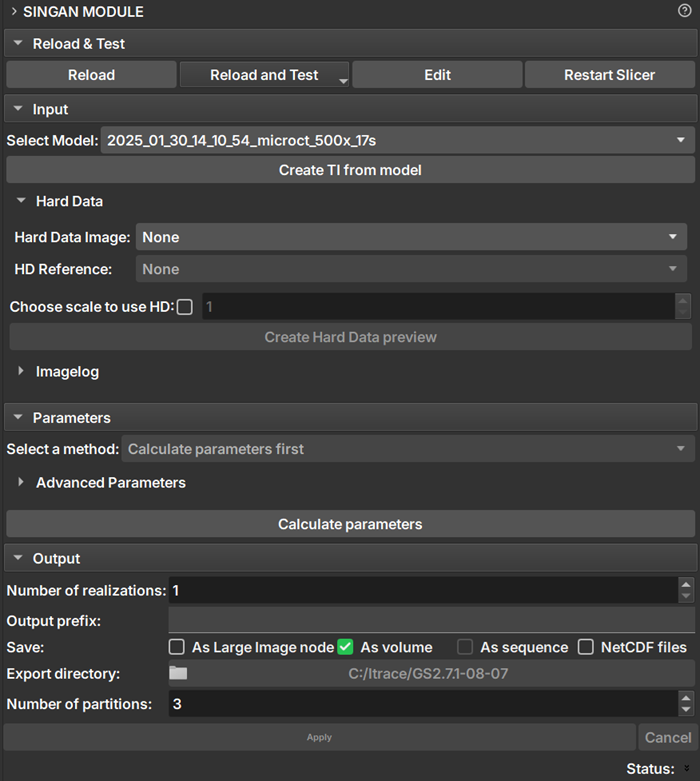

## SinGAN Module

The _SinGAN_ Module provides an interface for using SinGAN models within GeoSlicer...

### Panels and their usage

|  |
|:-----------------------------------------------:|
| Figure 1: SinGAN module presentation. |

### Parameters

#### Model Configuration:

 - _Select Model_: Select the model to be used. Only valid models are listed, within the SinGAN model directory configured by the user.
 
 - _Create TI from model_: Reconstructs the training image as a volume within _GeoSlicer_

#### Conditioning Image

 - _Hard Data Image_: Selects the conditioning image to be used during generation.

 - _Choose scale to use HD_: If selected, the conditioning image is injected only at the chosen scale. If disabled, the image is injected at the first available scale and then resized for subsequent scales.

 - _Create Hard Data preview_: Creates a preview of the hard data image at the injection scales.

#### BIG IMAGE:
 - _Selected method_: Method used for generating large images.
    1. _Generation patch on gpu_: All processing is performed entirely in RAM and on the GPU, without splitting into patches or writing anything to disk.
    2. _Pacth Inference_: Generates the image by processing it in small pieces (patches), using the disk to store intermediate data. It is ideal for very large images that do not fit in RAM.
    3. _Early crop_: Generates the image recursively, resizing the input image for each scale and extracting the corresponding *patch*.
    4. _By chunks_: Divides the image into larger blocks (chunks) defined by the user, processing each one individually. It is an approach to handle large images, offering a balance between memory usage and processing time.
    
 - _Set number of chunk_: Defines the number of blocks in each dimension in the _By chunks_ method.

#### Output
 - _Number of realizations_: Number of images to be generated.
 
 - _Output Prefix_: Name of the generated volumes

 - _Save_: How the simulated image will be saved in GeoSlicer.
    1. _As Large Image node_: An large image node will be added automaticaly to geoslicer. Refer to [Big Image](/Volumes/BigImage/BigImage.md) for more information about this node.
    1. _As volume_: An individual volume is generated for each realization. Available when there is enough memory to load output image.
    2. _As sequence_: A sequence of volumes containing all realizations is generated. This option is only available for more than one realization and when the option to save as volume is enabled.
    3. _As NetCDF files_: The generated images are automatically saved as .nc files. Obligatory for big images.
 - _Export directory_: Directory where the NetCDF images will be saved.