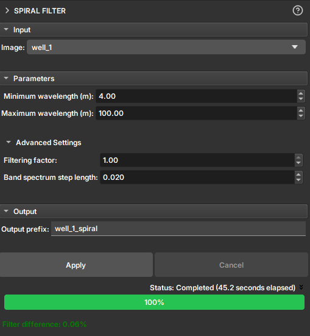

## Spiral Filter

The **Spiral Filter** module is a tool designed to remove artifacts from image profiles caused by the spiral movement and eccentricity of the logging tool within the well.

During the acquisition of image profiles, the rotational movement of the tool (spiraling) and its misalignment relative to the center of the well (eccentricity) can introduce periodic noise into the images. This noise appears as a pattern of bands or spirals superimposed on the geological data, which can make the interpretation of true features difficult.

This filter operates in the frequency domain to selectively remove signal components associated with these artifacts, resulting in a cleaner and easier-to-interpret image.

### How It Works

The filter is based on applying a band-stop filter to the 2D Fourier transform of the image. The frequency band to be rejected is defined by the vertical wavelengths (in meters) that correspond to the visible spiral pattern in the image. The user can measure these wavelengths directly on the image using the ruler tool to configure the filter parameters.

### How to Use

1.  **Image:** Select the image profile you want to filter.
2.  **Parameters:**
    *   **Minimum wavelength (m):** Define the minimum vertical wavelength of the spiral artifact. This value corresponds to the smallest vertical repetition distance of the pattern.
    *   **Maximum wavelength (m):** Define the maximum vertical wavelength of the artifact.
3.  **Advanced Settings (Optional):**
    *   **Filtering factor:** Control the filter intensity. A value of `0` applies no filtering, while `1` applies maximum filtering.
    *   **Band spectrum step length:** Adjusts the smoothness of the filter's frequency band transition. Larger values result in a smoother transition.
4.  **Output prefix:** Define the name for the new filtered image volume.
5.  **Click Apply:** Press the button to start the filtering process.

### Output

The result is a new image volume in the scene with the filter applied. After execution, the **Filter difference** field displays the percentage of the image that was changed by the filter, providing a quantitative measure of the filtering impact.