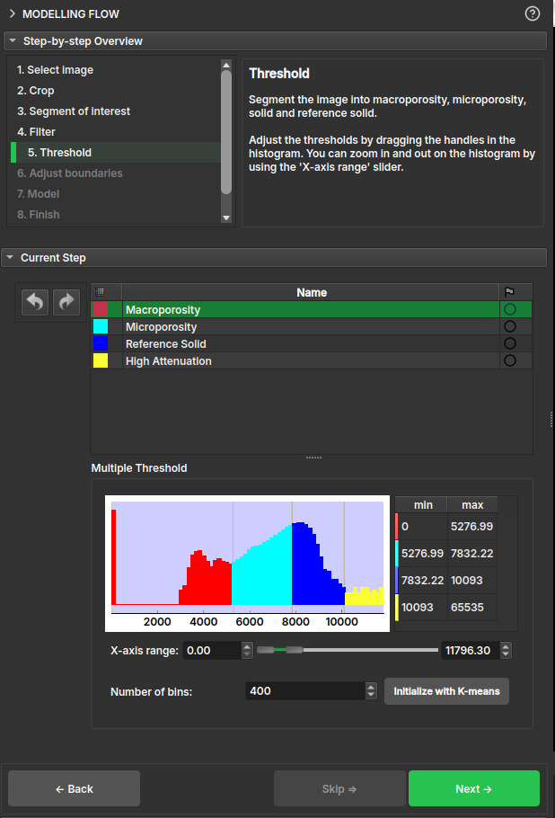

# Modelling Flow

This module aims to summarize the workflow for generating the porosity map from a microCT volume. To do this, the module divides the workflow into the following steps:

1.  **Select image**: Selects a volume loaded in the scene;
2.  **Crop**: Performs a cut on the original volume;
3.  **Segment of interest**: Allows the selection of a region of interest for modeling. The scissor tool or *Sample segmentation* can be used, which will attempt to select the cylinder automatically;
4.  **Filter**: Applies a median filter to the original image; the user must choose the number of neighbors used in each direction;
5.  **Threshold**: Creation of the segmentation based on the grayscale;
6.  **Adjust boundaries**: Removes a selected microporosity boundary by expanding the other segments to fill the empty space;
7.  **Model**: Calculates the porosity map, using a histogram to select the attenuation factors for solid and air;
8.  **Finish**: Visualization of the results;

When the option is optional, the *Skip* button will be enabled, allowing you to skip this step.

