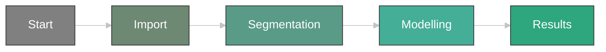
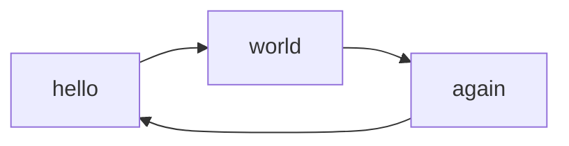
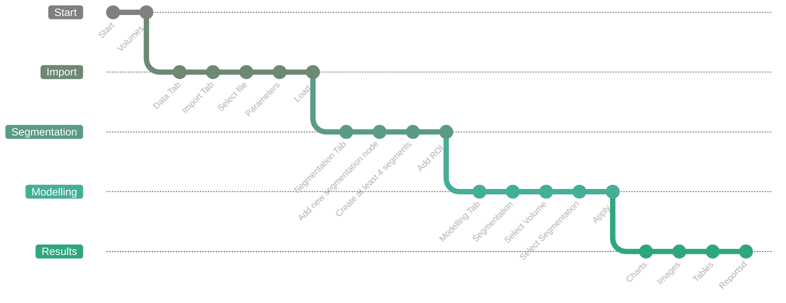

## Virtual Segmentation Flow

Flow for obtaining a porosity map from a scalar volume.

1. Start Geoslicer in the **Volumes** environment from the application interface.

2. Select the input volume by clicking on "Escolher pasta" or "Escolher arquivo" and choose the desired import data from the available options. We suggest testing the default parameters first.

3. Select the input volume by clicking on "Input:" Adjust the parameters for different segmentation effects, such as "Múltiplos Limiares," "Remoção de Fronteira," and "Expandir Segmentos." Adjust the settings to achieve the desired segmentation results, using interface feedback and visualization tools.

4. Review and refine the segmented data. Adjust segmentation boundaries, merge or split segments, and apply other modifications to enhance the porosity model using the provided tools.

5. Save the porosity map or export the volume with the parameter tables.

#### Start
Start Geoslicer in the MicroCT environment from the application interface.

#### Import(TODO)
Select the input volume by clicking on "Escolher pasta" or "Escolher arquivo" and choose the desired import data from the available options. We suggest testing the default parameters first.

#### Segmentation
Select the input volume by clicking on "Input:" Adjust the parameters for different segmentation effects, such as:
 
 1. Multiple Thresholds(TODO)
 2. Boundary Removal(TODO)
 3. Expand Segments(TODO)
  
Adjust the settings to obtain the desired segmentation results, using interface feedback and visualization tools.

#### Modeling(TODO)
 Review and refine the segmented data. Adjust segmentation boundaries, merge or split segments, and apply other modifications to enhance the segmentation model using the provided tools.(TODO)

#### Results(TODO)
Save the project or export the segmented volume. The results can be displayed as:

 1. Image(Screenshot)(TODO)
 2. Graphs(Charts)(TODO)
 3. Served via Reports (Streamlit)(TODO)