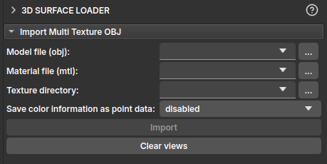

## 3D Surface Loader

The **3D Surface Loader** module is a tool designed to load and visualize textured 3D surface models within the GeoSlicer environment. Its main purpose is to import models in the `.obj` format that are accompanied by material files (`.mtl`) and image textures, applying these textures to the model's geometry for a 3D visualization of the rock surface. Typically, such images originate from 3D scanners.

### How to Use

The module's interface is straightforward, focused on importing models with multiple textures.

The main options available for importing the 3D model are:

1.  **Model file (obj):** Select the 3D model file with the `.obj` extension that you want to load.
2.  **Material file (mtl):** Select the corresponding material file, with the `.mtl` extension. The module will attempt to automatically populate this field if an `.mtl` file with the same name as the `.obj` file is found in the same directory.
3.  **Texture directory:** Specify the directory where the texture images (e.g., `.png` or `.jpg` files referenced by the `.mtl` file) are located. The module will also attempt to automatically populate this field based on the model file's path.
4.  **Save color information as point data :** This option allows saving texture colors as model attributes. This can be useful for subsequent color-based analyses or filters. The options are:
    *   `disabled`: Does not save color information to points.
    *   `separate scalars`: Saves color channels (Red, Green, Blue) as separate scalar arrays.
    *   `single vector`: Saves color information as a single 3-component vector (RGB).
5.  **Import:** After filling in the fields, click this button to load the model and its textures into the scene.
6.  **Clear views:** Disables the slices normally used in the slicer, to view only the 3D model.