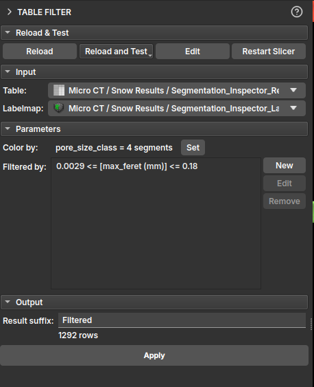
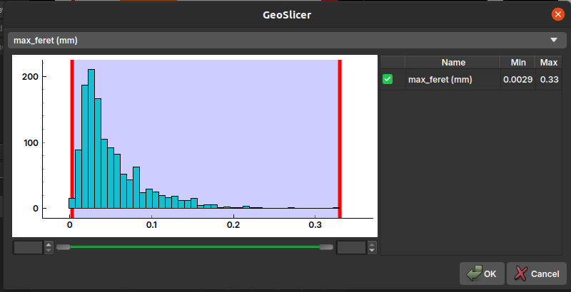
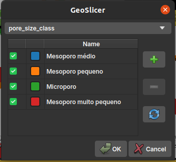

## Table Filter

This module filters tables of element properties (such as pores or grains) that have been individualized by segmentation algorithms. For more details on the origin of this data, consult the [Segment Inspector](/Volumes/Segmentation/Segmentation.md#segment-inspector) documentation.

In the module's interface, the user can select the input table and build specific filters for each of its columns. A central feature of this module is instant visual feedback: as filters are applied, the corresponding elements in the LabelMap are updated in real-time, allowing for visual and interactive analysis.

It is possible to add multiple rules to create a complex filter, and the user can choose to keep or remove the rows that meet the established criteria.

It is also possible to assign a different color to each pore class, facilitating visualization and analysis. By default, the color is associated with the *pore_size_class* classification.

### Properties Description

- *label*: A unique index for each of the individualized elements;
- *voxelCount*: The number of voxels that make up each element;
- *volume (mm³)*: The actual volume of the element, calculated from the `voxelCount` and the image's voxel size;
- *max_feret (mm)*: The maximum Feret diameter, which represents the greatest distance between two parallel points on the element's boundary. It is a measure of the element's maximum size;
- *aspect_ratio*: The aspect ratio, usually calculated as the ratio between the largest and smallest axis of the element. A value close to 1 indicates that the element is approximately isometric (like a sphere or cube), while larger values indicate a more elongated shape;
- *elongation*: Measures how elongated an object is. It is the square root of the ratio between the second and first moment of inertia of the object. A value of 0 corresponds to a circle or sphere, and larger values indicate greater elongation;
- *flatness*: Measures how flat an object is. It is the square root of the ratio between the third and second moment of inertia of the object. A value of 0 corresponds to a circle or sphere, and larger values indicate greater flatness.;
- *ellipsoid_area (mm²)*: The surface area of an ellipsoid that has the same moments of inertia as the element;
- *ellipsoid_volume (mm³)*: The volume of an ellipsoid that has the same moments of inertia as the element.
- *ellipsoid_area_over_ellipsoid_volume (1/mm)*: The ratio between the surface area and the volume of the equivalent ellipsoid. This measure is useful for characterizing the element's surface-to-volume ratio;
- *sphere_diameter_from_volume (mm)*: The diameter of a sphere that has the same volume as the element. It is a way to estimate an "equivalent" diameter for irregular shapes;
- *pore_size_class*: A categorical classification of pore size (e.g., micropore, mesopore, macropore) based on one of the size measurements;