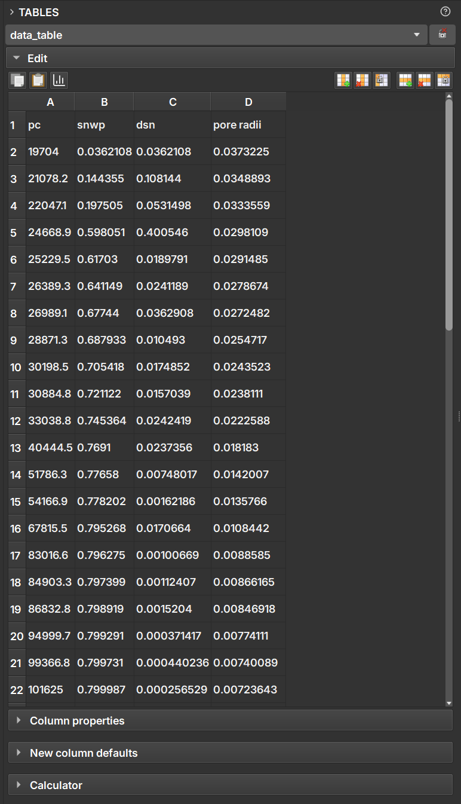

## Tables

This module is used to manipulate and edit tables within GeoSlicer.

By selecting a table node, the user can edit each of the cells as in a spreadsheet application. From the buttons located above the table, it is also possible to include/remove rows and columns, as well as make copies.

In the *Column properties* field, you can convert between the data types presented in the table columns.

In the *Calculator* field, the user can perform simple mathematical operations between the columns to generate new data columns.