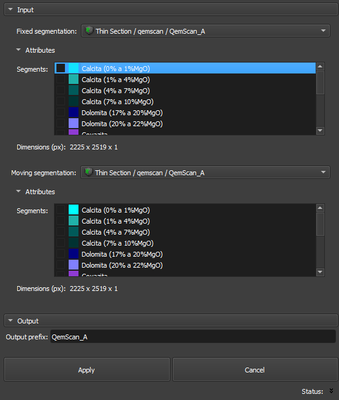

## Automatic Registration

The Thin Section Auto Registration module is part of the Registration category and aims to automatically register thin section images, using segmentations of fixed and moving volumes. It allows defining input images, configuring output prefixes, and applying transformations to align the images.

### Panels and their usage

|  |
|:-----------------------------------------------:|
| Figure 1: Presentation of the Auto Registration module. |

#### Main options
The interface of the Auto Registration module is composed of several panels, each designed to simplify the loading and processing of QEMSCAN/RGB images:

 - _Fixed segmentation image_: Choose the reference or fixed image.

 - _Moving segmentation image_: Choose the image that will be transformed to align with the fixed image.

 - _Segments_: Choose the segments of the image to be transformed to be used for registration optimization.

 - _Output prefix_: Define a prefix that will be applied to the results, facilitating the organization and identification of output files.

 - _Apply_: Initiates the registration process, applying transformations that align the moving segmentation to the fixed segmentation.

 - _Cancel_: Interrupts the process at any time, if necessary.
