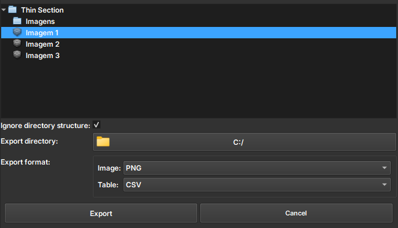

# Thin Section Export

The Thin Section Export module is used to export different types of data, such as images, label maps, and tables, in formats like PNG, TIF, CSV, LAS, and DLIS. The module offers a graphical interface where the user can choose which data to export, select the desired format, and define the destination folder. It also shows the export progress and allows cancelling the process if needed. The goal is to facilitate the organized export of geological or scientific data.

## Panels and their use

|  |
|:-----------------------------------------------:|
| Figure 1: Overview of the Thin Section Export module. |

### Main options

 - _Explorer data_: Choose the Image to be Exported.

 - _Ignore directory structure_: Export all data ignoring the directory structure. Only one node with the same name and type will be exported.

 - _Export directory_: Path to the exported files

 - _Export format_: Formats such as PNG, TIF, CSV, LAS, and DLIS are supported