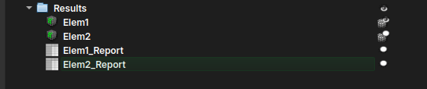
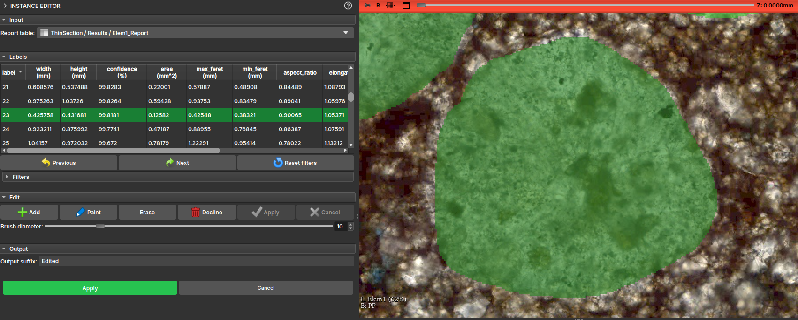
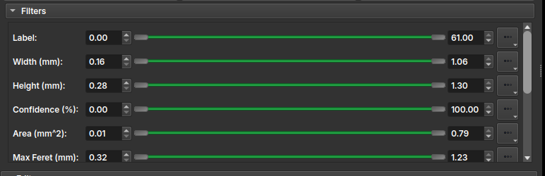

## Instance Editor

This module is used to manipulate and perform a label-by-label inspection of the results generated from an "Textural Structures" model of the AI Segmenter. When using the AI Segmenter module with this model on a thin section image, the result should be something like:

After the instance segmentation results are generated, the user might want to repaint, clean, or even inspect each of the created instances. Therefore, when loading one of the Report tables into the Instance Editor module, it should automatically display the LabelMap volume associated with the table.

!!! tip
	An opacity for the labels can be chosen to better visualize the sample beneath them. One practical way to do this is by holding the `Ctrl` button and dragging the mouse horizontally while clicking inside the viewing window.

The module interface will display a table with the main properties of the drawing, and the user can then, by clicking on the table entries or using the Next and Previous buttons, visit each of the elements individually.

Additionally, the interface features a Filters tool that lists all properties and allows selecting a certain range of these properties, applying a color to the table elements and enabling the user to more easily decide whether to keep or delete that element.

In the Edit field, some label editing tools are presented, including:
 - *Add*: Adds a new instance/label to the table, allowing the user to draw freehand over the thin section view;
 - *Paint*: Activates a brush tool, to use on an existing instance;
 - *Erase*: Activates an eraser tool, to erase part of an existing instance;
 - *Decline*: Deletes the instance entry from both the table and the drawing;
 - *Apply*: Applies the current change, recalculating the drawing properties;
 - *Cancel*: Discards the current change;

!!! info
	All changes made are temporary; to apply them and generate a new table and a new LabelMap with the drawings, it is necessary to finalize the changes by pressing the general "Apply" button, available further down in the interface.