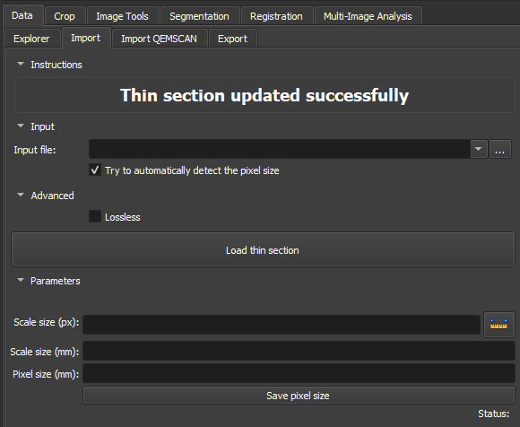

# Thin Section Loader

The ThinSectionLoader module is designed to efficiently load and process thin section images in the _Thin section_ environment. It imports PNG, JPG/JPEG, BMP, GIF, and TIFF images. It integrates automated scale detection using Tesseract OCR, ensuring accurate pixel size estimation. The module also includes advanced options for lossless image manipulation and allows manual adjustments to image spacing parameters, making it adaptable to diverse geological analysis needs.

## Panels and their usage

|  |
|:-----------------------------------------------:|
| Figure 1: Presentation of the Thin Section Loader module. |

### Main options

 - _Input file_: Choose the path of the Image to be imported. The most commonly used extensions are: PNG, JPG/JPEG, BMP, GIF, and TIFF.

 - _Advanced Lossless_: Using a lossless compression option ensures that the original image quality is fully preserved, without data loss during the process.

 - _Scale size(px)_: Section to define the pixel range used in the pixels per millimeter ratio. The ruler icon on the right allows adding a mark on the image scale, facilitating this definition.

 - _Scale size(mm)_: Section to define the size in millimeters of the selected pixel range. If the ruler was used on the image scale, the value should be corresponding.

 - _Pixel size(mm)_: Ratio between pixels/mm can be defined or result from the measurement of the _Scale size(px)_ and _Scale size(mm)_ fields.

 - _Save pixel size_: Once the pixels/mm ratio is defined, the button links the value to the image.

## Workflow

### PP / PX / Others

{{ video("thin_section_loader.webm", caption="Thin Section Loader") }}

Use the *Loader* Module to load thin section images, as described in the steps below:

1.  Use the *Add directories* button to add directories containing thin section data. These directories will appear in the *Data to be loaded* area (a search for thin section data in these directories will occur in subdirectories up to one level below). You can also remove unwanted entries by selecting them and clicking *Remove*.
2.  Define the pixel size (*Pixel size*) in millimeters.
3.  Optionally, activate *Try to automatically detect pixel size*. If successful, the detected pixel size will replace the value configured in *Pixel size*.
4.  Click the *Load thin sections* button and wait for the loading to complete. The loaded images can be accessed in the *Data* tab, within the *Thin Section* directory.