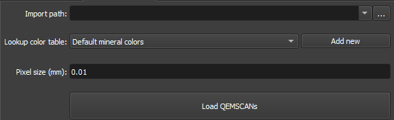

# Qemscan Loader

The QEMSCAN Loader module is specifically designed to load and process QEMSCAN images within the GeoSlicer Thin Section environment. This module simplifies the process of importing and visualizing complex QEMSCAN data, offering features such as customizable pixel size settings and integrated color tables for efficient mineral identification.

## Panels and their usage

|  |
|:-----------------------------------------------:|
| Figure 1: Qemscan Loader module overview. |

### Main options
The QEMSCAN Loader module interface consists of several panels, each designed to simplify the loading and processing of QEMSCAN images:

 - _Input file_: This input allows selecting the directory containing your QEMSCAN image files.

 - _Lookup color table_: Allows users to create and apply their own color mappings to mineral data or choose from a set of predefined .csv color tables to assign colors to different minerals based on their composition.

 - _Add new_: Option to allow the loader to search for a CSV file in the same directory as the QEMSCAN file being loaded. You also have the checkbox option to use the "Default mineral colors" table. **[Default mineral colors](../../assets/data/Default mineral colors.csv)**

 - _Pixel size(mm)_: Section to define the px/millimeters ratio. If the complementary RGB image has already been imported, the value should be corresponding.

 - _Load Qemscam_: Load _QEMSCANs_ .

## Workflow

{{ video("thin_section_QEMSCAN_loader.webm", caption="QEMSCAN Loader") }}

Use the *QEMSCAN Loader* Module to load QEMSCAN images, as described in the steps below:

1.  Use the *Add directories* button to add directories containing QEMSCAN data. These directories will appear in the *Data to be loaded* area (a search for QEMSCAN data in these directories will occur in subdirectories up to one level down). You can also remove unwanted entries by selecting them and clicking *Remove*.
2.  Select the color table (*Lookup color table*). You can select the default table (*Default mineral colors*) or add a new table by clicking the *Add new* button and selecting a CSV file. You also have the option to make the loader search for a CSV file in the same directory as the QEMSCAN file being loaded. There is also the *Fill missing values from "Default mineral colors" lookup table* option to fill in missing values.
3.  Define the pixel size (*Pixel size*) in millimeters.
4.  Click the *Load QEMSCANs* button and wait for the loading to finish. The loaded QEMSCANs can be accessed in the *Data* tab, inside the *QEMSCAN* directory.