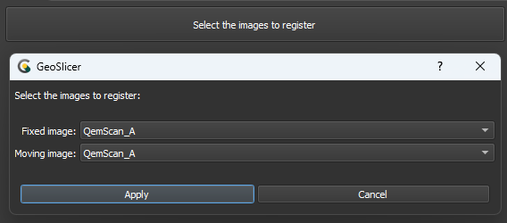
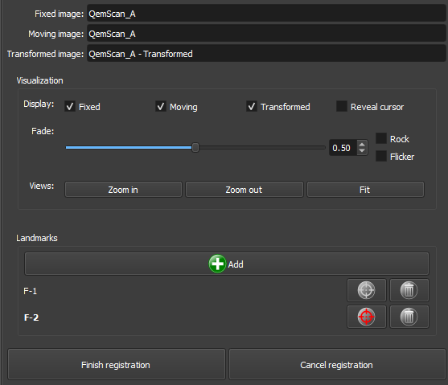
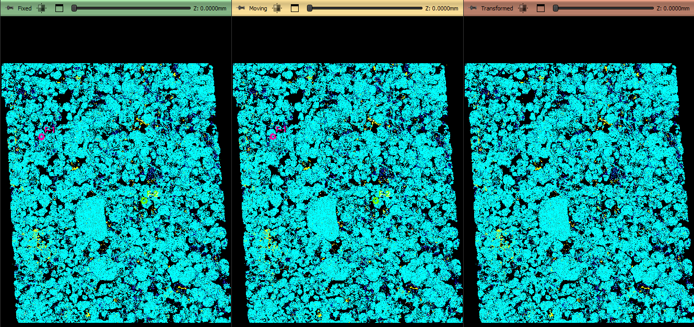
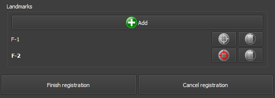

## Manual Registration

The Thin Section Registration module is designed to register thin section and QEMSCAN images, allowing the user to align images by adding landmarks to both. After selecting corresponding landmarks in the fixed and moving images, the module applies transformations to ensure accurate registration.

### Initialization

|  |
|:-----------------------------------------------:|
| Figure 1: Introduction to the Manual Registration module. |

#### Main options
The Manual Registration module interface is composed of several panels, each designed to simplify the loading and processing of QEMSCAN/RGB images:

 - _Select images to register_: This button starts the image selection for registration.

 - _Fixed image_: Choose the reference or fixed image.

 - _Moving_: Choose the image that will be transformed to align with the fixed image.

 - _Apply/Cancel_: Accept or cancel the image choices.

### Panels and their usage

|  |
|:-----------------------------------------------:|
| Figure 2: Overview of the Manual Registration module. |

#### Main options
The Manual Registration module interface is composed of several panels, each designed to simplify the loading and processing of QEMSCAN/RGB images:

##### Visualization

|  |
|:-----------------------------------------------:|
| Figure 3: Overview of the views in the Manual Registration module. |

 - _Display_: Checkboxes for visualization tools. _Fixed image_: Display the view with the fixed image, _Moving image_: Display the view with the image to be transformed, _Transformed_: Display the interactive view with the transformed image, and _Reveal cursor_: Display the transformation region in the view with the transformed image.

 - _Fade_: Choose the transparency of the transformed image in the interactive view with the transformed image.

 - _Rock/Flicker_: Rock or transparency variation effects for the transformed image in the interactive view with the transformed image.

 - _Views_: _ZoomIn/Out_: Choose the zoom level of the views. _Fit_: Resets the zoom level of the views to display the entire image.

##### Landmarks

|  |
|:-----------------------------------------------:|
| Figure 4: Overview of the landmarks interface. |

- _Add_ : Add a reference point that will be replicated in the views with the fixed image and the image to be transformed.

- : Remove a reference point that will be replicated in the views with the fixed image and the image to be transformed.

- / : Activates/Deactivates the position editing of a reference point that will be replicated in the views with the fixed image and the image to be transformed. Only one can be edited at a time.
- _Finish/Cancel registration_: Finish or cancel the registration edits. If finalized, use the transformed image for subsequent processes.