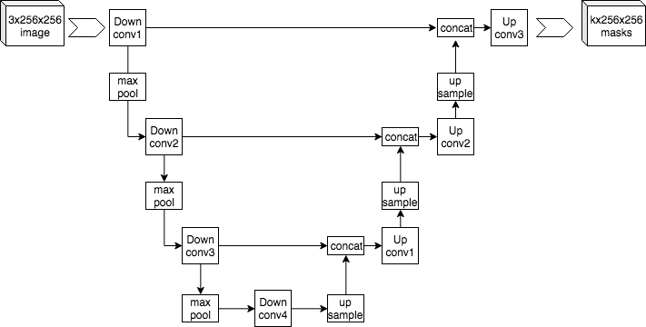
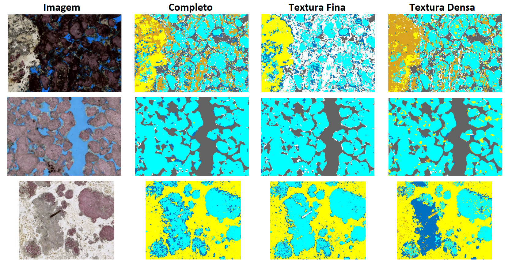
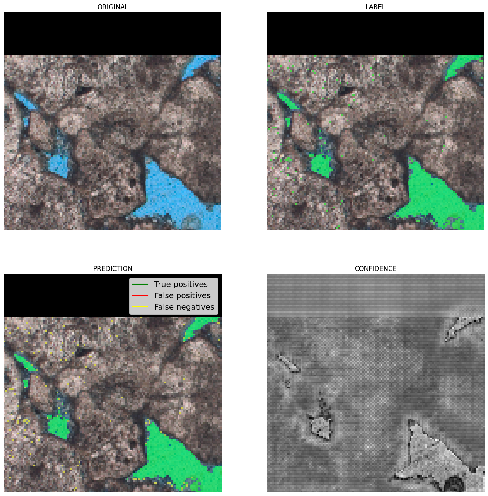
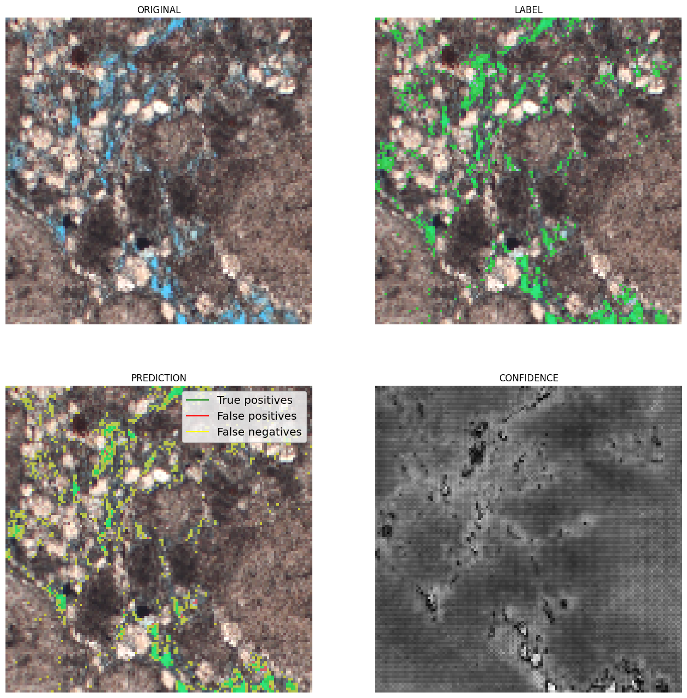
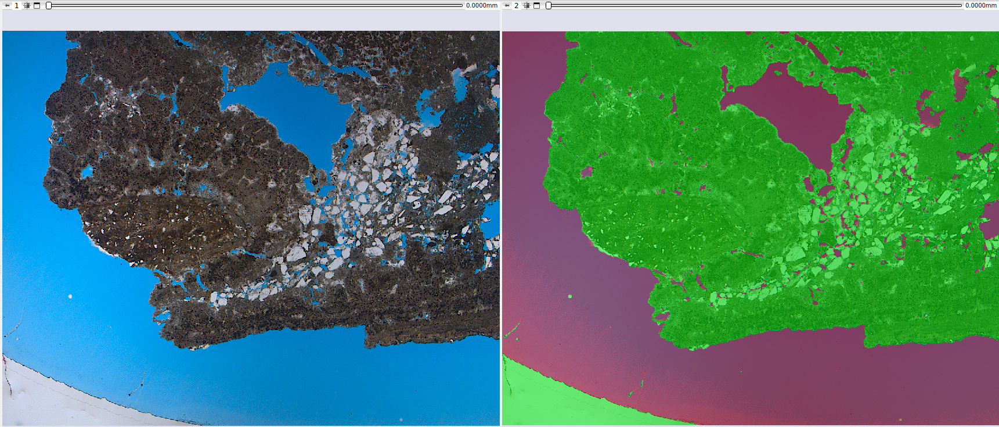

## <a id="automatic-thin-section-segmentation">Automatic Thin Section Segmentation</a>

The segmentation of petrographic thin section images can be done in two ways: binary segmentation, which identifies only the pore phase, and multiphase segmentation, which identifies the various minerals that make up the rock.

### Multiphase Segmentation (Minerals)

The analysis of mineral composition and rock texture is fundamental for the petroleum industry. GeoSlicer uses Deep Learning models to automate this analysis from thin section images, offering an alternative to the QEMSCAN method.

#### Convolutional Neural Network (U-Net)

For mineralogical segmentation, GeoSlicer employs a convolutional neural network with the **U-Net** architecture. This type of network is ideal for semantic segmentation, as it assigns a class to each pixel of the image, precisely delimiting the region of each element. The U-Net consists of an encoding path, which extracts features from the image at multiple scales, and a decoding path, which reconstructs the segmentation map.

|  |
|:-----------------------------------------------:|
| Figure 1: Example U-Net architecture. |

##### Training

Model training was performed using over 50 high-resolution thin sections, employing Plane Polarized Light (PP) and Cross-Polarized Light (PX) images. The QEMSCAN result was used as a ground truth. PP, PX, and QEMSCAN images were aligned through a registration process, and training focused on a region of interest (SOI) to minimize edge noise. To increase data diversity, thin section cutouts underwent random transformations, such as rotations and inversions. Models were trained to identify **Pores** and the minerals **Calcite**, **Dolomite**, **Mg-Clay minerals**, **Quartz**, and a generic **Others** class.

##### Results

The final models, integrated into GeoSlicer, show good approximations of mineral composition, especially for the study of textures and phase distribution. Below is an example of a prediction on thin sections not seen during training.

|  |
|:-----------------------------------------------:|
| Figure 2: Prediction of the final models on unseen thin sections. |

### Pore/Non-pore Segmentation

Porosity is a crucial indicator of a reservoir's potential. GeoSlicer offers automatic methods for segmenting pores, which are typically filled with blue resin for highlight.

#### Convolutional Neural Networks (U-Net)

As in multiphase segmentation, the U-Net architecture is used for pore segmentation.

##### Training

The model was trained with 85 thin section images, where the reference segmentation was obtained by color thresholding on the blue resin. The thin sections were divided into 128x128 pixel cutouts, and only the useful areas (delimited by the SOI) were considered. Training lasted 300 epochs, with random modifications (rotations, inversions) applied to diversify the data and improve the model's generalization capability.

##### Results

The model achieved satisfactory performance, with a Dice coefficient (overlap) greater than 85%. The results show that the network can identify pores with high confidence, although it may present some difficulties at the edges, where colors are intermediate.

| { width=50% }{ width=50% } |
|:-----------------------------------------------:|
| Figure 3: Examples of results. In green, true positives; in red, false positives; and in yellow, false negatives. |

### Bayesian Inference

As an alternative to neural networks, Bayesian Inference offers a simpler model for pore/non-pore segmentation. This method uses **Bayes' rule** to calculate the probability of a pixel belonging to a segment (pore or non-pore) based on a mean and a covariance matrix learned during training.

The approach uses a **Multivariate Normal Distribution** as a likelihood function:

$$ f(x_p|s)=\frac{1}{\sqrt{(2\pi)^k \det \Sigma_s}}\exp\left(-\frac{1}{2}(x_p-\mu_s)^T \Sigma_s^{-1} (x_p-\mu_s)\right) $$

Where $x_p$ is the pixel vector in a window, and $\mu_s$ and $\Sigma_s$ are the mean and covariance of segment $s$.

#### Training and Results

To improve results, thin section images, originally in RGB format, are converted to HSV. The model was trained on a small dataset (~10 samples) and, even with a simple approach, produces interesting results for pore/non-pore segmentation.

| { width=100% } |
|:-----------------------------------------------:|
| Figure 4: Qualitative result of pore/non-pore segmentation by Bayesian inference. |

### References

*   DE FIGUEIREDO, L. P. et al. (2020). *Direct Multivariate Simulation - A stepwise conditional transformation for multivariate geostatistical simulation*. Computers & Geosciences.

*   DE FIGUEIREDO, L. P. et al. (2017). *Bayesian seismic inversion based on rock-physics prior modeling for the joint estimation of acoustic impedance, porosity and lithofacies*. Journal of Computational Physics.

*   HUNT, B. R. (1977). *Bayesian methods in nonlinear digital image restoration*. IEEE Transactions on Computers.

*   SKILLING, J. & BRYAN, R. K. (1984). *Maximum entropy image reconstruction: general algorithm*. Monthly Notices of the Royal Astronomical Society.

*   HANSON, K. (1993). *Introduction to Bayesian image analysis*. Proc SPIE.

*   HANSON, K. (1990). *Object detection and amplitude estimation based on maximum a-posteriori reconstructions*. Proc. SPIE.

*   GEMAN, S. & GEMAN, D. (1990). *Stochastic Relaxation, Gibbs Distribution and the Bayesian Restoration of Images*. IEEE, Transactions on Pattern Analysis; Machine Intelligence.

*   AITKIN, M. A. (2010). *Statistical inference: an integrated Bayesian/likelihood approach*. CRC Press.

*   MIGON, H. S. et al. (2014). *Statistical Inference: An Integrated Approach*. 2nd ed. CRC Press.

*   GAMERMAN, D. & LOPES, H. F. (2006). *Monte Carlo Markov Chain: Stochastic Simulation for Bayesian Inference*. 2nd ed. Chapman & Hall.