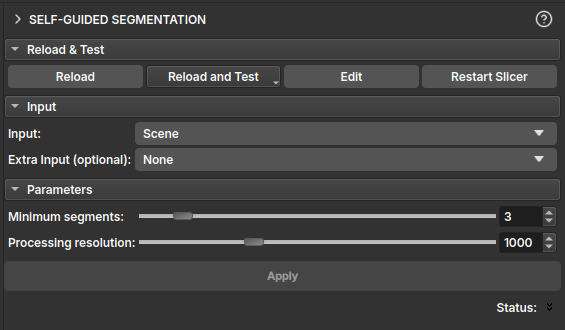

# <a id=self-guided-segmentation>Self-Guided Segmentation (Unsupervised)</a>

The Self-Guided Segmentation module performs unsupervised segmentation of a 2D image. This module is particularly useful for thin section images. It uses a superpixel algorithm along with a simple neural network to segment the image.

## Inputs

- **Input:** A `vtkMRMLVectorVolumeNode` representing a color image with 3 RGB or HSV channels.
- **Extra Input (optional):** An additional `vtkMRMLVectorVolumeNode` with 3 channels, which can be used as extra input for the segmentation process. This is useful for incorporating data from other imaging modalities, such as PP/PX images.

## Parameters

- **Minimum segments:** This slider determines the minimum number of segments the algorithm will produce. The algorithm will stop if it finds fewer segments than this value.
- **Processing resolution:** This slider controls the resolution at which the segmentation is performed. The image height is reduced to the specified number of pixels for processing, and the resulting segmentation is then scaled up to the original image size. This allows for faster processing at the cost of some detail.

## Output

- **Output segmentation:** The module generates a `vtkMRMLSegmentationNode` containing the segmented image. Each segment is assigned a distinct color for easy visualization.
- **Merge visible segments:** This button allows merging all currently visible segments into a single segment. This is useful for combining multiple segments that belong to the same region of interest.