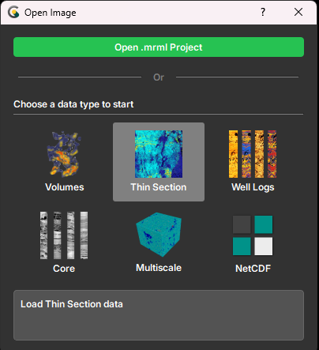
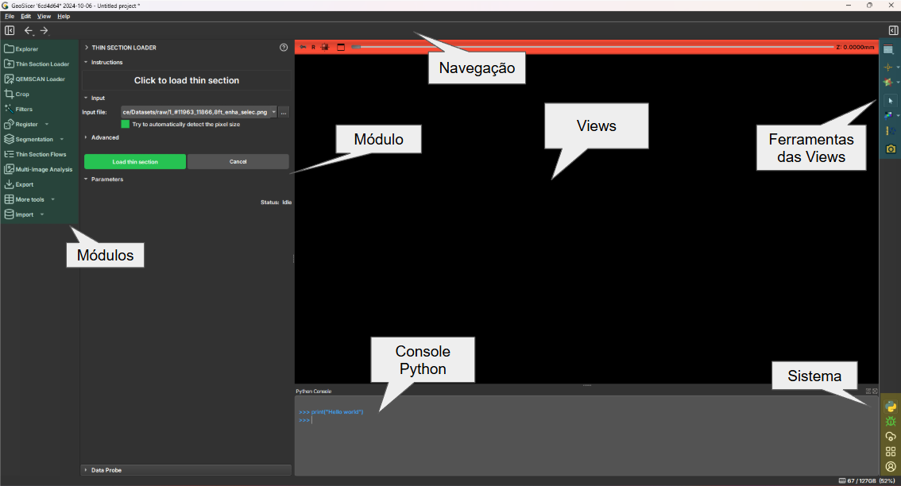

# User Interface

GeoSlicer's interface has recently been updated to improve the user experience.
The interface has been redesigned to be more intuitive and user-friendly. Next, we will cover the main changes
and functionalities of the new interface.

## Welcome Screen (Welcome Screen)

GeoSlicer presents a Welcome Screen every time it is opened. Here, you can choose to create a
new project, open an existing project, or access the documentation.

The following options are presented:

- **Open Project**: Open an existing project.
- **Volumes**: Create a new project to process 3D images, such as tomographies.
- **Thin Section**: Create a new project to process thin section images.
- **Well Log**: Create a new project to process well log images.
- **Core**: Create a new project to process well core images.
- **Multiscale**: Create a new project to process images of different scales.
- **NetCDF**: Create a new project to process NetCDF files.

When you select a project type, you will be directed to GeoSlicer's main screen, and only the modules
related to that project will be displayed
in the module bar. If the user needs to access modules from other projects, simply click on the  icon in the
bottom right corner of the screen, and the initial menu will open again.
Another way is to access the project menu in the top bar, which indicates the current project and allows switching to other
project types.

## Main Screen

GeoSlicer's main screen is where you will interact with images and perform analyses. It is divided into several
main parts:

1.  **Module Bar**: On the left side of the screen, it contains the modules available for the project according to the option
    chosen on the welcome screen.
2.  **Toolbar**: On the right side of the central *view*, it contains the image interaction tools.
3.  ***Central View***: Where the image is displayed and analyses are performed. The *layout* varies according to the
    data type or visualization objective.
4.  **Menu Bar**: At the top of the screen, it contains the application's menu options.
5.  **Visualization Toolbar**: At the top of the central *view*, it contains tools for controlling
    image visualization (e.g., center, scale, link axes and layers).
6.  **Current Module**: On the left side of the central *view*, it displays the currently running module and its options.
7.  **System Bar**: On the right side of the screen, it contains application interaction tools, such as:
    Python console, account manager, bug reporting, and others.
8.  **Status Bar**: At the bottom of the screen, it contains information about the application (e.g., memory usage),
    running processes, and notifications.

## Key Changes

Next, we will discuss these changes and how they impact the user experience.

### Concept and Usability

Most interface changes follow the principle of keeping the action close to the object of interest or area that
will be affected. The idea is to keep related graphic elements close, reducing the number of clicks and mouse movements
needed to perform a task.

Another applied concept is to let the project type drive what is on the interface, meaning only modules
related to the selected project type will be displayed, helping to keep the interface coherent and preventing the user
from getting lost in a sea of options.

The user will be able to navigate between project environments quickly and intuitively, using the environment menu in the
top bar.

As the user enters a new environment, the modules for that environment are loaded and displayed in the module bar.
If the user returns to an already open environment, the modules will be presented instantly, without the need to
reload them. This is especially useful for users who work with different data types. For the special case
of working with well logs, cores, and micro CTs, the user can use the **_Multiscale_** environment, which provides special
support for workflows involving these three data types.

### Module Bar

The available modules are now organized in a sidebar, facilitating navigation and access. Some icons are
submenus for more module options. As a rule, we have established that there will always be only one level of submenus,
thus keeping the options concise and quickly accessible. In this bar, only modules related to the selected project type
will be displayed. If the user wishes to access modules from other projects, simply click on the  icon in the bottom right corner of the screen, and then the bar items will be updated for the modules of the selected project type.

### Toolbar

The toolbar has been repositioned to the right side of the screen, near the central *view*, as
these tools are used to interact with the image. The tools present there are the same as in previous
versions, and most are native GeoSlicer tools, which is why the icons have been maintained.

### System Bar

This bar groups a special type of elements, which are application interaction tools, such as: Python console,
account manager, bug reporting, and others. These functionalities have in common that they activate new screens, normally
dialogs, and do not have image interaction as their main objective.

### Status Bar

The status bar has three main functions: presenting notifications (e.g., if there is a subprocess that needs
to communicate a message), displaying the progress of running processes, as well as quick access to the module that
triggered the process (via the button next to the progress bar). The amount of memory that the GeoSlicer process is
consuming at that moment is also displayed.
